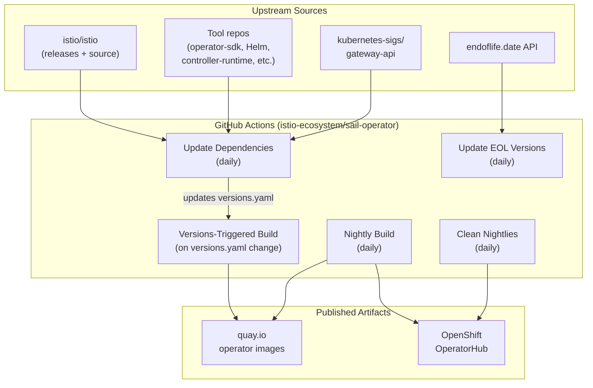

# Sync Jobs

This document describes the automated workflows that keep the Sail Operator in sync with upstream Istio and its dependencies.

## Overview

The Sail Operator uses several scheduled GitHub Actions workflows to track upstream Istio releases, update Go dependencies, manage end-of-life versions, and publish operator images. All automated PRs are created by the [Istio Automator](https://github.com/istio/test-infra/tree/master/tools/automator) tool running inside the `registry.istio.io/testing/build-tools` container.

## Workflows

### 1. Update Dependencies

The primary sync job. It runs against `main` and each active release branch (`release-1.28`, `release-1.29`, `release-1.30`), creating separate PRs for each. PRs are labeled `auto-merge` and are merged automatically by `istio-testing` once CI passes. If a PR fails due to a merge conflict or test failure, manual intervention is required to resolve the issue before it can merge.

**Workflow:** [update-deps.yaml](.github/workflows/update-deps.yaml)

**Schedule:** Daily

**Example PR:** [#1899](https://github.com/istio-ecosystem/sail-operator/pull/1899)

**What it updates:**

| Category | Details |
| --- | --- |
| **Istio Go modules** | `istio.io/istio` and `istio.io/client-go` pulled from the upstream branch (`master` for main, release branch for release branches). Skipped on release branches (`TOOLS_ONLY=true`). |
| **Istio versions** | Runs `make update-istio` (via `hack/update-istio.sh`) to detect new stable Istio releases and pre-release builds, adding them to `pkg/istioversion/versions.yaml`. Skipped on release branches. |
| **Istio sample manifests** | Downloads latest `helloworld`, `httpbin`, `sleep`, and `tcp-echo` samples from the upstream Istio repo into `tests/e2e/samples/`. These samples are used in e2e testing and by downloading them to the repo ahead of time we avoid having Github as a failure point for the tests. |
| **Tool versions** | Updates operator-sdk, Helm, controller-tools, controller-runtime, opm, OLM, gitleaks, runme, misspell, and KIND node image to their latest releases. On release branches, updates are pinned to the current minor version (patch-only). |
| **Gateway API CRDs** | Downloads the latest `experimental-install.yaml` from `kubernetes-sigs/gateway-api`. The Gateway API CRDs are used in e2e testing and by downloading them to the repo ahead of time we avoid having Github as a failure point for the tests. |
| **Istio build-tools image** | Updates the container image tag used by the `update-deps` and `update-eol-versions` workflows themselves. |
| **Documentation** | Runs `hack/update-istio-in-docs.sh` to update Istio version variables in `.adoc` files under `docs/`. |
| **Common files** | Runs `make update-common` to sync shared build scripts and tooling from `istio/common-files`. |

After all updates, the script runs `make gen` to regenerate CRDs, manifests, and generated code.

**Branch behavior:**

- **Main**: Full update including Istio modules, new Istio versions, tools, and samples.
- **Release branches**: Tools-only updates with versions pinned to the current minor (`PIN_MINOR=true`, `TOOLS_ONLY=true`). No new Istio versions are added and Istio Go modules are not updated.

### 2. Update Istio Versions

Called by the update-deps workflow (not a standalone workflow), this script performs two types of Istio version tracking:

- **Stable releases:** Queries the GitHub releases API for `istio/istio`, compares against versions in `versions.yaml`, and adds new patch releases when found. Updates the `vX.Y-latest` alias to point to the newest patch.
- **Pre-release (dev) builds:** Checks the upstream branch for new commits, waits for build artifacts to appear on GCS (`istio-build/dev/`), and updates the dev version entry with the new commit hash, version string, and chart URLs. Updates the `master` alias accordingly.

### 3. Update EOL Versions

Marks Istio versions as end-of-life when they are no longer supported upstream. Unlike update-deps, these PRs are **not** auto-merged and require manual review.

**Workflow:** [update-eol-versions.yaml](.github/workflows/update-eol-versions.yaml)

**Schedule:** Daily

**Example PR:** [#1821](https://github.com/istio-ecosystem/sail-operator/pull/1821)

### 4. Versions-Triggered Build

This workflow fires whenever the versions file changes on `main` (typically from a merged update-deps PR). It builds and pushes a new operator image to `quay.io` using `make docker-buildx`, ensuring a fresh image is available immediately after version updates land.

**Workflow:** [versions-triggered-build.yaml](.github/workflows/versions-triggered-build.yaml)

**Trigger:** Push to `main` that modifies `pkg/istioversion/versions.yaml`

### 5. Nightly Image Build

Builds and publishes a nightly operator image to

1. [quay.io](https://quay.io/repository/sail-dev/sail-operator)
2. [OpenShift OperatorHub](https://github.com/redhat-openshift-ecosystem/community-operators-prod/tree/main/operators/sailoperator)

**Workflow:** [nightly-images.yaml](.github/workflows/nightly-images.yaml)

**Schedule:** Daily

**Example PR:** [community-operators-prod#9564](https://github.com/redhat-openshift-ecosystem/community-operators-prod/pull/9564)

### 6. Clean Nightly Images

Removes nightly OLM bundle releases older than 2 weeks from the [community-operators-prod](https://github.com/redhat-openshift-ecosystem/community-operators-prod/tree/main/operators/sailoperator) repo to avoid unbounded growth of nightly entries.

**Workflow:** [clean-nightly-images.yaml](.github/workflows/clean-nightly-images.yaml)

**Schedule:** Daily

**Example PR:** [community-operators-prod#9401](https://github.com/redhat-openshift-ecosystem/community-operators-prod/pull/9401)
