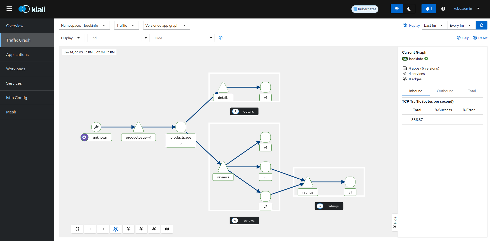
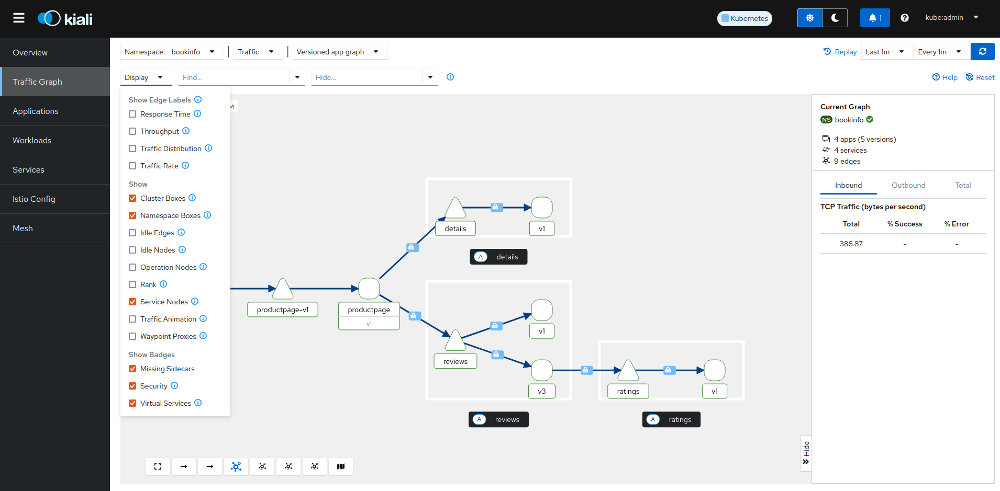

// Variables embedded for GitHub compatibility
:istio_latest_version: 1.28.0
:istio_latest_version_revision_format: 1-28-0
:istio_latest_tag: v1.28-latest
:istio_release_name: release-1.28
:istio_latest_minus_one_version: 1.27.3
:istio_latest_minus_one_version_revision_format: 1-27-3

link:../README.adoc[Return to Project Root]

== Table of Contents

* <<introduction-to-istio-ambient-mode>>
** <<component-version>>
** <<concepts>>
*** <<ztunnel-resource>>
*** <<api-reference-documentation>>
** <<core-features>>
** <<getting-started>>
*** <<installation-on-openshift>>
*** <<deploy-a-sample-application>>
** <<visualize-the-application-using-kiali-dashboard>>
** <<troubleshoot-issues>>
** <<cleanup>>

[[introduction-to-istio-ambient-mode]]
== Introduction to Istio Ambient mode

Ambient mesh was announced in September 2022 and reached a stable state in the Istio 1.24 release. It's core innovation is the separation of Layer 4 (L4) and Layer 7 (L7) processing into two distinct layers. It uses lightweight, shared L4 node proxies and optional L7 proxies, eliminating the need for traditional sidecar proxies in the data plane.

The lightweight, shared L4 node proxy is called ztunnel (zero-trust tunnel). It significantly reduces the overhead of running a mesh by eliminating the need to over-provision memory and CPU while still ensuring security through mutual TLS, simple L4 authorization policies, and telemetry.

The L7 proxies, known as waypoints, handle functions like traffic routing, authorization policy enforcement, and resilience. They run separately from application deployments and can scale independently based on demand.

In contrast to the Istio Sidecar mode, users can start with the secure L4 overlay, which offers features such as mTLS, authorization policy, and telemetry. Complex L7 handling such as retries, traffic splitting, load balancing, and observability collection can then be enabled on a case-by-case basis.

[[component-version]]
== Component version

To install Istio Ambient mode using Sail Operator on OpenShift, use version `v1.24.0` or later and deploy the `Istio`, `IstioCNI`, and `ZTunnel` resources.

[[concepts]]
== Concepts

[[ztunnel-resource]]
=== ZTunnel resource

NOTE: The ZTunnel API was promoted from `v1alpha1` to `v1`. If you have existing `v1alpha1.ZTunnel` resources, they will continue to work but you should migrate to `v1`. The `profile` field has been removed as part of the graduation, so if you previously set this field you'll need to remove it in order to use `v1`.

The `ZTunnel` resource manages the L4 node proxy and is a cluster-wide resource. It deploys a DaemonSet that runs on all nodes in the cluster. You can specify the version using the `spec.version` field, as shown in the example below. Similar to the `Istio` resource, it also includes a `values` field that allows you to configure options available in the ztunnel helm chart. The `metadata.name` field must be set to `default`, as enforced by a CRD validation rule that guarantees only one `ZTunnel` instance exists cluster-wide.

[source,yaml]
----
apiVersion: sailoperator.io/v1
kind: ZTunnel
metadata:
  name: default
spec:
  namespace: ztunnel
  values:
    ztunnel:
      image: docker.io/istio/ztunnel:1.24.0
----

NOTE: If you need a specific Istio version, you can explicitly set it using `spec.version`. If not specified, the Operator will install the latest supported version.

[[api-reference-documentation]]
=== API Reference documentation

The ZTunnel resource API reference documentation can be found link:../api-reference/sailoperator.io.adoc#ztunnel[here].

[[core-features]]
== Core features

- Secure application access using mTLS encryption.
- Enforce Layer 4 authorization policies for enhanced security.
- Apply Layer 7 authorization policies using a waypoint proxy.
- Route and split traffic between services with a waypoint proxy.
- Collect TCP telemetry and visualize traffic flow between pods using Kiali.

[[getting-started]]
== Getting Started

[[installation-on-openshift]]
=== Installation on OpenShift

*Prerequisites*

* You have access to the cluster as a user with the `cluster-admin` cluster role.

*Steps*

. Install the Sail Operator using the CLI or through the web console. The steps can be found link:../general/getting-started.adoc#installation-on-openshift[here].

. Create the `istio-system` namespace and add a label `istio-discovery=enabled`.
+
[source,bash,subs="attributes+"]
----
kubectl create namespace istio-system
kubectl label namespace istio-system istio-discovery=enabled
----

. Create the `Istio` resource. 
+
NOTE: The Istio resource `.spec.values.pilot.trustedZtunnelNamespace` value should match the namespace that we will install a `ZTunnel` resource at.
+

[source,bash,subs="attributes+"]
----
cat <<EOF | kubectl apply -f-
apiVersion: sailoperator.io/v1
kind: Istio
metadata:
  name: default
spec:
  version: v{istio_latest_version}
  namespace: istio-system
  updateStrategy:
    type: InPlace
  profile: ambient
  values:
    pilot:
      trustedZtunnelNamespace: ztunnel
    meshConfig:
      discoverySelectors:
        - matchLabels:
            istio-discovery: enabled
EOF
----

. Confirm the installation and version of the control plane.
+
[source,console,subs="attributes+"]
----
kubectl get istio -n istio-system
    NAME      REVISIONS   READY   IN USE   ACTIVE REVISION   STATUS    VERSION   AGE
    default   1           1       0        default           Healthy   v{istio_latest_version}   23s
----
+
NOTE: `IN USE` field shows as 0, as `Istio` has just been installed and there are no workloads using it.

. Create the `istio-cni` namespace.
+
[source,bash,subs="attributes+"]
----
kubectl create namespace istio-cni
----

. Create the `IstioCNI` resource.
+
[source,bash,subs="attributes+"]
----
cat <<EOF | kubectl apply -f-
apiVersion: sailoperator.io/v1
kind: IstioCNI
metadata:
  name: default
spec:
  profile: ambient
  version: v{istio_latest_version}
  namespace: istio-cni
EOF
----

. Create the `ztunnel` namespace and add a label `istio-discovery=enabled`.
+
NOTE: We need to label both the `Istio` resource's namespace e.g. `istio-system` and the `ZTunnel` resource's namespace when using a `discoverySelectors` mesh config. Those two labels should be added before installing a `ZTunnel` instance. This approach is used to avoid a https://github.com/istio/istio/issues/52057[TLS signing error].
+
[source,bash,subs="attributes+"]
----
kubectl create namespace ztunnel
kubectl label namespace ztunnel istio-discovery=enabled
----

. Create the `ZTunnel` resource.
+
[source,bash,subs="attributes+"]
----
cat <<EOF | kubectl apply -f-
apiVersion: sailoperator.io/v1
kind: ZTunnel
metadata:
  name: default
spec:
  version: v{istio_latest_version}
  namespace: ztunnel
EOF
----

. Confirm the installation and version of the `ztunnel`.
+
[source,console,subs="attributes+"]
----
kubectl get ztunnel -n istio-system
    NAME      READY   STATUS    VERSION   AGE
    default   True    Healthy   v{istio_latest_version}  16s
----

[[deploy-a-sample-application]]
=== Deploy a sample application

To explore Istio's ambient mode, let's install the sample `Bookinfo application`.

*Steps*

. Create the `bookinfo` namespace and add a label `istio-discovery=enabled`.
+
[source,bash,subs="attributes+"]
----
kubectl create ns bookinfo
kubectl label namespace bookinfo istio-discovery=enabled
----

. Deploy the application.
+
[source,bash,subs="attributes+"]
----
kubectl apply -n bookinfo -f https://raw.githubusercontent.com/istio/istio/{istio_release_name}/samples/bookinfo/platform/kube/bookinfo.yaml
kubectl apply -n bookinfo -f https://raw.githubusercontent.com/istio/istio/{istio_release_name}/samples/bookinfo/platform/kube/bookinfo-versions.yaml
----

. Verify that the application is running.
+
[source,console,subs="attributes+"]
----
kubectl get -n bookinfo pods

    NAME                             READY   STATUS    RESTARTS   AGE
    details-v1-cf74bb974-nw94k       1/1     Running   0          42s
    productpage-v1-87d54dd59-wl7qf   1/1     Running   0          42s
    ratings-v1-7c4bbf97db-rwkw5      1/1     Running   0          42s
    reviews-v1-5fd6d4f8f8-66j45      1/1     Running   0          42s
    reviews-v2-6f9b55c5db-6ts96      1/1     Running   0          42s
    reviews-v3-7d99fd7978-dm6mx      1/1     Running   0          42s
----

. Deploy and configure the ingress gateway using the Kubernetes Gateway API.
+
[source,bash,subs="attributes+"]
----
kubectl get crd gateways.gateway.networking.k8s.io &> /dev/null || \
{ kubectl apply -f https://github.com/kubernetes-sigs/gateway-api/releases/download/v1.2.0/standard-install.yaml; }
kubectl apply -n bookinfo -f https://raw.githubusercontent.com/istio/istio/{istio_release_name}/samples/bookinfo/gateway-api/bookinfo-gateway.yaml
----
+
Wait for the `bookinfo-gateway` pod to enter running state and then get the `productpage` service URL. The wait time depends on your cluster cloud provider. It takes me about one minute from an AWS ELB to be able to access it.
+
[source,bash,subs="attributes+"]
----
export INGRESS_HOST=$(kubectl get -n bookinfo gtw bookinfo-gateway -o jsonpath='{.status.addresses[0].value}')
export INGRESS_PORT=$(kubectl get -n bookinfo gtw bookinfo-gateway -o jsonpath='{.spec.listeners[?(@.name=="http")].port}')
export GATEWAY_URL=$INGRESS_HOST:$INGRESS_PORT
echo "http://${GATEWAY_URL}/productpage"
----

. Access the application.
+
Open your browser and navigate to `http://${GATEWAY_URL}/productpage` to view the Bookinfo application.
If you refresh the page, you should see the display of the book ratings changing as the requests are distributed across the different versions of the reviews service.

. Add Bookinfo to the Ambient mesh.
+
[source,bash,subs="attributes+"]
----
kubectl label namespace bookinfo istio.io/dataplane-mode=ambient
----
+
NOTE: You don't need to restart or redeploy any of the application pods. Unlike the sidecar mode, each pod's container count will remain the same even after adding them to the ambient mesh.
+
If you refresh the previous browser page, you should see the same display.

. To confirm that `ztunnel` successfully opened listening sockets inside the pod network ns, use the following command.
+
[source,console,subs="attributes+"]
----
kubectl debug -it -n bookinfo "$(kubectl get pod -n bookinfo -l app=productpage -o name)" --image quay.io/curl/curl -- netstat -tulpn
Active Internet connections (only servers)
Proto Recv-Q Send-Q Local Address           Foreign Address         State       PID/Program name
tcp        0      0 127.0.0.1:15053         0.0.0.0:*               LISTEN      -
tcp        0      0 ::1:15053               :::*                    LISTEN      -
tcp        0      0 :::15008                :::*                    LISTEN      -
tcp        0      0 :::15001                :::*                    LISTEN      -
tcp        0      0 :::15006                :::*                    LISTEN      -
udp        0      0 127.0.0.1:15053         0.0.0.0:*                           -
udp        0      0 ::1:15053               :::*                                -
----

[[visualize-the-application-using-kiali-dashboard]]
== Visualize the application using Kiali dashboard

Using Kiali dashboard and Prometheus metrics engine, you can visualize the Bookinfo application traffic and mTLS encryption.

Deploy Prometheus in `istio-system` namespace.

[source,bash,subs="attributes+"]
----
kubectl apply -n istio-system -f https://raw.githubusercontent.com/istio/istio/master/samples/addons/prometheus.yaml
----

NOTE: If using https://docs.redhat.com/en/documentation/red_hat_openshift_service_mesh/3.0/html/observability/metrics-and-service-mesh#ossm-metrics-assembly[OpenShift monitoring], don't forget to apply the PodMonitor in the ztunnel namespace.

Deploy a Kiali dashboard using a community Kiali operator on OpenShift.

[source,bash,subs="attributes+"]
----
cat <<EOF | kubectl apply -f -
apiVersion: operators.coreos.com/v1alpha1
kind: Subscription
metadata:
  name: kiali
  namespace: openshift-operators
spec:
  channel: stable
  installPlanApproval: Automatic
  name: kiali
  source: community-operators
  sourceNamespace: openshift-marketplace
EOF
kubectl wait --for condition=established --timeout=60s crd "kialis.kiali.io"

customresourcedefinition.apiextensions.k8s.io/kialis.kiali.io condition met

cat <<EOF | kubectl apply -f -
apiVersion: kiali.io/v1alpha1
kind: Kiali
metadata:
  name: kiali
  namespace: istio-system
EOF
----

To access the Kiali dashboard, let's get the URL.

[source,bash,subs="attributes+"]
----
kubectl get route -n istio-system -l app.kubernetes.io/name=kiali -o jsonpath='https://{..spec.host}/'
----

image::images/kiali-dashboard.png[Kiali Dashboard]

Send some traffic to the Bookinfo application and open the Kiali dashboard page. Click on the Traffic Graph and select `bookinfo` from the `Select Namespaces` drop-down. You should see the Bookinfo application traffic flow in the graph.

Next, click and select `Show Badges`, `Security` from the `Display` drop-down. You should see each Bookinfo application traffic edge with a lock icon. By default, the traffic between services is mTLS encrypted in Istio ambient mode.

In the https://kiali.io/docs/features/ambient/[Kiali documentation] there is a list of all the Ambient features. 

[[troubleshoot-issues]]
=== Troubleshoot issues

A brief and helpful troubleshooting guide can be reviewed from the upstream documentation, https://istio.io/latest/docs/ambient/usage/troubleshoot-ztunnel/[Troubleshoot connectivity issues with ztunnel].

Users can download an `istioctl` binary and run those diagnostic commands. We recommend configuring the Istio resource and namespaces within the mesh using Istio's `discoverySelectors` mesh config. This helps simplify the result of diagnostic `istioctl` commands as well.

Before adding Bookinfo to the Ambient mesh, you would see the PROTOCOL field as TCP for all the workloads.

[source,console,subs="attributes+"]
----
istioctl -n ztunnel ztunnel-config workloads
    NAMESPACE    POD NAME                        ADDRESS      NODE                       WAYPOINT PROTOCOL
    bookinfo     details-v1-6cd6d9df6b-mddv2     10.129.0.43  ip-10-0-0-241.ec2.internal None     TCP
    bookinfo     productpage-v1-57ffb6658c-vmb6z 10.129.0.48  ip-10-0-0-241.ec2.internal None     TCP
    bookinfo     ratings-v1-794744f5fd-wm798     10.129.0.44  ip-10-0-0-241.ec2.internal None     TCP
    bookinfo     reviews-v1-67896867f4-4h9j6     10.129.0.45  ip-10-0-0-241.ec2.internal None     TCP
    bookinfo     reviews-v2-86d5db4bd6-dbw4f     10.129.0.46  ip-10-0-0-241.ec2.internal None     TCP
    bookinfo     reviews-v3-77947c4c78-r54c9     10.129.0.47  ip-10-0-0-241.ec2.internal None     TCP
...
----

After adding `bookinfo` namespace to the Ambient mesh, you would see HBONE protocol.

[source,console,subs="attributes+"]
----
istioctl -n ztunnel ztunnel-config workloads
    NAMESPACE    POD NAME                        ADDRESS      NODE                       WAYPOINT PROTOCOL
    bookinfo     details-v1-6cd6d9df6b-mddv2     10.129.0.43  ip-10-0-0-241.ec2.internal None     HBONE
    bookinfo     productpage-v1-57ffb6658c-vmb6z 10.129.0.48  ip-10-0-0-241.ec2.internal None     HBONE
    bookinfo     ratings-v1-794744f5fd-wm798     10.129.0.44  ip-10-0-0-241.ec2.internal None     HBONE
    bookinfo     reviews-v1-67896867f4-4h9j6     10.129.0.45  ip-10-0-0-241.ec2.internal None     HBONE
    bookinfo     reviews-v2-86d5db4bd6-dbw4f     10.129.0.46  ip-10-0-0-241.ec2.internal None     HBONE
    bookinfo     reviews-v3-77947c4c78-r54c9     10.129.0.47  ip-10-0-0-241.ec2.internal None     HBONE
...
----

- https://istio.io/latest/docs/ambient/usage/verify-mtls-enabled/[Verify mutual TLS is enabled]

You can also validate mTLS from ztunnel logs to confirm mTLS is enabled.

[source,console,subs="attributes+"]
----
kubectl -n ztunnel logs -l app=ztunnel | grep -E "inbound|outbound"

2025-01-23T05:07:25.806642Z	info	access	connection complete	src.addr=10.129.0.48:40978 src.workload="productpage-v1-57ffb6658c-vmb6z" src.namespace="bookinfo" src.identity="spiffe://cluster.local/ns/bookinfo/sa/bookinfo-productpage" dst.addr=10.129.0.43:15008 dst.hbone_addr=10.129.0.43:9080 dst.service="details.bookinfo.svc.cluster.local" dst.workload="details-v1-6cd6d9df6b-mddv2" dst.namespace="bookinfo" dst.identity="spiffe://cluster.local/ns/bookinfo/sa/bookinfo-details" direction="outbound" bytes_sent=283 bytes_recv=358 duration="2ms"
----

Validate the `src.identity` and `dst.identity` values are correct. They are the identities used for the mTLS communication among the source and destination workloads.

[[cleanup]]
=== Cleanup

If you no longer need associated resources, you can delete them by following the steps below.

==== Remove the namespace from the ambient data plane

[source,bash,subs="attributes+"]
----
kubectl label namespace bookinfo istio.io/dataplane-mode-
----

NOTE: You must remove workloads from the ambient data plane before uninstalling Istio.

==== Remove the sample application

[source,bash,subs="attributes+"]
----
kubectl delete -n bookinfo -f https://raw.githubusercontent.com/istio/istio/{istio_release_name}/samples/bookinfo/platform/kube/bookinfo.yaml
kubectl delete -n bookinfo -f https://raw.githubusercontent.com/istio/istio/{istio_release_name}/samples/bookinfo/platform/kube/bookinfo-versions.yaml
kubectl delete -n bookinfo -f https://raw.githubusercontent.com/istio/istio/{istio_release_name}/samples/bookinfo/gateway-api/bookinfo-gateway.yaml
----

==== Remove the Kubernetes Gateway API CRDs

[source,bash,subs="attributes+"]
----
kubectl delete -f https://github.com/kubernetes-sigs/gateway-api/releases/download/v1.2.0/standard-install.yaml
----
