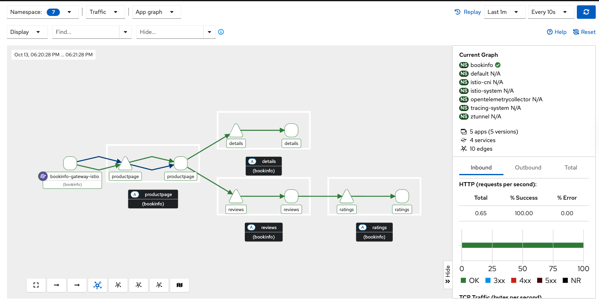

= Migrating from Sidecar to Ambient Mode

This guide provides a comprehensive, step-by-step process for migrating an existing Sail Operator deployment from sidecar mode to ambient mode. The migration approach is designed to achieve a near zero-downtime transition while maintaining all security policies and service mesh functionality.

== Table of Contents

- <<overview-of-sidecar-to-ambient-migration, 1. Overview of Sidecar to Ambient Migration>>
  - <<migration-strategy, 1.1 Migration Strategy>>
  - <<key-architectural-changes, 1.2 Key Architectural Changes>>
- <<prerequisites, 2. Prerequisites>>
  - <<technical-requirements, 2.1 Technical Requirements>>
    - <<cni-compatibility-requirements, 2.1.1 CNI Compatibility Requirements>>
    - <<waypoint-decision-framework, 2.1.2 Waypoint Decision Framework>>
  - <<compatibility-validation, 2.2 Compatibility Validation>>
  - <<pre-migration-checklist, 2.3 Pre-Migration Checklist>>
  - <<backup-existing-configuration, 2.4 Backup Existing Configuration>>
- <<migration-steps, 3. Migration Steps>>
  - <<step-1-prerequisites-validation, Step 1: Prerequisites Validation>>
  - <<step-2-cluster-setup-enable-ambient-support, Step 2: Cluster Setup - Enable Ambient Support>>
    - <<step-21-update-istio-configuration, Step 2.1 Update Istio Configuration>>
    - <<step-22-deploy-istio-cni-for-ambient, Step 2.2 Deploy Istio CNI for Ambient>>
    - <<step-23-deploy-ztunnel-proxies, Step 2.3 Deploy ZTunnel Proxies>>
  - <<step-3-update-sidecars-for-hbone-support, Step 3: Update Sidecars for HBONE Support>>
    - <<step-31-enable-hbone-protocol-support, Step 3.1 Enable HBONE Protocol Support>>
    - <<step-32-validate-hbone-capability, Step 3.2 Validate HBONE Capability>>
    - <<step-33-connectivity-validation, Step 3.3 Connectivity Validation>>
  - <<step-4-deploy-waypoint-proxies, Step 4: Deploy Waypoint Proxies>>
    - <<step-41-identify-services-requiring-l7-features, Step 4.1 Identify Services Requiring L7 Features>>
    - <<step-42-create-waypoint-configurations, Step 4.2 Create Waypoint Configurations>>
  - <<step-5-migrate-traffic-policies, Step 5: Migrate Traffic Policies>>
    - <<step-51-convert-virtualservices-to-httproutes, Step 5.1 Convert VirtualServices to HTTPRoutes>>
      - <<step-511-create-version-specific-services-required-for-httproute, Step 5.1.1 Create Version-Specific Services (Required for HTTPRoute)>>
      - <<step-512-convert-virtualservice-to-httproute, Step 5.1.2 Convert VirtualService to HTTPRoute>>
    - <<step-52-create-waypoint-targeted-authorization-policies, Step 5.2 Create Waypoint-Targeted Authorization Policies>>
    - <<step-53-add-ztunnel-bypass-protection-critical-security-step, Step 5.3 Add Ztunnel Bypass Protection (Critical Security Step)>>
  - <<step-6-enable-ambient-mode-for-applications, Step 6: Enable Ambient Mode for Applications>>
    - <<step-61-gradual-namespace-migration, Step 6.1 Gradual Namespace Migration>>
  - <<step-7-enable-waypoint-processing, Step 7: Enable Waypoint Processing>>
    - <<step-71-activate-waypoints-for-l7-processing, Step 7.1 Activate Waypoints for L7 Processing>>
    - <<step-72-validate-l7-policy-enforcement, Step 7.2 Validate L7 Policy Enforcement>>
  - <<step-8-policy-simplification, Step 8: Policy Simplification>>
    - <<step-81-remove-redundant-sidecar-policies, Step 8.1 Remove Redundant Sidecar Policies>>
  - <<step-9-remove-sidecar-injection, Step 9: Remove Sidecar Injection>>
    - <<step-91-disable-sidecar-injection, Step 9.1 Disable Sidecar Injection>>
    - <<step-92-validate-sidecar-removal, Step 9.2 Validate Sidecar Removal>>
- <<validation-and-testing, 4. Validation and Testing>>
  - <<migration-verification, 4.1 Migration Verification>>
- <<troubleshooting, 5. Troubleshooting>>
  - <<common-issues, 5.1 Common Issues>>
  - <<rollback-procedures, 5.2 Rollback Procedures>>
- <<post-migration-optimization, 6. Post-Migration Optimization>>
  - <<waypoint-right-sizing, 6.1 Waypoint Right-Sizing>>
  - <<observability-considerations, 6.2 Observability Considerations>>
  - <<configure-kiali-for-ambient-mode, 6.3 Configure Kiali for Ambient Mode>>
- <<additional-resources, 7. Additional Resources>>

---

[[overview-of-sidecar-to-ambient-migration]]
== 1. Overview of Sidecar to Ambient Migration

[[migration-strategy]]
=== 1.1 Migration Strategy

The migration from sidecar to ambient mode follows a structured, phased approach to ensure a smooth transition with minimal disruption. Key principles include:

1. **Gradual Transition**: Both sidecar and ambient proxies operate simultaneously during migration
2. **Service-by-Service**: Migration can occur incrementally, one service or namespace at a time
3. **Policy Preservation**: All existing security and traffic policies are maintained throughout the process
4. **Rollback Support**: Each step can be reversed if issues arise

[[key-architectural-changes]]
=== 1.2 Key Architectural Changes

[cols="1,2,2"]
|===
|Component |Sidecar Mode |Ambient Mode

|**L4 Processing**
|Envoy sidecar per pod
|ZTunnel node proxy (shared)

|**L7 Processing**
|Envoy sidecar per pod
|Waypoint proxy per namespace/service

|**mTLS Enforcement**
|Sidecar proxy
|ZTunnel proxy

|**Policy Enforcement**
|Sidecar proxy
|ZTunnel (L4) + Waypoint (L7)
|===

---

[[prerequisites]]
== 2. Prerequisites

For this migration we are going to use the bookinfo application as an example. You can use any application that is currently running with sidecar injection enabled.

[[technical-requirements]]
=== 2.1 Technical Requirements

Before starting migration, ensure your environment meets these requirements:

For Kubernetes:
- **Kubernetes 1.21+**: Minimum version for ambient mode support
- **Sail Operator v1.27+**: Must be running Sail Operator version 1.27 or later
- **Istio v1.27+**: Control plane must be v1.27 or later for ambient support
- **Cluster Admin Access**: Required for namespace labeling and resource creation

For Openshift:
- **Openshift 4.19+**: Minimum version for ambient mode support
- **Sail Operator v1.27+**: Must be running Sail Operator version 1.27 or later
- **Istio v1.27+**: Control plane must be v1.27 or later for ambient support
- **Cluster Admin Access**: Required for namespace labeling and resource creation

[[cni-compatibility-requirements]]
=== 2.1.1 CNI Compatibility Requirements

**CNI Configuration Validation:**
For Openshift clusters, the CNI must be `OVNKubernetes`. Other CNIs may work but are not officially supported. For Kubernetes, any CNI that supports NetworkPolicy should be compatible.

[source,console]
----
# Verify CNI type compatibility
kubectl get network.operator cluster -o jsonpath='{.spec.defaultNetwork.type}'
# Expected: OVNKubernetes for OCP clusters

# Check if multiple CNI plugins are configured
kubectl get network.operator cluster -o yaml | grep -A 10 "additionalNetworks"
----

[[waypoint-decision-framework]]
=== 2.1.2 Waypoint Decision Framework

A critical architectural decision involves whether to deploy waypoint proxies. This choice affects both functionality and performance:

**Option 1: Ztunnel-Only (No Waypoints)**
- **Maximum performance**: Minimal processing overhead
- **Automatic mTLS**: Transparent encryption between services
- **L4 policies**: Basic authorization and authentication
- **No L7 features**: Traffic routing, fault injection, L7 authorization

**Option 2: Ztunnel + Waypoint Proxies**
- **Full feature set**: All Istio traffic management and security features
- **L7 policies**: HTTP-level authorization, routing, telemetry
- **Gateway API support**: Modern traffic management APIs
- **Performance cost**: Similar to sidecar mode for L7 processing

**Decision Criteria:**
- **Use waypoints if**: You need traffic routing, L7 authorization, fault injection, or advanced observability
- **Skip waypoints if**: You only need mTLS and basic L4 security policies
- **Hybrid approach**: Deploy waypoints only for services requiring L7 features

This decision can be made per-namespace or per-service and changed after migration.

[[compatibility-validation]]
=== 2.2 Compatibility Validation

**Supported Features:**
- All L4 traffic policies (AuthorizationPolicy, PeerAuthentication)
- L7 traffic management (VirtualService, DestinationRule converted to HTTPRoute)
- Security policies (RequestAuthentication, AuthorizationPolicy)
- Telemetry and observability features

**Unsupported Features** (migration blockers):
- Multi-cluster mesh configurations
- Virtual Machine (VM) workload integration
- SPIRE integration for identity federation

[[pre-migration-checklist]]
=== 2.3 Pre-Migration Checklist

**Environment Validation:**
[source,console]
----
# Verify Sail Operator is deployed
kubectl get pods -n sail-operator
----

[source,console]
----
# Check Istio control plane version
kubectl get istio -n istio-system
NAME      NAMESPACE      PROFILE   REVISIONS   READY   IN USE   ACTIVE REVISION   STATUS    VERSION   AGE
default   istio-system             1           1       1        default           Healthy   v1.27.0   20m
----

[source,console]
----
# Verify no unsupported features are in use
kubectl get virtualservice,destinationrule,peerauthentication -A
----

Note: if you have any of the unsupported features listed above, we will need to resolve those before proceeding with the migration.

== Application Namespace Validation:

[source,console]
----
# Check your application namespaces for sidecar injection
kubectl get namespaces -l istio.io/rev=default
NAME       STATUS   AGE
bookinfo   Active   6m56
----

[source,console]
----
# Check current workloads with sidecar injection
kubectl get pods -n bookinfo
NAME                                      READY   STATUS    RESTARTS   AGE
bookinfo-gateway-istio-75d96b45d9-m65mq   1/1     Running   0          4m31s
details-v1-646f945867-2gg99               2/2     Running   0          6m6s
productpage-v1-7dbcd8849-4pmjt            2/2     Running   0          6m6s
ratings-v1-9bd8c8595-266zs                2/2     Running   0          6m6s
reviews-v1-5fd7b88d9-7vqxf                2/2     Running   0          6m5s
reviews-v2-54ff7fcf79-22k8r               2/2     Running   0          6m5s
reviews-v3-6445668877-gdr22               2/2     Running   0          6m5s
----

[source,console]
----
# Check current gateway API being used
kubectl get gateway -n bookinfo
NAME               CLASS   ADDRESS       PROGRAMMED   AGE
bookinfo-gateway   istio   10.0.147.96   True         5m41s
----

Note: You can check that your application is getting requests trough the mesh by using Kiali. For example, in the Bookinfo application, you should see traffic flowing between the services on every request to the productpage:

image:./images/kiali-bookinfo-traffic.png[Kiali Bookinfo Traffic]

For this migration example we are generating traffic to the productpage service using the following command:

[source,console]
----
# Generate traffic to productpage service
export INGRESS_HOST=$(kubectl get gtw bookinfo-gateway -n bookinfo -o jsonpath='{.status.addresses[0].value}')
export INGRESS_PORT=$(kubectl get gtw bookinfo-gateway -n bookinfo -o jsonpath='{.spec.listeners[?(@.name=="http")].port}')
export GATEWAY_URL=$INGRESS_HOST:$INGRESS_PORT
while true; do
  STATUS=$(curl -s -w "%{http_code}" -o /dev/null --connect-timeout 5 "http://$GATEWAY_URL/productpage")
  TIMESTAMP=$(date +'%Y-%m-%d %H:%M:%S')
  if [ "$STATUS" -eq 200 ]; then
    echo "[$TIMESTAMP] Request OK"
  else
    echo "[$TIMESTAMP] Request KO - Status code: $STATUS"
  fi
  sleep 1
done
----

[[backup-existing-configuration]]
=== 2.4 Backup Existing Configuration

Before starting migration, back up all existing Istio resources and namespace labels:
[source,console]
----
# Backup all Istio resources
kubectl get istio,istiocni,virtualservice,destinationrule,authorizationpolicy,requestauthentication -A -o yaml > istio-backup.yaml

# Backup namespace labels
kubectl get namespaces -o yaml > namespace-backup.yaml
----

**Note**: This backup is critical for rollback if issues arise during migration. Please add any resources specific to your environment that may not be covered here.

[[migration-steps]]
== 3. Migration Steps

This migration follows a structured step-by-step approach, with each step including detailed instructions, commands, and validation checks.

**Critical Sequencing Rules:**
- All waypoints must be enabled BEFORE removing any sidecars
- Policies must be migrated and validated BEFORE removing sidecar policies
- ZTunnel must be fully operational before enabling ambient mode

[[step-1-prerequisites-validation]]
=== Step 1: Prerequisites Validation

Before starting migration, validate your cluster meets all requirements

**Enhanced Policy Compatibility Check:**
[source,console]
----
# Check for Layer 7-only authorization policies that will require waypoints
kubectl get authorizationpolicy -A -o yaml | grep -E "(methods|paths|headers)" | grep -v "name:"

# Identify VirtualServices with subset-based routing requiring service migration
kubectl get virtualservice -A -o yaml | grep -B5 -A10 "subset:" | grep -E "(name:|subset:)"

# Check for unsupported features that need manual conversion
kubectl get virtualservice -A -o yaml | grep -E "(fault|delay|mirror)" | grep -v "name:"
----

**Migration Readiness Assessment:**
[source,console]
----
# List all resources that need conversion
echo "=== VirtualServices requiring HTTPRoute conversion ==="
kubectl get virtualservice -A --no-headers | wc -l

echo "=== DestinationRules with subsets requiring service creation ==="
kubectl get destinationrule -A -o yaml | grep -c "subset:"

echo "=== Authorization policies requiring waypoint deployment ==="
kubectl get authorizationpolicy -A -o yaml | grep -c -E "(methods|paths|headers)"
----

Note: You will need to resolve any unsupported features before proceeding. This includes:
- Converting VirtualServices and DestinationRules to HTTPRoute and Gateway resources
- Creating granular services to replace subset-based routing
- Identifying which policies require waypoint deployment for Layer 7 processing

[source,console]
----
# Check cluster CNI compatibility
kubectl get network.operator cluster -o jsonpath='{.spec.defaultNetwork.type}'
OVNKubernetes
----

**Migration Blockers (must resolve before proceeding):**
- Multi-cluster mesh configurations
- VM workload integration
- SPIRE integration
- Istio version < 1.27

**Step 1 Validation Checkpoint:**
[source,console]
----
# Ensure all prerequisites are met before proceeding
echo "=== Step 1 Validation ==="

# 1. Verify Sail Operator version is 1.27+# 2. Verify Istio version is 1.27+
ISTIO_VERSION=$(kubectl get istio -n istio-system -o jsonpath='{.items[0].status.version}')
echo "PASS: Istio version: $ISTIO_VERSION"

# 2. Verify no blocking features are present
BLOCKING_FEATURES=$(kubectl get virtualservice,destinationrule -A --no-headers 2>/dev/null | grep -E "DISABLE|multi-cluster|vm-" | wc -l)
if [[ "$BLOCKING_FEATURES" -eq 0 ]]; then
  echo "PASS: No blocking features detected"
else
  echo "FAIL: Found $BLOCKING_FEATURES blocking features - resolve before proceeding"
  exit 1
fi

# 3. Verify CNI compatibility
CNI_TYPE=$(kubectl get network.operator cluster -o jsonpath='{.spec.defaultNetwork.type}')
if [[ "$CNI_TYPE" == "OVNKubernetes" ]]; then
  echo "PASS: CNI compatible: $CNI_TYPE"
else
  echo "FAIL: CNI incompatible: $CNI_TYPE"
  exit 1
fi

echo "SUCCESS: Step 1 validation passed - ready to proceed to Step 2"
----

**If validation fails**: Resolve all issues before proceeding to Step 2.

[[step-2-cluster-setup-enable-ambient-support]]
=== Step 2: Cluster Setup - Enable Ambient Support

[[step-21-update-istio-configuration]]
==== Step 2.1 Update Istio Configuration

Update your existing Istio resource:

[source,yaml]
----
apiVersion: sailoperator.io/v1
kind: Istio
metadata:
  name: default
  namespace: istio-system
spec:
  version: v1.27.0
  namespace: istio-system
  updateStrategy:
    type: InPlace # Set your preferred update strategy
  profile: ambient
  values:
    pilot:
      trustedZtunnelNamespace: ztunnel
    # Preserve existing customizations
    # Add any existing values configuration here
----

Apply the updated configuration:
[source,console]
----
kubectl apply -f istio-ambient.yaml
kubectl wait --for=condition=Ready istios/default --timeout=5m
----

You can also update the Istio resource using the following command:
[source,console]
----
kubectl patch istio default -n istio-system --type merge -p '{"spec":{"profile":"ambient","values":{"pilot":{"trustedZtunnelNamespace":"ztunnel"}}}}'
----

[[step-22-deploy-istio-cni-for-ambient]]
==== Step 2.2 Deploy Istio CNI for Ambient

Create or update the IstioCNI resource:

[source,yaml]
----
apiVersion: sailoperator.io/v1
kind: IstioCNI
metadata:
  name: default
spec:
  namespace: istio-cni
  profile: ambient
----

Apply the CNI configuration:
[source,console]
----
kubectl apply -f istio-cni-ambient.yaml
kubectl wait --for=condition=Ready istiocnis/default --timeout=3m
----

You can also apply the CNI configuration using the following command:
[source,console]
----
kubectl patch istiocni default --type merge -p '{"spec":{"profile":"ambient"}}'
----

[[step-23-deploy-ztunnel-proxies]]
==== Step 2.3 Deploy ZTunnel Proxies

Create the ZTunnel namespace and resource:

[source,console]
----
kubectl create namespace ztunnel
# If you are using discoverySelectors, label the namespace accordingly
kubectl label namespace ztunnel istio-discovery=enabled
----

[source,yaml]
----
apiVersion: sailoperator.io/v1alpha1
kind: ZTunnel
metadata:
  name: default
spec:
  namespace: ztunnel
  profile: ambient
----

[source,console]
----
kubectl apply -f ztunnel.yaml
kubectl wait --for=condition=Ready ztunnel/default --timeout=3m
----

**Validation:**
[source,console]
----
# Verify ZTunnel pods are running on all nodes
kubectl get pods -n ztunnel -o wide
kubectl get daemonset -n ztunnel
----

[source,console]
----
# Confirm cluster setup validation passes
$ kubectl get ztunnel -n ztunnel
NAME      NAMESPACE   PROFILE   READY   STATUS    VERSION   AGE
default   ztunnel               True    Healthy   v1.27.0   12m
----

**Step 2 Validation Checkpoint:**
[source,console]
----
echo "=== Step 2 Validation ==="

# 1. Verify Istio is configured for ambient mode
ISTIO_PROFILE=$(kubectl get istio default -n istio-system -o jsonpath='{.spec.profile}')
if [[ "$ISTIO_PROFILE" == "ambient" ]]; then
  echo "PASS: Istio profile: $ISTIO_PROFILE"
else
  echo "FAIL: Istio profile is not 'ambient': $ISTIO_PROFILE"
  exit 1
fi

# 2. Verify Istio is ready
ISTIO_STATUS=$(kubectl get istio default -n istio-system -o jsonpath='{.status.state}')
if [[ "$ISTIO_STATUS" == "Healthy" ]]; then
  echo "PASS: Istio status: $ISTIO_STATUS"
else
  echo "FAIL: Istio not healthy: $ISTIO_STATUS"
  exit 1
fi

# 3. Verify IstioCNI is configured for ambient
CNI_PROFILE=$(kubectl get istiocni default -o jsonpath='{.spec.profile}')
if [[ "$CNI_PROFILE" == "ambient" ]]; then
  echo "PASS: IstioCNI profile: $CNI_PROFILE"
else
  echo "FAIL: IstioCNI profile is not 'ambient': $CNI_PROFILE"
  exit 1
fi

# 4. Verify IstioCNI is ready
CNI_STATUS=$(kubectl get istiocni default -o jsonpath='{.status.state}')
if [[ "$CNI_STATUS" == "Healthy" ]]; then
  echo "PASS: IstioCNI status: $CNI_STATUS"
else
  echo "FAIL: IstioCNI not healthy: $CNI_STATUS"
  exit 1
fi

# 5. Verify ZTunnel is deployed and ready
ZTUNNEL_STATUS=$(kubectl get ztunnel default -n ztunnel -o jsonpath='{.status.state}')
if [[ "$ZTUNNEL_STATUS" == "Healthy" ]]; then
  echo "PASS: ZTunnel status: $ZTUNNEL_STATUS"
else
  echo "FAIL: ZTunnel not healthy: $ZTUNNEL_STATUS"
  exit 1
fi

# 6. Verify ZTunnel pods are running on all nodes
EXPECTED_NODES=$(kubectl get nodes --no-headers | wc -l)
ZTUNNEL_PODS=$(kubectl get pods -n ztunnel --no-headers | grep -c Running)
if [[ "$ZTUNNEL_PODS" -eq "$EXPECTED_NODES" ]]; then
  echo "PASS: ZTunnel pods running: $ZTUNNEL_PODS/$EXPECTED_NODES"
else
  echo "FAIL: ZTunnel pods not ready: $ZTUNNEL_PODS/$EXPECTED_NODES"
  exit 1
fi

echo "PASS: Step 2 validation passed - ready to proceed to Step 3"
----

**If validation fails**: Check Istio, IstioCNI, and ZTunnel logs before proceeding.

**Rollback Decision Point**: If Step 2 validation fails and cannot be resolved, you can safely rollback:
[source,console]
----
# Rollback to sidecar mode
kubectl patch istio default -n istio-system --type merge -p '{"spec":{"profile":"default"}}'
kubectl patch istiocni default --type merge -p '{"spec":{"profile":"default"}}'
kubectl delete ztunnel default -n ztunnel
kubectl delete namespace ztunnel
----
**Risk**: Low - No application traffic affected.

[[step-3-update-sidecars-for-hbone-support]]
=== Step 3: Update Sidecars for HBONE Support

[[step-31-enable-hbone-protocol-support]]
==== Step 3.1 Enable HBONE Protocol Support

Existing sidecars need to support the HBONE protocol. Restart deployments in all sidecar-injected namespaces:

[source,console]
----
# Restart workloads in each application namespace
kubectl rollout restart deployment -n bookinfo

# Verify pods have restarted with ambient-aware sidecars
kubectl get pods -n bookinfo
----
Note: during the restart, sidecars will be updated to support HBONE while still functioning as traditional sidecars.

[[step-32-validate-hbone-capability]]
==== Step 3.2 Validate HBONE Capability

Check that sidecars now support HBONE protocol:
[source,console]
----
# Verify sidecar version supports ambient (example with productpage)
kubectl exec -n bookinfo $(kubectl get pods -n bookinfo -l app=productpage -o jsonpath='{.items[0].metadata.name}') -c istio-proxy -- pilot-agent version
----

[source,console]
----
client version: version.BuildInfo{Version:"1.27.0", GitRevision:"8dad717f74fbffd463595039148f9ec2148fa5fc", GolangVersion:"go1.24.4 (Red Hat 1.24.4-2.el9) X:strictfipsruntime", BuildStatus:"Clean", GitTag:"1.27.0"}
----

[source,console]
----
# Check for HBONE is enable in sidecar
kubectl get pod $(kubectl get pods -n bookinfo -l app=reviews -o jsonpath='{.items[0].metadata.name}') -n bookinfo -o yaml | yq '.spec.containers[] | select(.name=="istio-proxy") | .env[] | select(.name=="PROXY_CONFIG")'
----

[source,console]
----
name: PROXY_CONFIG
value: |
  {"proxyMetadata":{"ISTIO_META_ENABLE_HBONE":"true"},"image":{"imageType":"distroless"}}
----

As shown above, the `ISTIO_META_ENABLE_HBONE` environment variable is set to `true`, indicating HBONE support is enabled.

[[step-33-connectivity-validation]]
==== Step 3.3 Connectivity Validation
Send requests to ensure connectivity remains intact:
[source,console]
----
# Test service connectivity through sidecars
kubectl exec $(kubectl get pods -n bookinfo -l app=reviews -o jsonpath='{.items[0].metadata.name}') -n bookinfo -- curl http://reviews.bookinfo:9080/reviews/1
----

[source,json]
----
{
  "id": "1",
  "podname": "reviews-v1-75797bd984-7b5g6",
  "clustername": "null",
  "reviews": [
    {
      "reviewer": "Reviewer1",
      "text": "An extremely entertaining play by Shakespeare. The play lacks thematic depth when compared to other plays by the author."
    },
    {
      "reviewer": "Reviewer2",
      "text": "Absolutely fun and entertaining. The play lacks thematic depth when compared to other plays by Shakespeare."
    }
  ]
}
----

Note: At this point, sidecars are fully functional with HBONE support, but traffic is still flowing through the sidecars as before.

**Critical**: Do NOT remove sidecars yet. They must remain until waypoints are fully deployed and active in Step 7.

Test connectivity from outside the mesh:
[source,console]
----
# Test ingress connectivity
curl -s http://$GATEWAY_URL/productpage | grep title
----

[source,html]
----
<title>Simple Bookstore App</title>
----

Traffic should continue flowing as before. This confirms that sidecars are still handling traffic.

**Step 3 Validation Checkpoint:**
[source,console]
----
echo "=== Step 3 Validation ==="

# 1. Verify all pods have been restarted and are running
NAMESPACE="bookinfo"  # Adjust for your namespace
READY_PODS=$(kubectl get pods -n $NAMESPACE --no-headers | grep -c "2/2.*Running")

echo "Total pods running with sidecars: $READY_PODS"
if [[ "$READY_PODS" -gt 0 ]]; then
  echo "PASS: All pods restarted and running"
else
  echo "FAIL: Some pods not running after restart"
  exit 1
fi

# 2. Verify HBONE is enabled in sidecars
HBONE_ENABLED=$(kubectl get pod -n $NAMESPACE -l app=productpage -o yaml | grep -c "ISTIO_META_ENABLE_HBONE.*true")
if [[ "$HBONE_ENABLED" -gt 0 ]]; then
  echo "PASS: HBONE enabled in sidecars"
else
  echo "FAIL: HBONE not enabled in sidecars"
  exit 1
fi

# 3. Test internal service connectivity
TEST_POD=$(kubectl get pods -n $NAMESPACE -l app=reviews -o jsonpath='{.items[0].metadata.name}')
HTTP_STATUS=$(kubectl exec $TEST_POD -n $NAMESPACE -- curl -s -w "%{http_code}" -o /dev/null http://reviews.$NAMESPACE:9080/reviews/1)
if [[ "$HTTP_STATUS" == "200" ]]; then
  echo "PASS: Internal service connectivity working"
else
  echo "FAIL: Internal service connectivity failed: HTTP $HTTP_STATUS"
  exit 1
fi

# 4. Test external connectivity (if gateway configured)
if [[ -n "$GATEWAY_URL" ]]; then
  EXTERNAL_STATUS=$(curl -s -w "%{http_code}" -o /dev/null --connect-timeout 5 "http://$GATEWAY_URL/productpage")
  if [[ "$EXTERNAL_STATUS" == "200" ]]; then
    echo "PASS: External connectivity working"
  else
    echo "FAIL: External connectivity failed: HTTP $EXTERNAL_STATUS"
    exit 1
  fi
fi

echo "PASS: Step 3 validation passed - ready to proceed to Step 4"
----

**If validation fails**: Check pod logs and verify sidecar injection is still working.

**Rollback Decision Point**: If Step 3 validation fails, rollback the pod restarts:
[source,console]
----
# Rollback pods to previous version (if they fail to restart properly)
kubectl rollout undo deployment -n bookinfo
----
**Risk**: Low - Sidecars still active, no ambient components affecting traffic yet.

[[step-4-deploy-waypoint-proxies]]
=== Step 4: Deploy Waypoint Proxies

[[step-41-identify-services-requiring-l7-features]]
==== Step 4.1 Identify Services Requiring L7 Features

Analyze your current configuration to identify services that need waypoint proxies:

[source,console]
----
# Check for existing L7 policies that will need waypoints
kubectl get virtualservice,httproute -A
kubectl get authorizationpolicy -A -o yaml | grep -A 10 -B 5 "rules.*methods\|operation"
----

[[step-42-create-waypoint-configurations]]
==== Step 4.2 Create Waypoint Configurations

Create waypoints for namespaces requiring L7 processing:

**Waypoint for bookinfo namespace:**
[source,yaml]
----
apiVersion: gateway.networking.k8s.io/v1
kind: Gateway
metadata:
  name: waypoint
  namespace: bookinfo
  labels:
    istio.io/waypoint-for: service
spec:
  gatewayClassName: istio-waypoint
  listeners:
  - name: mesh
    port: 15008
    protocol: HBONE
----

Apply the waypoint configurations:
[source,console]
----
kubectl apply -f waypoint-bookinfo.yaml

# Verify waypoints are created but not yet active
kubectl get gateway -n bookinfo
----

**Important**: Deploying waypoints does NOT activate them. They remain dormant until explicitly enabled.

**Step 4 Validation Checkpoint:**
[source,console]
----
echo "=== Step 4 Validation ==="

NAMESPACE="bookinfo"  # Adjust for your namespace

# 1. Verify waypoint gateway is created
WAYPOINT_EXISTS=$(kubectl get gateway waypoint -n $NAMESPACE --no-headers 2>/dev/null | wc -l)
if [[ "$WAYPOINT_EXISTS" -eq 1 ]]; then
  echo "PASS: Waypoint gateway created"
else
  echo "FAIL: Waypoint gateway not found"
  exit 1
fi

# 2. Verify waypoint has correct configuration
WAYPOINT_CLASS=$(kubectl get gateway waypoint -n $NAMESPACE -o jsonpath='{.spec.gatewayClassName}')
if [[ "$WAYPOINT_CLASS" == "istio-waypoint" ]]; then
  echo "PASS: Waypoint gateway class: $WAYPOINT_CLASS"
else
  echo "FAIL: Incorrect waypoint gateway class: $WAYPOINT_CLASS"
  exit 1
fi

# 3. Verify waypoint proxy deployment is created
WAYPOINT_DEPLOY=$(kubectl get deployment -n $NAMESPACE -l gateway.networking.k8s.io/gateway-name=waypoint --no-headers 2>/dev/null | wc -l)
if [[ "$WAYPOINT_DEPLOY" -eq 1 ]]; then
  echo "PASS: Waypoint deployment created"
else
  echo "FAIL: Waypoint deployment not found"
  exit 1
fi

# 4. Verify waypoint pod is running
WAYPOINT_POD_STATUS=$(kubectl get pods -n $NAMESPACE -l gateway.networking.k8s.io/gateway-name=waypoint -o jsonpath='{.items[0].status.phase}' 2>/dev/null)
if [[ "$WAYPOINT_POD_STATUS" == "Running" ]]; then
  echo "PASS: Waypoint pod running"
else
  echo "FAIL: Waypoint pod not running: $WAYPOINT_POD_STATUS"
  exit 1
fi

# 5. Verify waypoint is not yet active (namespace should not have use-waypoint label)
USE_WAYPOINT=$(kubectl get namespace $NAMESPACE -o jsonpath='{.metadata.labels.istio\.io/use-waypoint}' 2>/dev/null)
if [[ -z "$USE_WAYPOINT" ]]; then
  echo "PASS: Waypoint deployed but not active (as expected)"
else
  echo "FAIL: Waypoint unexpectedly active: $USE_WAYPOINT"
  exit 1
fi

echo "PASS: Step 4 validation passed - ready to proceed to Step 5"
----

**If validation fails**: Check waypoint deployment logs and Gateway API CRDs installation.

**Rollback Decision Point**: If Step 4 validation fails, remove waypoint resources:
[source,console]
----
# Remove waypoint resources
kubectl delete gateway waypoint -n bookinfo
# Waypoint deployments will be automatically cleaned up
----
**Risk**: Low - Waypoints are dormant and not affecting traffic flow.

[[step-5-migrate-traffic-policies]]
=== Step 5: Migrate Traffic Policies

[[step-51-convert-virtualservices-to-httproutes]]
==== Step 5.1 Convert VirtualServices to HTTPRoutes

[[step-511-create-version-specific-services-required-for-httproute]]
==== Step 5.1.1 Create Version-Specific Services (Required for HTTPRoute)

Before creating HTTPRoute resources, you must create granular services for each version since Gateway API doesn't support DestinationRule subsets, for example for the reviews service:

[source,yaml]
----
apiVersion: v1
kind: Service
metadata:
  name: reviews-v1
  namespace: bookinfo
spec:
  selector:
    app: reviews
    version: v1
  ports:
  - name: http
    port: 9080
    targetPort: 9080
---
apiVersion: v1
kind: Service
metadata:
  name: reviews-v2
  namespace: bookinfo
spec:
  selector:
    app: reviews
    version: v2
  ports:
  - name: http
    port: 9080
    targetPort: 9080
---
apiVersion: v1
kind: Service
metadata:
  name: reviews-v3
  namespace: bookinfo
spec:
  selector:
    app: reviews
    version: v3
  ports:
  - name: http
    port: 9080
    targetPort: 9080
----

Apply the version-specific services:
[source,console]
----
kubectl apply -f reviews-version-services.yaml
----

[[step-512-convert-virtualservice-to-httproute]]
==== Step 5.1.2 Convert VirtualService to HTTPRoute

Convert existing VirtualService resources to Gateway API HTTPRoute:

**Before (VirtualService):**
[source,yaml]
----
apiVersion: networking.istio.io/v1beta1
kind: VirtualService
metadata:
  name: reviews
  namespace: bookinfo
spec:
  hosts:
  - reviews
  http:
  - match:
    - headers:
        end-user:
          exact: jason
    route:
    - destination:
        host: reviews
        subset: v2
  - route:
    - destination:
        host: reviews
        subset: v1
----

**After (HTTPRoute):**
[source,yaml]
----
apiVersion: gateway.networking.k8s.io/v1
kind: HTTPRoute
metadata:
  name: reviews
  namespace: bookinfo
spec:
  parentRefs:
  - group: ""
    kind: Service
    name: reviews
    port: 9080
  rules:
  - matches:
    - headers:
      - name: end-user
        value: jason
    backendRefs:
    - name: reviews-v2
      port: 9080
  - backendRefs:
    - name: reviews-v1
      port: 9080
----

[[step-52-create-waypoint-targeted-authorization-policies]]
==== Step 5.2 Create Waypoint-Targeted Authorization Policies

Create waypoint-targeted authorization policies while maintaining existing sidecar policies during transition. For the bookinfo application, we need to create policies that match the actual service account structure:

**Complete Authorization Policies for Bookinfo:**

[source,yaml]
----
# ProductPage service authorization - allows traffic from gateway
apiVersion: security.istio.io/v1
kind: AuthorizationPolicy
metadata:
  name: productpage-waypoint
  namespace: bookinfo
spec:
  targetRefs:
  - kind: Service
    group: ""
    name: productpage
  action: ALLOW
  rules:
  - from:
    - source:
        principals:
        - cluster.local/ns/bookinfo/sa/bookinfo-gateway-istio
    to:
    - operation:
        methods: ["GET", "POST"]
---
# Reviews service authorization - allows traffic from productpage
apiVersion: security.istio.io/v1
kind: AuthorizationPolicy
metadata:
  name: reviews-waypoint
  namespace: bookinfo
spec:
  targetRefs:
  - kind: Service
    group: ""
    name: reviews
  action: ALLOW
  rules:
  - from:
    - source:
        principals:
        - cluster.local/ns/bookinfo/sa/bookinfo-productpage
    to:
    - operation:
        methods: ["GET"]
---
# Ratings service authorization - allows traffic from reviews
apiVersion: security.istio.io/v1
kind: AuthorizationPolicy
metadata:
  name: ratings-waypoint
  namespace: bookinfo
spec:
  targetRefs:
  - kind: Service
    group: ""
    name: ratings
  action: ALLOW
  rules:
  - from:
    - source:
        principals:
        - cluster.local/ns/bookinfo/sa/bookinfo-reviews
    to:
    - operation:
        methods: ["GET"]
---
# Details service authorization - allows traffic from productpage
apiVersion: security.istio.io/v1
kind: AuthorizationPolicy
metadata:
  name: details-waypoint
  namespace: bookinfo
spec:
  targetRefs:
  - kind: Service
    group: ""
    name: details
  action: ALLOW
  rules:
  - from:
    - source:
        principals:
        - cluster.local/ns/bookinfo/sa/bookinfo-productpage
    to:
    - operation:
        methods: ["GET"]
----

**Apply the authorization policies:**
[source,console]
----
kubectl apply -f bookinfo-waypoint-authz-policies.yaml
----

**Verify the service accounts in your bookinfo deployment:**
[source,console]
----
# Check actual service accounts used by bookinfo pods
kubectl get pods -n bookinfo -o jsonpath='{range .items[*]}{.metadata.name}{"\t"}{.spec.serviceAccountName}{"\n"}{end}'
----

**Note**: The service account names above (`bookinfo-gateway-istio`, `bookinfo-productpage`, `bookinfo-reviews`) should match your actual deployment. Adjust the principal names if your service accounts use different naming conventions.

Apply waypoint policies while keeping existing sidecar policies:
[source,console]
----
kubectl apply -f productpage-waypoint-policy.yaml
kubectl apply -f reviews-waypoint-policy.yaml
----

[source,console]
----
# Verify policies are created
$ kubectl get authorizationpolicy -n bookinfo
NAME                             ACTION   AGE
productpage-waypoint             ALLOW    18s
productpage-ztunnel-protection   DENY     7s
reviews-waypoint                 ALLOW    17s
reviews-ztunnel-protection       DENY     6s
----

[[step-53-add-ztunnel-bypass-protection-critical-security-step]]
==== Step 5.3 Add Ztunnel Bypass Protection (Critical Security Step)

**Security Warning**: In ambient mode, waypoint-targeted policies can be bypassed if traffic flows directly through ztunnel, because the ztunnel itself cannot enforce Layer 7 (L7) policies. Add protection policies to prevent this:

[source,yaml]
----
apiVersion: security.istio.io/v1
kind: AuthorizationPolicy
metadata:
  name: productpage-ztunnel-protection
  namespace: bookinfo
spec:
  targetRefs:
  - kind: Service
    group: ""
    name: productpage
  action: DENY
  rules:
  - when:
    - key: source.workload_name
      notValues: ["waypoint"]
---
apiVersion: security.istio.io/v1
kind: AuthorizationPolicy
metadata:
  name: reviews-ztunnel-protection
  namespace: bookinfo
spec:
  targetRefs:
  - kind: Service
    group: ""
    name: reviews
  action: DENY
  rules:
  - when:
    - key: source.workload_name
      notValues: ["waypoint"]
----

Apply the protection policies:
[source,console]
----
kubectl apply -f ztunnel-protection-policies.yaml
----

**Critical**: Keep existing sidecar policies active until Policy Simplification step.

**Step 5 Validation Checkpoint:**
[source,console]
----
echo "=== Step 5 Validation ==="

NAMESPACE="bookinfo"  # Adjust for your namespace

# 1. Verify version-specific services are created
VERSION_SERVICES=$(kubectl get service -n $NAMESPACE | grep -c "reviews-v[123]")
if [[ "$VERSION_SERVICES" -eq 3 ]]; then
  echo "PASS: Version-specific services created: $VERSION_SERVICES"
else
  echo "FAIL: Version-specific services missing: found $VERSION_SERVICES, expected 3"
  exit 1
fi

# 2. Verify HTTPRoute is created (if applicable)
HTTPROUTE_EXISTS=$(kubectl get httproute -n $NAMESPACE --no-headers 2>/dev/null | wc -l)
if [[ "$HTTPROUTE_EXISTS" -gt 0 ]]; then
  echo "PASS: HTTPRoute(s) created: $HTTPROUTE_EXISTS"
else
  echo "WARNING:  No HTTPRoutes found (acceptable if using VirtualServices)"
fi

# 3. Verify waypoint-targeted authorization policies are created
WAYPOINT_AUTHZ=$(kubectl get authorizationpolicy -n $NAMESPACE | grep -c "waypoint")
if [[ "$WAYPOINT_AUTHZ" -gt 0 ]]; then
  echo "PASS: Waypoint authorization policies created: $WAYPOINT_AUTHZ"
else
  echo "FAIL: No waypoint authorization policies found"
  exit 1
fi

# 4. Verify ztunnel protection policies are created
PROTECTION_POLICIES=$(kubectl get authorizationpolicy -n $NAMESPACE | grep -c "protection")
if [[ "$PROTECTION_POLICIES" -gt 0 ]]; then
  echo "PASS: ZTunnel protection policies created: $PROTECTION_POLICIES"
else
  echo "FAIL: No ztunnel protection policies found"
  exit 1
fi

# 5. Verify policies have correct target references
TARGETREF_POLICIES=$(kubectl get authorizationpolicy -n $NAMESPACE -o yaml | grep -c "targetRefs")
if [[ "$TARGETREF_POLICIES" -gt 0 ]]; then
  echo "PASS: Policies using targetRefs: $TARGETREF_POLICIES"
else
  echo "FAIL: No policies using targetRefs found"
  exit 1
fi

# 6. Test that services are still accessible (policies not yet enforced)
TEST_POD=$(kubectl get pods -n $NAMESPACE -l app=reviews -o jsonpath='{.items[0].metadata.name}')
HTTP_STATUS=$(kubectl exec $TEST_POD -n $NAMESPACE -- curl -s -w "%{http_code}" -o /dev/null http://reviews.$NAMESPACE:9080/reviews/1)
if [[ "$HTTP_STATUS" == "200" ]]; then
  echo "PASS: Service connectivity still working"
else
  echo "FAIL: Service connectivity failed: HTTP $HTTP_STATUS"
  exit 1
fi

echo "PASS: Step 5 validation passed - ready to proceed to Step 6"
----

**If validation fails**: Verify policy syntax and ensure existing sidecar policies are still active.

**Rollback Decision Point**: If Step 5 validation fails, remove new policies:
[source,console]
----
# Remove waypoint-targeted policies if they cause issues
kubectl delete authorizationpolicy -n bookinfo -l migration=waypoint
kubectl delete httproute -n bookinfo --all
# Keep original VirtualServices and sidecar policies active
----
**Risk**: Medium - Policy conflicts could affect traffic, but sidecar policies remain active.

[[step-6-enable-ambient-mode-for-applications]]
=== Step 6: Enable Ambient Mode for Applications

[[step-61-gradual-namespace-migration]]
==== Step 6.1 Gradual Namespace Migration

We recommend enabling ambient mode one namespace at a time, starting with the least critical. For our example, we will continue with the `bookinfo` namespace.

[source,console]
----
kubectl label namespace bookinfo istio.io/dataplane-mode=ambient
----

[source,console]
----
# Verify ztunnel configuration for each namespace
$ istioctl ztunnel-config workloads --namespace ztunnel | grep bookinfo
bookinfo                                         bookinfo-gateway-istio-6b9cf4b8c8-xxsq2                     10.128.2.58   user-rhos-d-4-9b684-worker-0-4fhm6 None     TCP
bookinfo                                         details-v1-bb955f94b-4sppn                                  10.128.2.59   user-rhos-d-4-9b684-worker-0-4fhm6 None     HBONE
bookinfo                                         productpage-v1-c4cb9cb4b-ghzwc                              10.128.2.60   user-rhos-d-4-9b684-worker-0-4fhm6 None     HBONE
bookinfo                                         ratings-v1-bc5f6b4fd-qvr6m                                  10.128.2.61   user-rhos-d-4-9b684-worker-0-4fhm6 None     HBONE
bookinfo                                         reviews-v1-9db68f4d-v4cnb                                   10.128.2.62   user-rhos-d-4-9b684-worker-0-4fhm6 None     HBONE
bookinfo                                         reviews-v2-646d654b58-gmht2                                 10.128.2.63   user-rhos-d-4-9b684-worker-0-4fhm6 None     HBONE
bookinfo                                         reviews-v3-86bb4fb6fb-b946t                                 10.128.2.64   user-rhos-d-4-9b684-worker-0-4fhm6 None     HBONE
bookinfo                                         waypoint-58cdc7f494-98h79                                   10.128.2.65   user-rhos-d-4-9b684-worker-0-4fhm6 None     TCP
----

**Validation after each namespace:**
[source,console]
----
# Test connectivity after enabling each namespace, e.g., bookinfo
kubectl exec -n bookinfo $(kubectl get pods -n bookinfo -l app=reviews -o jsonpath='{.items[0].metadata.name}') -- curl http://reviews.bookinfo:9080/
----

**Step 6 Validation Checkpoint:**
[source,console]
----
echo "=== Step 6 Validation ==="

NAMESPACE="bookinfo"  # Adjust for your namespace

# 1. Verify namespace has ambient mode label
AMBIENT_MODE=$(kubectl get namespace $NAMESPACE -o jsonpath='{.metadata.labels.istio\.io/dataplane-mode}')
if [[ "$AMBIENT_MODE" == "ambient" ]]; then
  echo "PASS: Namespace in ambient mode: $AMBIENT_MODE"
else
  echo "FAIL: Namespace not in ambient mode: $AMBIENT_MODE"
  exit 1
fi

# 2. Verify workloads are recognized by ztunnel
WORKLOAD_COUNT=$(istioctl ztunnel-config workloads --namespace ztunnel | grep $NAMESPACE | grep HBONE | wc -l)
if [[ "$WORKLOAD_COUNT" -gt 0 ]]; then
  echo "PASS: Workloads detected by ztunnel: $WORKLOAD_COUNT"
else
  echo "FAIL: No workloads detected by ztunnel in $NAMESPACE"
  exit 1
fi

# 3. Verify pods still have sidecars (should not be removed yet)
SIDECAR_COUNT=$(kubectl get pods -n $NAMESPACE --no-headers | grep -c "2/2.*Running")
EXPECTED_PODS=$(kubectl get deployment -n $NAMESPACE --no-headers | wc -l)
if [[ "$SIDECAR_COUNT" -eq "$EXPECTED_PODS" ]]; then
  echo "PASS: Sidecars still present: $SIDECAR_COUNT/$EXPECTED_PODS"
else
  echo "FAIL: Sidecars missing: $SIDECAR_COUNT/$EXPECTED_PODS"
  exit 1
fi

# 4. Test connectivity still works
TEST_POD=$(kubectl get pods -n $NAMESPACE -l app=reviews -o jsonpath='{.items[0].metadata.name}')
HTTP_STATUS=$(kubectl exec $TEST_POD -n $NAMESPACE -- curl -s -w "%{http_code}" -o /dev/null http://reviews.$NAMESPACE:9080/reviews/1)
if [[ "$HTTP_STATUS" == "200" ]]; then
  echo "PASS: Service connectivity working in ambient mode"
else
  echo "FAIL: Service connectivity failed: HTTP $HTTP_STATUS"
  exit 1
fi

# 5. Verify traffic is using HBONE protocol
HBONE_TRAFFIC=$(istioctl ztunnel-config workloads --namespace ztunnel | grep $NAMESPACE | grep -c "HBONE")
if [[ "$HBONE_TRAFFIC" -gt 0 ]]; then
  echo "PASS: HBONE protocol active: $HBONE_TRAFFIC workloads"
else
  echo "FAIL: HBONE protocol not active"
  exit 1
fi

echo "PASS: Step 6 validation passed - ready to proceed to Step 7"
----

**If validation fails**: Check ztunnel logs and verify namespace labels are correct.

**Rollback Decision Point**: If Step 6 validation fails, disable ambient mode:
[source,console]
----
# Disable ambient mode for the namespace
kubectl label namespace bookinfo istio.io/dataplane-mode-
# Traffic will continue through sidecars
----
**Risk**: High - This is the critical transition point. Test thoroughly before proceeding.

[[step-7-enable-waypoint-processing]]
=== Step 7: Enable Waypoint Processing

[[step-71-activate-waypoints-for-l7-processing]]
==== Step 7.1 Activate Waypoints for L7 Processing

**Critical Sequencing**: Only activate waypoints AFTER all required namespaces are in ambient mode.

[source,console]
----
# Enable waypoint for bookinfo first
kubectl label namespace bookinfo istio.io/use-waypoint=waypoint

# Verify waypoint activation
kubectl get pods -n bookinfo -l gateway.networking.k8s.io/gateway-name=waypoint
----

[[step-72-validate-l7-policy-enforcement]]
==== Step 7.2 Validate L7 Policy Enforcement

Test that L7 policies are now enforced through waypoints (L7 policies should work as before after waypoint activation):

[source,console]
----
# Test authorization policies work through waypoint (use correct endpoint)
kubectl exec -n bookinfo $(kubectl get pods -n bookinfo -l app=reviews -o jsonpath='{.items[0].metadata.name}') -- curl -v http://reviews.bookinfo:9080/reviews/1
{"id": "1","podname": "reviews-v3-dd9d6fc89-6glvk","clustername": "null","reviews": [{  "reviewer": "Reviewer1",  "text": "An extremely entertaining play by Shakespeare. The slapstick humor is refreshing!", "rating": {"stars": 5, "color": "red"}},{  "reviewer": "Reviewer2",  "text": "Absolutely fun and entertaining. The play lacks thematic depth when compared to other plays by Shakespeare.", "rating": {"stars": 4, "color": "red"}}]}* Mark bundle as not supporting multiuse
< HTTP/1.1 200 OK
< x-powered-by: Servlet/3.1
< content-type: application/json
< date: Mon, 13 Oct 2025 16:13:58 GMT
< content-language: en-US
< content-length: 437
< x-envoy-upstream-service-time: 41
< server: envoy
<
{ [437 bytes data]
100   437  100   437    0     0   9340      0 --:--:-- --:--:-- --:--:--  9500
* Connection #0 to host reviews.bookinfo left intact
----

[source,console]
----
# Test traffic routing through waypoint with header
$ kubectl exec -n bookinfo $(kubectl get pods -n bookinfo -l app=reviews -o jsonpath='{.items[0].metadata.name}') -- curl -H "end-user: jason" http://reviews.bookinfo:9080/reviews/1
% Total    % Received % Xferd  Average Speed   Time    Time     Time  Current
                               Dload  Upload   Total   Spent    Left  Speed
0     0    0     0    0     0      0      0 --:--:-- --:--:-- --:--:--     0{"id": "1","podname": "reviews-v2-67ff7bcdc5-kklgl","clustername":"null","reviews": [{  "reviewer": "Reviewer1",  "text": "An extremely entertaining play by Shakespeare. The slapstick humor is refreshing!","rating": {"stars": 5, "color": "black"}},{  "reviewer": "Reviewer2",  "text": "Absolutely fun and entertaining. The play lacks thematic depthwhen compared to other plays by Shakespeare.100   442  100   442    0     0   3306      0 --:--:-- --:--:-- --:--:--  3323
----

**Critical Identity Security Consideration**:

Waypoints do not spoof client identity. When ztunnel processes traffic from waypoints, it sees the waypoint's identity, not the original client's identity. This has important implications:

1. **Authorization policies targeting client identities must be applied at the waypoint level**, not at the ztunnel level
2. **Ztunnel-level policies will see all traffic as coming from the waypoint**
3. **Client identity validation should be configured in waypoint-targeted policies**

Ensure your authorization policies account for this identity behavior when validating security enforcement.

**Critical**: Enable ALL required waypoints before removing ANY sidecars to maintain policy enforcement.

**Step 7 Validation Checkpoint:**
[source,console]
----
echo "=== Step 7 Validation ==="

NAMESPACE="bookinfo"  # Adjust for your namespace

# 1. Verify namespace has use-waypoint label
USE_WAYPOINT=$(kubectl get namespace $NAMESPACE -o jsonpath='{.metadata.labels.istio\.io/use-waypoint}')
if [[ "$USE_WAYPOINT" == "waypoint" ]]; then
  echo "PASS: Waypoint activated for namespace: $USE_WAYPOINT"
else
  echo "FAIL: Waypoint not activated: $USE_WAYPOINT"
  exit 1
fi

# 2. Verify waypoint pod is still running
WAYPOINT_POD_STATUS=$(kubectl get pods -n $NAMESPACE -l gateway.networking.k8s.io/gateway-name=waypoint -o jsonpath='{.items[0].status.phase}')
if [[ "$WAYPOINT_POD_STATUS" == "Running" ]]; then
  echo "PASS: Waypoint pod running"
else
  echo "FAIL: Waypoint pod not running: $WAYPOINT_POD_STATUS"
  exit 1
fi

# 3. Test L7 policies are enforced through waypoint
TEST_POD=$(kubectl get pods -n $NAMESPACE -l app=reviews -o jsonpath='{.items[0].metadata.name}')

# Test normal request should work
HTTP_STATUS=$(kubectl exec $TEST_POD -n $NAMESPACE -- curl -s -w "%{http_code}" -o /dev/null http://reviews.$NAMESPACE:9080/reviews/1)
if [[ "$HTTP_STATUS" == "200" ]]; then
  echo "PASS: Normal requests working through waypoint"
else
  echo "FAIL: Normal requests failing: HTTP $HTTP_STATUS"
  exit 1
fi

# Test header-based routing (if configured)
HEADER_TEST=$(kubectl exec $TEST_POD -n $NAMESPACE -- curl -s -H "end-user: jason" http://reviews.$NAMESPACE:9080/reviews/1 2>/dev/null | grep -c "reviews-v2")
if [[ "$HEADER_TEST" -gt 0 ]]; then
  echo "PASS: Header-based routing working"
else
  echo "WARNING:  Header-based routing not configured or not working"
fi

# 4. Verify waypoint is processing traffic (check waypoint logs for traffic)
WAYPOINT_POD=$(kubectl get pods -n $NAMESPACE -l gateway.networking.k8s.io/gateway-name=waypoint -o jsonpath='{.items[0].metadata.name}')
WAYPOINT_LOGS=$(kubectl logs $WAYPOINT_POD -n $NAMESPACE --tail=10 | grep -c "200" || echo "0")
if [[ "$WAYPOINT_LOGS" -gt 0 ]]; then
  echo "PASS: Waypoint processing traffic (found $WAYPOINT_LOGS requests)"
else
  echo "WARNING:  No recent traffic found in waypoint logs"
fi

echo "PASS: Step 7 validation passed - ready to proceed to Step 8"
----

**If validation fails**: Check waypoint configuration and ensure L7 policies are correctly targeted.

**Rollback Decision Point**: If Step 7 validation fails, disable waypoint usage:
[source,console]
----
# Disable waypoint usage but keep ambient mode
kubectl label namespace bookinfo istio.io/use-waypoint-
# L4 policies will still work through ztunnel, L7 policies will be disabled
----
**Risk**: High - L7 policy enforcement may be lost. Consider full rollback to sidecar mode if L7 policies are critical.

[[step-8-policy-simplification]]
=== Step 8: Policy Simplification

[[step-81-remove-redundant-sidecar-policies]]
==== Step 8.1 Remove Redundant Sidecar Policies

Once traffic flows through waypoints, remove duplicate sidecar-specific policies:

[source,console]
----
# List all authorization policies to identify duplicates
kubectl get authorizationpolicy -A
# List virtual services to identify those replaced by HTTPRoutes
kubectl get virtualservice -A
----

Delete the redundant sidecar policies by running the following commands:
[source,console]
----
# Example: Remove sidecar-specific authorization policies
kubectl delete authorizationpolicy authorizationpolicy-name -n bookinfo

# Example: Remove sidecar-specific virtual services
kubectl delete virtualservice virtualservice-name -n bookinfo
----

**Step 8 Validation Checkpoint:**
[source,console]
----
echo "=== Step 8 Validation ==="

NAMESPACE="bookinfo"  # Adjust for your namespace

# 1. Verify duplicate policies have been removed
TOTAL_AUTHZ=$(kubectl get authorizationpolicy -n $NAMESPACE --no-headers | wc -l)
echo "INFO:  Total authorization policies remaining: $TOTAL_AUTHZ"

# 2. Verify waypoint-targeted policies are still present
WAYPOINT_AUTHZ=$(kubectl get authorizationpolicy -n $NAMESPACE | grep -c "waypoint" || echo "0")
PROTECTION_AUTHZ=$(kubectl get authorizationpolicy -n $NAMESPACE | grep -c "protection" || echo "0")
if [[ "$WAYPOINT_AUTHZ" -gt 0 && "$PROTECTION_AUTHZ" -gt 0 ]]; then
  echo "PASS: Waypoint and protection policies preserved"
else
  echo "FAIL: Critical policies missing - waypoint: $WAYPOINT_AUTHZ, protection: $PROTECTION_AUTHZ"
  exit 1
fi

# 3. Test that traffic still flows correctly after policy cleanup
TEST_POD=$(kubectl get pods -n $NAMESPACE -l app=reviews -o jsonpath='{.items[0].metadata.name}')
HTTP_STATUS=$(kubectl exec $TEST_POD -n $NAMESPACE -- curl -s -w "%{http_code}" -o /dev/null http://reviews.$NAMESPACE:9080/reviews/1)
if [[ "$HTTP_STATUS" == "200" ]]; then
  echo "PASS: Service connectivity working after policy cleanup"
else
  echo "FAIL: Service connectivity failed after policy cleanup: HTTP $HTTP_STATUS"
  exit 1
fi

# 4. Test external connectivity still works
if [[ -n "$GATEWAY_URL" ]]; then
  EXTERNAL_STATUS=$(curl -s -w "%{http_code}" -o /dev/null --connect-timeout 5 "http://$GATEWAY_URL/productpage")
  if [[ "$EXTERNAL_STATUS" == "200" ]]; then
    echo "PASS: External connectivity working"
  else
    echo "FAIL: External connectivity failed: HTTP $EXTERNAL_STATUS"
    exit 1
  fi
fi

# 5. Verify no conflicting policies remain
CONFLICT_POLICIES=$(kubectl get authorizationpolicy -n $NAMESPACE -o yaml | grep -c "selector:" || echo "0")
if [[ "$CONFLICT_POLICIES" -eq 0 ]]; then
  echo "PASS: No conflicting selector-based policies found"
else
  echo "WARNING:  Found $CONFLICT_POLICIES selector-based policies - review for conflicts"
fi

echo "PASS: Step 8 validation passed - ready to proceed to Step 9"
----

**If validation fails**: Restore any accidentally deleted policies and verify traffic flows correctly.

**Rollback Decision Point**: If Step 8 validation fails, restore from backup:
[source,console]
----
# Restore original policies from backup
kubectl apply -f istio-backup.yaml
# This may cause policy conflicts - review and remove duplicates manually
----
**Risk**: Medium - Policy conflicts possible, but ambient infrastructure remains intact.

[[step-9-remove-sidecar-injection]]
=== Step 9: Remove Sidecar Injection

[[step-91-disable-sidecar-injection]]
==== Step 9.1 Disable Sidecar Injection

**Final step**: Remove sidecar injection now that ambient mode is fully operational:

[source,console]
----
# Remove sidecar injection while preserving ambient mode labels
kubectl label namespace bookinfo istio.io/rev- istio.io/dataplane-mode=ambient

# Restart deployments to remove sidecars
kubectl rollout restart deployment -n bookinfo
----

[[step-92-validate-sidecar-removal]]
==== Step 9.2 Validate Sidecar Removal

Verify sidecars are removed and ambient mode is working:

[source,console]
----
# Verify pods no longer have sidecars containers in the application pods
kubectl get pods -n bookinfo
----

Checking on Kiali should show traffic flowing:

Also, checking the application the label ambient will be visible:

image:./images/general-view-ambient.png[Bookinfo Ambient Label]

**Step 9 Validation Checkpoint:**
[source,console]
----
echo "=== Step 9 Validation ==="

NAMESPACE="bookinfo"  # Adjust for your namespace

# 1. Verify namespace no longer has sidecar injection labels
REV_LABEL=$(kubectl get namespace $NAMESPACE -o jsonpath='{.metadata.labels.istio\.io/rev}' 2>/dev/null)
if [[ -z "$REV_LABEL" ]]; then
  echo "PASS: Sidecar injection disabled (no rev label)"
else
  echo "FAIL: Sidecar injection still enabled: $REV_LABEL"
  exit 1
fi

# 2. Verify namespace still has ambient mode label
AMBIENT_MODE=$(kubectl get namespace $NAMESPACE -o jsonpath='{.metadata.labels.istio\.io/dataplane-mode}')
if [[ "$AMBIENT_MODE" == "ambient" ]]; then
  echo "PASS: Ambient mode preserved: $AMBIENT_MODE"
else
  echo "FAIL: Ambient mode lost: $AMBIENT_MODE"
  exit 1
fi

# 3. Verify pods no longer have sidecars (should be 1/1 instead of 2/2)
SINGLE_CONTAINER_PODS=$(kubectl get pods -n $NAMESPACE --no-headers | grep -c "1/1.*Running")
EXPECTED_PODS=$(kubectl get deployment -n $NAMESPACE --no-headers | wc -l)
if [[ "$SINGLE_CONTAINER_PODS" -eq "$EXPECTED_PODS" ]]; then
  echo "PASS: Sidecars removed: $SINGLE_CONTAINER_PODS/$EXPECTED_PODS pods are 1/1"
else
  echo "FAIL: Sidecars not fully removed: $SINGLE_CONTAINER_PODS/$EXPECTED_PODS"
  exit 1
fi

# 4. Verify workloads still appear in ztunnel
WORKLOAD_COUNT=$(istioctl ztunnel-config workloads --namespace ztunnel | grep $NAMESPACE | grep HBONE | wc -l)
if [[ "$WORKLOAD_COUNT" -gt 0 ]]; then
  echo "PASS: Workloads tracked by ztunnel: $WORKLOAD_COUNT"
else
  echo "FAIL: Workloads not tracked by ztunnel"
  exit 1
fi

# 5. Test full connectivity end-to-end
TEST_POD=$(kubectl get pods -n $NAMESPACE -l app=reviews -o jsonpath='{.items[0].metadata.name}')
HTTP_STATUS=$(kubectl exec $TEST_POD -n $NAMESPACE -- curl -s -w "%{http_code}" -o /dev/null http://reviews.$NAMESPACE:9080/reviews/1)
if [[ "$HTTP_STATUS" == "200" ]]; then
  echo "PASS: Internal connectivity working in pure ambient mode"
else
  echo "FAIL: Internal connectivity failed: HTTP $HTTP_STATUS"
  exit 1
fi

# 6. Test external connectivity
if [[ -n "$GATEWAY_URL" ]]; then
  EXTERNAL_STATUS=$(curl -s -w "%{http_code}" -o /dev/null --connect-timeout 5 "http://$GATEWAY_URL/productpage")
  if [[ "$EXTERNAL_STATUS" == "200" ]]; then
    echo "PASS: External connectivity working"
  else
    echo "FAIL: External connectivity failed: HTTP $EXTERNAL_STATUS"
    exit 1
  fi
fi

# 7. Verify L7 policies still work (if waypoints are active)
USE_WAYPOINT=$(kubectl get namespace $NAMESPACE -o jsonpath='{.metadata.labels.istio\.io/use-waypoint}')
if [[ -n "$USE_WAYPOINT" ]]; then
  HEADER_TEST=$(kubectl exec $TEST_POD -n $NAMESPACE -- curl -s -H "end-user: jason" http://reviews.$NAMESPACE:9080/reviews/1 2>/dev/null | grep -c "reviews-v2" || echo "0")
  if [[ "$HEADER_TEST" -gt 0 ]]; then
    echo "PASS: L7 policies working in ambient mode"
  else
    echo "WARNING:  L7 policies not working or not configured"
  fi
fi

echo "SUCCESS: Step 9 validation passed - Migration to ambient mode complete!"
----

**If validation fails**: Check ztunnel and waypoint logs, verify traffic is flowing through ambient components.

**Final Rollback Decision Point**: If Step 9 validation fails, you have two options:

**Option 1 - Restore sidecars while keeping ambient infrastructure:**
[source,console]
----
# Re-enable sidecar injection (keeps ambient components)
kubectl label namespace bookinfo istio.io/rev=default
kubectl rollout restart deployment -n bookinfo
# Both sidecars and ambient will be active (safe but not optimal)
----

**Option 2 - Complete rollback to sidecar-only mode:**
[source,console]
----
# Full rollback (see Section 5.2 for complete procedure)
kubectl label namespace bookinfo istio.io/rev=default istio.io/dataplane-mode- istio.io/use-waypoint-
kubectl rollout restart deployment -n bookinfo
kubectl delete gateway waypoint -n bookinfo
kubectl apply -f istio-backup.yaml
----
**Risk**: Very High - You're removing the safety net of sidecars. Thoroughly test before proceeding.

---

**Migration Complete!** Applications now run in ambient mode with:
- No sidecar containers
- mTLS via ztunnel
- L7 policies via waypoints
---

[[validation-and-testing]]
== 4. Validation and Testing

[[migration-verification]]
=== 4.1 Migration Verification

**mTLS Verification:**

[source,console]
----
# Check ztunnel protocols for the bookinfo namespace
istioctl ztunnel-config workloads -n ztunnel |grep bookinfo
bookinfo                                         bookinfo-gateway-istio-86496d9445-fgczp                     10.128.2.66   user-rhos-d-4-9b684-worker-0-4fhm6 None     TCP
bookinfo                                         details-v1-584b5c5f6c-dhkjx                                 10.128.2.67   user-rhos-d-4-9b684-worker-0-4fhm6 None     HBONE
bookinfo                                         productpage-v1-7b5749b8bf-96mmg                             10.128.2.68   user-rhos-d-4-9b684-worker-0-4fhm6 None     HBONE
bookinfo                                         ratings-v1-cd589f595-wrjds                                  10.128.2.69   user-rhos-d-4-9b684-worker-0-4fhm6 None     HBONE
bookinfo                                         reviews-v1-695599f9d5-58626                                 10.128.2.70   user-rhos-d-4-9b684-worker-0-4fhm6 None     HBONE
bookinfo                                         reviews-v2-6bc5c6b6cf-4nqpq                                 10.128.2.71   user-rhos-d-4-9b684-worker-0-4fhm6 None     HBONE
bookinfo                                         reviews-v3-5866bd5557-g86wx                                 10.128.2.72   user-rhos-d-4-9b684-worker-0-4fhm6 None     HBONE
bookinfo                                         waypoint-748b7f45c6-vxlnd                                   10.128.2.73   user-rhos-d-4-9b684-worker-0-4fhm6 None     TCP
----

**Validate using Kiali:**
After migration, use Kiali to visualize the service mesh. You should see traffic flowing through ztunnel and waypoints instead of sidecars. You will see the ztunnel as a node in the graph, and the waypoints as nodes for each namespace.

image:./images/general-view-ambient.png[Bookinfo Ambient Label]

image:./images/mtls-ambient.png[Mtls Verification]

**Policy Enforcement Test:**
You can test that your policies are still being enforced by sending requests that should be allowed or denied based on your existing policies.

image:./images/istio-config-ambient.png[Istio configuration view]

[[troubleshooting]]
== 5. Troubleshooting

[[common-issues]]
=== 5.1 Common Issues

==== Step-Specific Error Scenarios

**Step 2 Errors - Cluster Setup Issues:**

*Issue: ZTunnel pods failing to start*
[source,console]
----
# Check ZTunnel DaemonSet status
kubectl get daemonset -n ztunnel
kubectl describe daemonset -n ztunnel

# Common causes and solutions:
# 1. Node selector issues
kubectl get nodes --show-labels
# 2. Resource constraints
kubectl describe nodes | grep -A 5 "Allocated resources"
# 3. Security context issues
kubectl logs -n ztunnel -l app=ztunnel --tail=50
----

**Step 3 Errors - HBONE Support Issues:**

*Issue: Pods fail to restart after enabling HBONE*
[source,console]
----
# Check deployment rollout status
kubectl rollout status deployment -n bookinfo

# Check for image pull errors or resource limits
kubectl describe pods -n bookinfo | grep -A 10 "Events:"

# Verify sidecar proxy version supports HBONE
kubectl exec -n bookinfo $(kubectl get pods -n bookinfo -l app=productpage -o jsonpath='{.items[0].metadata.name}') -c istio-proxy -- pilot-agent version
----

*Issue: HBONE environment variable not set*
[source,console]
----
# Check proxy configuration
kubectl get pods -n bookinfo -o yaml | grep -A 5 -B 5 "PROXY_CONFIG"

# Force pod recreation if HBONE not enabled
kubectl delete pods -n bookinfo -l app=reviews
kubectl rollout status deployment/reviews-v1 -n bookinfo
----

**Step 6 Errors - Ambient Mode Activation Issues:**

*Issue: Services not communicating after enabling ambient mode*
[source,console]
----
# Check ztunnel logs for specific service issues
kubectl logs -n ztunnel $(kubectl get pod -n ztunnel -l app=ztunnel -o jsonpath='{.items[0].metadata.name}') | grep productpage

# Verify namespace labels are correct
kubectl get namespace bookinfo --show-labels

# Check istio-cni logs for traffic redirection issues
kubectl logs -n istio-cni $(kubectl get pod -n istio-cni -l app.kubernetes.io/name=istio-cni -o jsonpath='{.items[0].metadata.name}') | grep bookinfo

# Verify workloads are detected by ztunnel
istioctl ztunnel-config workloads --namespace ztunnel | grep bookinfo
----

*Issue: Traffic still going through sidecars instead of ztunnel*
[source,console]
----
# Verify ambient mode is actually enabled
kubectl get namespace bookinfo -o jsonpath='{.metadata.labels.istio\.io/dataplane-mode}'

# Check if CNI is redirecting traffic properly
kubectl exec -n bookinfo $(kubectl get pods -n bookinfo -l app=reviews -o jsonpath='{.items[0].metadata.name}') -- netstat -rn
# Look for ztunnel redirect rules

# Force pod restart to pick up ambient mode
kubectl rollout restart deployment -n bookinfo
----

**Step 7 Errors - Waypoint Activation Issues:**

*Issue: Policies not enforcing correctly*
[source,console]
----
# Verify policy target configuration
kubectl get authorizationpolicy -n bookinfo -o yaml

# Check waypoint proxy status
kubectl get gateway -n bookinfo
kubectl get pods -n bookinfo -l gateway.networking.k8s.io/gateway-name=waypoint

# Verify waypoint is receiving traffic
WAYPOINT_POD=$(kubectl get pods -n bookinfo -l gateway.networking.k8s.io/gateway-name=waypoint -o jsonpath='{.items[0].metadata.name}')
kubectl logs $WAYPOINT_POD -n bookinfo | grep -E "HTTP|GET|POST"

# Check if use-waypoint label is correctly set
kubectl get namespace bookinfo -o jsonpath='{.metadata.labels.istio\.io/use-waypoint}'
----

Compare the existing sidecar policies with the new waypoint-targeted policies to ensure they match. All the rules should be the same to ensure consistent enforcement.

*Issue: L7 policies not working through waypoints*
[source,console]
----
# Verify waypoint configuration
kubectl get gateway waypoint -n bookinfo -o yaml
# Check gatewayClassName is "istio-waypoint"

# Check authorization policy targeting
kubectl get authorizationpolicy -n bookinfo -o yaml | grep -A 10 "targetRefs"
# Ensure policies target the correct services

# Test policy enforcement manually
TEST_POD=$(kubectl get pods -n bookinfo -l app=reviews -o jsonpath='{.items[0].metadata.name}')
kubectl exec $TEST_POD -n bookinfo -- curl -v -H "authorization: invalid" http://productpage.bookinfo:9080/
# Should be denied if authorization policies are working
----

**General Connectivity Issues:**

*Issue: High latency after migration*
[source,console]
----
# Check waypoint proxy performance
$ istioctl proxy-config listeners  $(kubectl get pod -n bookinfo -l gateway.networking.k8s.io/gateway-name=waypoint -o jsonpath='{.items[0].metadata.name}') -n bookinfo
ADDRESSES PORT  MATCH DESTINATION
          0     ALL   Cluster: inbound-vip|9080|http|reviews.bookinfo.svc.cluster.local
          0     ALL   Cluster: inbound-vip|9080|http|reviews-v3.bookinfo.svc.cluster.local
          0     ALL   Cluster: inbound-vip|9080|http|reviews-v2.bookinfo.svc.cluster.local
          0     ALL   Cluster: inbound-vip|9080|http|reviews-v1.bookinfo.svc.cluster.local
          0     ALL   Cluster: inbound-vip|9080|http|ratings.bookinfo.svc.cluster.local
          0     ALL   Cluster: inbound-vip|9080|http|ratings-v1.bookinfo.svc.cluster.local
          0     ALL   Cluster: inbound-vip|9080|http|productpage.bookinfo.svc.cluster.local
          0     ALL   Cluster: inbound-vip|9080|http|productpage-v1.bookinfo.svc.cluster.local
          0     ALL   Cluster: inbound-vip|9080|http|details.bookinfo.svc.cluster.local
          0     ALL   Cluster: inbound-vip|9080|http|details-v1.bookinfo.svc.cluster.local
          0     ALL   Cluster: inbound-vip|80|http|bookinfo-gateway-istio.bookinfo.svc.cluster.local
          0     ALL   Cluster: inbound-vip|15021|tcp|bookinfo-gateway-istio.bookinfo.svc.cluster.local
          0     ALL   Cluster: encap
          0     ALL   Cluster: encap
          0     ALL   Cluster: connect_originate
0.0.0.0   15008 ALL   Inline Route:
0.0.0.0   15021 ALL   Inline Route: /healthz/ready*
0.0.0.0   15090 ALL   Inline Route: /stats/prometheus*
----

[source,console]
----
# Verify waypoint scaling
kubectl get deployment -n bookinfo -l gateway.networking.k8s.io/gateway-name=waypoint

# Scale waypoints if needed
kubectl scale deployment $(kubectl get deployment -n bookinfo -l gateway.networking.k8s.io/gateway-name=waypoint -o jsonpath='{.items[0].metadata.name}') -n bookinfo --replicas=2
----

[[rollback-procedures]]
=== 5.2 Rollback Procedures

**Complete Rollback:**
If you experience several issues during migration, use this complete procedure:

[source,console]
----
#!/bin/bash
# Complete rollback script. Please review and customize before running.

echo "COMPLETE ROLLBACK - Restoring service availability"

NAMESPACE=${1:-bookinfo}  # Use provided namespace or default to bookinfo

# Step 1: Re-enable sidecar injection immediately
echo "Step 1: Re-enabling sidecar injection..."
# Use the original revision label used before migration
kubectl label namespace $NAMESPACE istio.io/rev=default --overwrite

# Step 2: Disable ambient mode
echo "Step 2: Disabling ambient mode..."
kubectl label namespace $NAMESPACE istio.io/dataplane-mode- 2>/dev/null || true
kubectl label namespace $NAMESPACE istio.io/use-waypoint- 2>/dev/null || true

# Step 3: Restart all deployments to get sidecars back
echo "Step 3: Restarting deployments..."
kubectl rollout restart deployment -n $NAMESPACE

# Step 4: Wait for rollout to complete
echo "Step 4: Waiting for deployments to be ready..."
kubectl rollout status deployment -n $NAMESPACE --timeout=300s

# Step 5: Test connectivity
echo "Step 5: Testing connectivity..."
TEST_POD=$(kubectl get pods -n $NAMESPACE -o jsonpath='{.items[0].metadata.name}' 2>/dev/null)
if [[ -n "$TEST_POD" ]]; then
    HTTP_STATUS=$(kubectl exec $TEST_POD -n $NAMESPACE -- curl -s -w "%{http_code}" -o /dev/null --connect-timeout 5 http://productpage.$NAMESPACE:9080/ 2>/dev/null || echo "000")
    if [[ "$HTTP_STATUS" == "200" ]]; then
        echo "PASS: Emergency rollback successful - services restored"
    else
        echo "FAIL: Services still not responding - check logs and contact support"
    fi
else
    echo "FAIL: No pods found - check deployment status"
fi

echo "Next steps: Restore original policies from backup:"
echo "Run: kubectl apply -f istio-backup.yaml to restore original configurations."
----

**Partial Service Degradation - Gradual Rollback:**
If only some services are affected, use a more measured approach:

[source,console]
----
# Identify affected services
kubectl get pods -n bookinfo --field-selector=status.phase!=Running

# For specific deployments with issues:
DEPLOYMENT_NAME="reviews-v1"  # Replace with actual deployment
kubectl label namespace bookinfo istio.io/rev=default  # Re-enable sidecars
kubectl rollout restart deployment/$DEPLOYMENT_NAME -n bookinfo
kubectl rollout status deployment/$DEPLOYMENT_NAME -n bookinfo

# Test specific service
kubectl exec -n bookinfo $(kubectl get pods -n bookinfo -l app=reviews -o jsonpath='{.items[0].metadata.name}') -- curl http://reviews.bookinfo:9080/reviews/1
----

[[post-migration-optimization]]
== 6. Post-Migration Optimization

[[waypoint-right-sizing]]
=== 6.1 Waypoint Right-Sizing

**Monitor waypoint resource usage:**
[source,console]
----
# Scale waypoint for high-traffic services (e.g., bookinfo)
kubectl scale deployment $(kubectl get deployment -n bookinfo -l gateway.networking.k8s.io/gateway-name=waypoint -o jsonpath='{.items[0].metadata.name}') -n bookinfo --replicas=3
----

**Memory and CPU Issues:**
[source,console]
----
# Check resource usage of ambient components
kubectl top pods -n ztunnel
kubectl top pods -n istio-cni
kubectl top pods -n bookinfo -l gateway.networking.k8s.io/gateway-name=waypoint

# Check for resource limits
kubectl describe pods -n ztunnel | grep -A 5 "Limits:"
kubectl describe pods -n bookinfo -l gateway.networking.k8s.io/gateway-name=waypoint | grep -A 5 "Limits:"

# Adjust waypoint resources if needed
kubectl patch deployment waypoint -n bookinfo -p '{"spec":{"template":{"spec":{"containers":[{"name":"istio-proxy","resources":{"requests":{"memory":"256Mi","cpu":"100m"},"limits":{"memory":"512Mi","cpu":"500m"}}}]}}}}'
----

**Network Connectivity Issues:**
[source,console]
----
# Check ztunnel network configuration
kubectl exec -n ztunnel $(kubectl get pods -n ztunnel -o jsonpath='{.items[0].metadata.name}') -- ss -tulpn | grep :15001

# Verify CNI network setup
kubectl exec -n bookinfo $(kubectl get pods -n bookinfo -o jsonpath='{.items[0].metadata.name}') -- ip route show

# Check for DNS resolution issues
kubectl exec -n bookinfo $(kubectl get pods -n bookinfo -o jsonpath='{.items[0].metadata.name}') -- nslookup reviews.bookinfo.svc.cluster.local

# Verify mTLS connectivity
istioctl authn tls-check $(kubectl get pods -n bookinfo -l app=productpage -o jsonpath='{.items[0].metadata.name}').bookinfo reviews.bookinfo.svc.cluster.local
----

==== Log Analysis Commands

**Comprehensive Log Collection:**
[source,console]
----
# Collect all relevant logs for troubleshooting
mkdir -p /tmp/ambient-debug-logs

# Istio control plane logs
kubectl logs -n istio-system -l app=istiod --tail=100 > /tmp/ambient-debug-logs/istiod.log

# ZTunnel logs
kubectl logs -n ztunnel -l app=ztunnel --tail=100 > /tmp/ambient-debug-logs/ztunnel.log

# CNI logs
kubectl logs -n istio-cni -l app.kubernetes.io/name=istio-cni --tail=100 > /tmp/ambient-debug-logs/cni.log

# Waypoint logs
kubectl logs -n bookinfo -l gateway.networking.k8s.io/gateway-name=waypoint --tail=100 > /tmp/ambient-debug-logs/waypoint.log

# Application logs
kubectl logs -n bookinfo -l app=productpage --tail=100 > /tmp/ambient-debug-logs/app.log

echo "Debug logs collected in /tmp/ambient-debug-logs/"
----

[[observability-considerations]]
=== 6.2 Observability Considerations

**Metrics Changes:**
Understanding how metrics change in ambient mode is crucial for monitoring and troubleshooting:

- **Without waypoints**: Only Layer 4 (TCP) metrics are available, as Layer 7 processing is not performed
- **With waypoints**: Metrics show `reporter="waypoint"` instead of the traditional `reporter="source"` and `reporter="destination"` labels
- **Traffic flow metrics**: Waypoints appear as intermediaries in connection paths

**Tracing Impact:**
- **Sidecar mode**: Generates two spans per request (client-side and server-side spans)
- **Ambient mode**: Single span per waypoint (if waypoints are deployed), or no Layer 7 tracing without waypoints
- **Span depth**: Less detailed trace information compared to sidecar mode

**Dashboard Updates Required:**
Existing observability dashboards need updates to account for:
- Changed reporter label values
- Different span patterns in distributed traces
- Modified metric collection points

**Configuration for Telemetry Policies:**
Update Telemetry API policies to use `targetRefs` instead of workload selectors when targeting waypoints:

[source,yaml]
----
apiVersion: telemetry.istio.io/v1
kind: Telemetry
metadata:
  name: waypoint-metrics
  namespace: bookinfo
spec:
  targetRefs:
  - kind: Gateway
    group: gateway.networking.k8s.io
    name: waypoint
  metrics:
  - providers:
    - name: prometheus
----

[[configure-kiali-for-ambient-mode]]
=== 6.3 Configure Kiali for Ambient Mode

**Configure Kiali for ambient mode:**
When you move to ambient you will need to create a `PodMonitor` resource to allow Kiali to scrape the waypoint metrics.

[source,yaml]
----
apiVersion: monitoring.coreos.com/v1
kind: PodMonitor
metadata:
  name: ztunnel-monitor
  namespace: ztunnel
spec:
  selector:
    matchExpressions:
      - key: istio-prometheus-ignore
        operator: DoesNotExist
  podMetricsEndpoints:
    - path: /stats/prometheus
      interval: 30s
      relabelings:
        - action: keep
          sourceLabels: ["__meta_kubernetes_pod_container_name"]
          regex: "istio-proxy"
        - action: keep
          sourceLabels: ["__meta_kubernetes_pod_annotationpresent_prometheus_io_scrape"]
        - action: replace
          regex: (\d+);(([A-Fa-f0-9]{1,4}::?){1,7}[A-Fa-f0-9]{1,4})
          replacement: '[$2]:$1'
          sourceLabels: ["__meta_kubernetes_pod_annotation_prometheus_io_port", "__meta_kubernetes_pod_ip"]
          targetLabel: "__address__"
        - action: replace
          regex: (\d+);((([0-9]+?)(\.|$)){4})
          replacement: '$2:$1'
          sourceLabels: ["__meta_kubernetes_pod_annotation_prometheus_io_port", "__meta_kubernetes_pod_ip"]
          targetLabel: "__address__"
        - action: labeldrop
          regex: "__meta_kubernetes_pod_label_(.+)"
        - sourceLabels: ["__meta_kubernetes_namespace"]
          action: replace
          targetLabel: namespace
        - sourceLabels: ["__meta_kubernetes_pod_name"]
          action: replace
          targetLabel: pod_name
----

---

[[additional-resources]]
== 7. Additional Resources
These resources provide further information on ambient mode and related configurations:

- link:README.md[Getting Started with Istio Ambient Mode] - Initial ambient mode setup
- link:waypoint.md[Getting Started with Waypoint Proxies] - Detailed waypoint configuration
- https://istio.io/latest/docs/ambient/[Upstream Istio Ambient Documentation] - Official Istio ambient mode docs