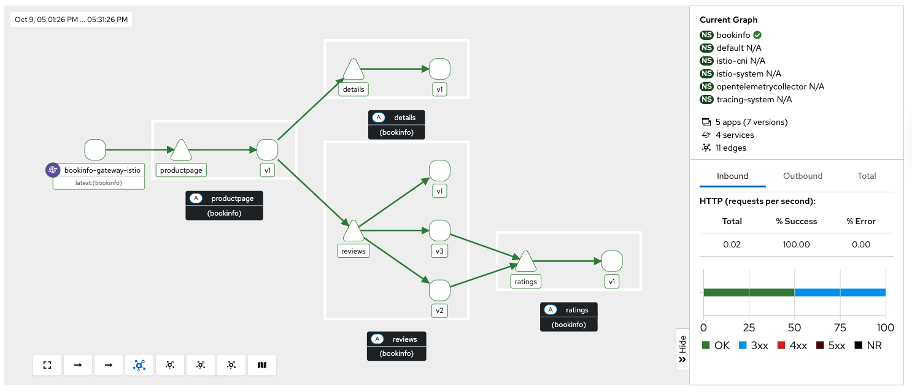

= Migrating from Sidecar to Ambient Mode

This guide provides a comprehensive, step-by-step process for migrating an existing Sail Operator deployment from sidecar mode to ambient mode. The migration approach is designed to achieve a near zero-downtime transition while maintaining all security policies and service mesh functionality.

== Table of Contents

* <<overview-of-sidecar-to-ambient-migration, 1. Overview of Sidecar to Ambient Migration>>
** <<migration-strategy, 1.1 Migration Strategy>>
** <<key-architectural-changes, 1.2 Key Architectural Changes>>
* <<prerequisites, 2. Prerequisites>>
** <<technical-requirements, 2.1 Technical Requirements>>
*** <<waypoint-decision-framework, 2.1.1 Waypoint Decision Framework>>
** <<compatibility-validation, 2.2 Compatibility Validation>>
** <<pre-migration-checklist, 2.3 Pre-Migration Checklist>>
** <<backup-existing-configuration, 2.4 Backup Existing Configuration>>
* <<migration-steps, 3. Migration Steps>>
** <<step-1-prerequisites-validation, Step 1: Prerequisites Validation>>
** <<step-2-cluster-setup-enable-ambient-support, Step 2: Cluster Setup - Enable Ambient Support>>
*** <<step-21-update-istio-configuration, Step 2.1 Update Istio Configuration>>
*** <<step-22-deploy-istio-cni-for-ambient, Step 2.2 Deploy Istio CNI for Ambient>>
*** <<step-23-deploy-ztunnel-proxies, Step 2.3 Deploy ZTunnel Proxies>>
** <<step-3-update-sidecars-for-hbone-support, Step 3: Update Sidecars for HBONE Support>>
*** <<step-31-enable-hbone-protocol-support, Step 3.1 Enable HBONE Protocol Support>>
*** <<step-32-validate-hbone-capability, Step 3.2 Validate HBONE Capability>>
*** <<step-33-connectivity-validation, Step 3.3 Connectivity Validation>>
** <<step-4-deploy-waypoint-proxies, Step 4: Deploy Waypoint Proxies>>
*** <<step-41-identify-services-requiring-l7-features, Step 4.1 Identify Services Requiring L7 Features>>
*** <<step-42-create-waypoint-configurations, Step 4.2 Create Waypoint Configurations>>
** <<step-5-migrate-traffic-policies, Step 5: Migrate Traffic Policies>>
*** <<step-51-convert-virtualservices-to-httproutes, Step 5.1 Convert VirtualServices to HTTPRoutes>>
**** <<step-511-create-version-specific-services-required-for-httproute, Step 5.1.1 Create Version-Specific Services (Required for HTTPRoute)>>
**** <<step-512-convert-virtualservice-to-httproute, Step 5.1.2 Convert VirtualService to HTTPRoute>>
*** <<step-52-create-waypoint-targeted-authorization-policies, Step 5.2 Create Waypoint-Targeted Authorization Policies>>
*** <<step-53-add-ztunnel-bypass-protection-critical-security-step, Step 5.3 Add Ztunnel Bypass Protection (Critical Security Step)>>
** <<step-6-enable-ambient-mode-for-applications, Step 6: Enable Ambient Mode for Applications>>
*** <<step-61-gradual-namespace-migration, Step 6.1 Gradual Namespace Migration>>
** <<step-7-enable-waypoint-processing, Step 7: Enable Waypoint Processing>>
*** <<step-71-activate-waypoints-for-l7-processing, Step 7.1 Activate Waypoints for L7 Processing>>
** <<step-8-policy-simplification, Step 8: Policy Simplification>>
*** <<step-81-remove-redundant-sidecar-policies, Step 8.1 Remove Redundant Sidecar Policies>>
** <<step-9-remove-sidecar-injection, Step 9: Remove Sidecar Injection>>
*** <<step-91-disable-sidecar-injection, Step 9.1 Disable Sidecar Injection>>
*** <<step-92-validate-sidecar-removal, Step 9.2 Validate Sidecar Removal>>
*** <<step-93-validate-l7-policy-enforcement, Step 9.3 Validate L7 Policy Enforcement>>
* <<validation-and-testing, 4. Validation and Testing>>
** <<migration-verification, 4.1 Migration Verification>>
* <<troubleshooting, 5. Troubleshooting>>
** <<common-issues, 5.1 Common Issues>>
** <<rollback-procedures, 5.2 Rollback Procedures>>
* <<post-migration-optimization, 6. Post-Migration Optimization>>
** <<observability-considerations, 6.1 Observability Considerations>>
** <<configure-kiali-for-ambient-mode, 6.2 Configure Kiali for Ambient Mode>>
* <<additional-resources, 7. Additional Resources>>

---

[[overview-of-sidecar-to-ambient-migration]]
== 1. Overview of Sidecar to Ambient Migration

[[migration-strategy]]
=== 1.1 Migration Strategy

The migration from sidecar to ambient mode follows a structured, phased approach to ensure a smooth transition with minimal disruption. Key principles include:

1. **Gradual Transition**: Both sidecar and ambient proxies operate simultaneously during migration
2. **Service-by-Service**: Migration can occur incrementally, one service or namespace at a time
3. **Policy Preservation**: All existing security and traffic policies are maintained throughout the process
4. **Rollback Support**: Each step can be reversed if issues arise

[[key-architectural-changes]]
=== 1.2 Key Architectural Changes

[cols="1,2,2"]
|===
|Component |Sidecar Mode |Ambient Mode

|**L4 Processing**
|Envoy sidecar per pod
|ZTunnel node proxy (shared)

|**L7 Processing**
|Envoy sidecar per pod
|Waypoint proxy per namespace or service or workload.

|**mTLS Enforcement**
|Sidecar proxy
|ZTunnel proxy

|**Policy Enforcement**
|Sidecar proxy
|ZTunnel (L4) + Waypoint (L7)
|===

---

[[prerequisites]]
== 2. Prerequisites

This migration guide uses example commands that can be adapted to any application. For reference purposes, we use placeholder values like `<NAMESPACE>`, `<SERVICE_NAME>`, and `<GATEWAY_NAME>` that you should replace with your actual application details.

**Related Documentation:**

- If you want to follow along with a sample application, you can deploy the bookinfo application by following the steps described in link:../addons/addons.adoc#deploy-gateway-and-bookinfo[Deploying Gateway and Bookinfo]
- For detailed waypoint proxy configuration, see link:../common/istio-ambient-waypoint.adoc[Waypoint Proxy Documentation]
- For general application deployment guidance, refer to link:../common/install-bookinfo-app.adoc[Installing the Bookinfo Application]

You can use any application that is currently running with sidecar injection enabled.

[[technical-requirements]]
=== 2.1 Technical Requirements

Before starting migration, ensure your environment meets these requirements:

For Kubernetes:

- **Kubernetes 1.21+**: Minimum version for ambient mode support
- **Sail Operator v1.27+**: Must be running Sail Operator version 1.27 or later
- **Istio v1.27+**: Control plane must be v1.24 or later for ambient support
- **Cluster Admin Access**: Required for namespace labeling and resource creation

For Openshift:

- **Openshift versions supported**: We support Openshift 4.14 and later but for versions older than 4.19 you will need to manually install Gateway API CRDs.
- **Sail Operator v1.27+**: Must be running Sail Operator version 1.27 or later.
- **Istio v1.27+**: Control plane must be v1.27 or later for ambient support on Openshift.
- **Cluster Admin Access**: Required for namespace labeling and resource creation

**Note**: for Openshift clusters, it's need the use of the local gateway mode for ambient deployments. Please refer to the Openshift documentation for more details: https://docs.redhat.com/en/documentation/red_hat_openshift_service_mesh/3.1/html/installing/ossm-istio-ambient-mode#ossm-installing-istio-ambient-mode_ossm-istio-ambient-mode.

**See also**: For general Istio installation guidance in this repository, refer to the installation documentation in the `docs/` directory.

[[waypoint-decision-framework]]
=== 2.1.1 Waypoint Decision Framework

A critical architectural decision involves whether to deploy waypoint proxies. This choice affects both functionality and performance:

**Option 1: Ztunnel-Only (No Waypoints)**

- **Maximum performance**: Minimal processing overhead
- **Automatic mTLS**: Transparent encryption between services
- **L4 policies**: Basic authorization and authentication
- **No L7 features**: Traffic routing, fault injection, L7 authorization

**Option 2: Ztunnel + Waypoint Proxies**

- **Full feature set**: All Istio traffic management and security features
- **L7 policies**: HTTP-level authorization, routing, telemetry
- **Gateway API support**: Modern traffic management APIs
- **Performance cost**: Similar to sidecar mode for L7 processing

**When Waypoints Are Used vs Not Used:**

**Automatic Waypoint Activation occurs when:**

1. **Namespace labeling**: Adding `istio.io/use-waypoint=<waypoint-name>` label to a namespace
2. **Service labeling**: Adding the label to specific services for granular control
3. **Pod labeling**: Adding the label to individual pods (requires `istio.io/waypoint-for: workload`)

**Traffic Flow Decision Tree:**

- **Without waypoint labels**: Traffic flows directly through ztunnel (L4-only processing)
- **With waypoint labels**: Traffic is intercepted and routed through waypoint proxies for L7 processing
- **Mixed environments**: Some services use waypoints while others remain ztunnel-only

**Decision Criteria:**

- **Use waypoints if**: You need VirtualServices, HTTPRoutes, L7 AuthorizationPolicies, fault injection, or HTTP-level observability
- **Skip waypoints if**: You only need mTLS, L4 AuthorizationPolicies, and basic connectivity
- **Hybrid approach**: Deploy waypoints only for services requiring L7 features

**Important**: Waypoint activation is explicit, deploying a waypoint Gateway resource alone does not affect traffic flow. You must label namespaces, services, or pods to direct traffic through waypoints.

For detailed waypoint configuration guidance, see link:../common/istio-ambient-waypoint.adoc[Waypoint Proxy Documentation].

[[compatibility-validation]]
=== 2.2 Compatibility between Sidecar and Ambient Modes

**Supported Features:**

- All L4 traffic policies (AuthorizationPolicy, PeerAuthentication)
- L7 traffic management (VirtualService, DestinationRule converted to HTTPRoute)
- Security policies (RequestAuthentication, AuthorizationPolicy)
- Telemetry and observability features

**Unsupported Features** (migration blockers):

- Multi-cluster mesh configurations
- Virtual Machine (VM) workload integration
- SPIRE integration for identity federation

For additional compatibility considerations refer to: link:../common/coexistence.adoc[Sidecar-Ambient Coexistence Guidelines]

[[pre-migration-checklist]]
=== 2.3 Pre-Migration Checklist

**Environment Validation:**
[source,console]
----
# Verify Sail Operator is deployed
kubectl get pods -n sail-operator
----

[source,console]
----
# Check Istio control plane version
kubectl get istio -n istio-system
NAME      NAMESPACE      PROFILE   REVISIONS   READY   IN USE   ACTIVE REVISION   STATUS    VERSION   AGE
default   istio-system             1           1       1        default           Healthy   v1.27.0   20m
----

[NOTE]
====
* If you have any of the unsupported features like VirtualServices or DestinationRules, during Step 5 you will need to migrate those to be compatible with ambient mode.
* Ambient supports PeerAuthentication, but disabled mode is not supported. More information: https://istio.io/latest/docs/reference/config/security/peer_authentication/
* Migrate ingress gateways to use Gateway API resources before migration. More information: https://istio.io/latest/docs/reference/config/networking/gateway/
====

**Application Namespace Validation:**

[source,console]
----
# Check your application namespaces for sidecar injection
kubectl get namespaces -l istio.io/rev=default #or any other istio revision name. Also, check if you are using instead istio-injection=enabled label.
NAME       STATUS   AGE
bookinfo   Active   6m56
----

[source,console]
----
# Check current workloads with sidecar injection
kubectl get pods -n bookinfo
NAME                                      READY   STATUS    RESTARTS   AGE
bookinfo-gateway-istio-75d96b45d9-m65mq   1/1     Running   0          4m31s
details-v1-646f945867-2gg99               2/2     Running   0          6m6s
productpage-v1-7dbcd8849-4pmjt            2/2     Running   0          6m6s
ratings-v1-9bd8c8595-266zs                2/2     Running   0          6m6s
reviews-v1-5fd7b88d9-7vqxf                2/2     Running   0          6m5s
reviews-v2-54ff7fcf79-22k8r               2/2     Running   0          6m5s
reviews-v3-6445668877-gdr22               2/2     Running   0          6m5s
----

[source,console]
----
# Check current gateway API being used
kubectl get gateway -n bookinfo
NAME               CLASS   ADDRESS       PROGRAMMED   AGE
bookinfo-gateway   istio   10.0.147.96   True         5m41s
----

Note: You can check that your application is getting requests through the mesh by using Kiali. You should see traffic flowing between the services for every request to your application.

For testing purposes during migration, you can generate traffic to your application's main service using commands similar to:

[source,console]
----
# Generate traffic to productpage service
export INGRESS_HOST=$(kubectl get gtw bookinfo-gateway -n bookinfo -o jsonpath='{.status.addresses[0].value}')
export INGRESS_PORT=$(kubectl get gtw bookinfo-gateway -n bookinfo -o jsonpath='{.spec.listeners[?(@.name=="http")].port}')
export GATEWAY_URL=$INGRESS_HOST:$INGRESS_PORT
while true; do
  STATUS=$(curl -s -w "%{http_code}" -o /dev/null --connect-timeout 5 "http://$GATEWAY_URL/productpage")
  TIMESTAMP=$(date +'%Y-%m-%d %H:%M:%S')
  if [ "$STATUS" -eq 200 ]; then
    echo "[$TIMESTAMP] Request OK"
  else
    echo "[$TIMESTAMP] Request KO - Status code: $STATUS"
  fi
  sleep 1
done
----

[[backup-existing-configuration]]
=== 2.4 Backup Existing Configuration

Before starting migration, back up all existing Istio resources and namespace labels:
[source,console]
----
# Backup all Istio resources
kubectl get istio,istiocni,virtualservice,destinationrule,authorizationpolicy,requestauthentication,httproute,gateway,peerauthentication -A -o yaml > istio-backup.yaml

# Backup namespace labels
kubectl get namespaces -o yaml > namespace-backup.yaml
----

**Note**: This backup is critical for rollback if issues arise during migration. Please add any resources specific to your environment that may not be covered here.

[[migration-steps]]
== 3. Migration Steps

This migration follows a structured step-by-step approach, with each step including detailed instructions, commands, and validation checks.

**Critical Sequencing Rules:**

- All waypoints must be enabled BEFORE removing any sidecars
- Policies must be migrated and validated BEFORE removing sidecar policies
- ZTunnel must be fully operational before enabling ambient mode

[[step-1-prerequisites-validation]]
=== Step 1: Prerequisites Validation

Before starting migration, validate your cluster meets all requirements and check the current configuration for compatibility.

**Enhanced Policy Compatibility Check:**
[source,console]
----
# Check for Layer 7-only authorization policies that will require waypoints
kubectl get authorizationpolicy -A -o yaml | grep -E "(methods|paths|headers)" | grep -v "name:"

# Identify VirtualServices with subset-based routing requiring service migration
kubectl get virtualservice -A -o yaml | grep -B5 -A10 "subset:" | grep -E "(name:|subset:)"

# Check for unsupported features that need manual conversion
kubectl get virtualservice -A -o yaml | grep -E "(fault|delay|mirror)" | grep -v "name:"
----

**Migration Readiness Assessment:**
[source,console]
----
# List all resources that need conversion
echo "=== VirtualServices requiring HTTPRoute conversion ==="
kubectl get virtualservice -A --no-headers | wc -l

echo "=== DestinationRules with subsets requiring service creation ==="
kubectl get destinationrule -A -o yaml | grep -c "subset:"

echo "=== Authorization policies requiring waypoint deployment ==="
kubectl get authorizationpolicy -A -o yaml | grep -c -E "(methods|paths|headers)"
----

Note: In the step 5 of this guide you will need to migrate unsupported features. This includes:

- Converting VirtualServices and DestinationRules to HTTPRoute and Gateway resources
- Creating granular services to replace subset-based routing
- Identifying which policies require waypoint deployment for Layer 7 processing

**Migration Blockers (must resolve before proceeding):**

- Multi-cluster mesh configurations
- VM workload integration
- SPIRE integration
- Istio version < 1.24

[[step-2-cluster-setup-enable-ambient-support]]
=== Step 2: Cluster Setup - Enable Ambient Support

[[step-21-update-istio-configuration]]
==== Step 2.1 Update Istio Configuration

Update your existing Istio resource:

[source,yaml]
----
apiVersion: sailoperator.io/v1
kind: Istio
metadata:
  name: default
  namespace: istio-system
spec:
  version: v1.27.0
  namespace: istio-system
  updateStrategy:
    type: InPlace # Set your preferred update strategy
  profile: ambient
  values:
    pilot:
      trustedZtunnelNamespace: ztunnel
    # Preserve existing customizations
    # Add any existing values configuration here
----

Apply the updated configuration:
[source,console]
----
kubectl apply -f istio-ambient.yaml
kubectl wait --for=condition=Ready istios/default --timeout=5m
----

[[step-22-deploy-istio-cni-for-ambient]]
==== Step 2.2 Deploy Istio CNI for Ambient

Create or update the IstioCNI resource:

[source,yaml]
----
apiVersion: sailoperator.io/v1
kind: IstioCNI
metadata:
  name: default
spec:
  namespace: istio-cni
  profile: ambient
  # Preserve existing customizations
----

Apply the CNI configuration:
[source,console]
----
# Create Istio CNI namespace if it doesn't exist
kubectl create namespace istio-cni
# Apply Istio CNI configuration
kubectl apply -f istio-cni-ambient.yaml
kubectl wait --for=condition=Ready istiocnis/default --timeout=3m
----

[[step-23-deploy-ztunnel-proxies]]
==== Step 2.3 Deploy ZTunnel Proxies

Create the ZTunnel namespace and resource:

[source,console]
----
kubectl create namespace ztunnel
# If you are using discoverySelectors, label the namespace accordingly
kubectl label namespace ztunnel istio-discovery=enabled
----

[source,yaml]
----
apiVersion: sailoperator.io/v1
kind: ZTunnel
metadata:
  name: default
spec:
  namespace: ztunnel
----

[source,console]
----
kubectl apply -f ztunnel.yaml
kubectl wait --for=condition=Ready ztunnel/default --timeout=3m
----

**Validation:**
[source,console]
----
# Verify ZTunnel pods are running on all nodes
kubectl get pods -n ztunnel -o wide
kubectl get daemonset -n ztunnel
----

[source,console]
----
# Confirm cluster setup validation passes
kubectl get ztunnel -n ztunnel
NAME      NAMESPACE   PROFILE   READY   STATUS    VERSION   AGE
default   ztunnel               True    Healthy   v1.27.0   12m
----

**If rollback needed**: See <<rollback-procedures,Section 5.2 Rollback Procedures>> for Step 2 cluster setup rollback instructions (Low Risk).

[[step-3-update-sidecars-for-hbone-support]]
=== Step 3: Update Sidecars for HBONE Support

[[step-31-enable-hbone-protocol-support]]
==== Step 3.1 Enable HBONE Protocol Support

Existing sidecars need to support the HBONE protocol. Restart deployments in all sidecar-injected namespaces:

[source,console]
----
# Restart workloads in each application namespace
kubectl rollout restart deployment -n bookinfo

# Verify pods have restarted
kubectl get pods -n bookinfo
----
Note: during the restart, sidecars will be updated to support HBONE while still functioning as traditional sidecars. Having HBONE support enabled is a prerequisite for ambient mode.

[[step-32-validate-hbone-capability]]
==== Step 3.2 Validate HBONE Capability

Check that sidecars now support HBONE protocol:

[source,console]
----
# Check for HBONE is enabled in sidecar
$ kubectl get pod $(kubectl get pods -n bookinfo -l app=ratings -o jsonpath='{.items[0].metadata.name}') -n bookinfo -o yaml | yq '.spec.containers[] | select(.name=="istio-proxy") | .env[] | select(.name=="PROXY_CONFIG")'
name: PROXY_CONFIG
value: |
  {"proxyMetadata":{"ISTIO_META_ENABLE_HBONE":"true"},"image":{"imageType":"distroless"}}
----

As shown above, the `ISTIO_META_ENABLE_HBONE` environment variable is set to `true`, indicating HBONE support is enabled.

[[step-33-connectivity-validation]]
==== Step 3.3 Connectivity Validation
Send requests to ensure connectivity remains intact:
[source,console]
----
# Test service connectivity through sidecars
$ kubectl exec $(kubectl get pods -n bookinfo -l app=ratings -o jsonpath='{.items[0].metadata.name}') -n bookinfo -- curl http://reviews.bookinfo:9080/reviews/1
{
  "id": "1",
  "podname": "reviews-v1-75797bd984-7b5g6",
  "clustername": "null",
  "reviews": [
    {
      "reviewer": "Reviewer1",
      "text": "An extremely entertaining play by Shakespeare. The play lacks thematic depth when compared to other plays by the author."
    },
    {
      "reviewer": "Reviewer2",
      "text": "Absolutely fun and entertaining. The play lacks thematic depth when compared to other plays by Shakespeare."
    }
  ]
}
----

Note: At this point, sidecars are fully functional with HBONE support, but traffic is still flowing through the sidecars as before.

**Critical**: Do NOT remove sidecars yet. They must remain until waypoints are fully deployed and active in Step 7.

Test connectivity from outside the mesh:
[source,console]
----
# Test ingress connectivity
$ curl -s http://$GATEWAY_URL/productpage | grep title
<title>Simple Bookstore App</title>
----

Traffic should continue flowing as before. This confirms that sidecars are still handling traffic.

**If rollback needed**: See <<rollback-procedures,Section 5.2 Rollback Procedures>> for Step 3 HBONE support rollback instructions (Low Risk).

[[step-4-deploy-waypoint-proxies]]
=== Step 4: Deploy Waypoint Proxies

[[step-41-identify-services-requiring-l7-features]]
==== Step 4.1 Identify Services Requiring L7 Features

Analyze your current configuration to identify services that need waypoint proxies:

[source,console]
----
# Check for existing L7 policies that will need waypoints
kubectl get virtualservice,httproute -A
kubectl get authorizationpolicy -A -o yaml | grep -A 10 -B 5 "rules.*methods\|operation"
----

[[step-42-create-waypoint-configurations]]
==== Step 4.2 Create Waypoint Configurations

Create waypoints for namespaces requiring L7 processing:

**Example Waypoint for bookinfo namespace:**
[source,yaml]
----
apiVersion: gateway.networking.k8s.io/v1
kind: Gateway
metadata:
  name: waypoint
  namespace: bookinfo
  labels:
    istio.io/waypoint-for: service
spec:
  gatewayClassName: istio-waypoint
  listeners:
  - name: mesh
    port: 15008
    protocol: HBONE
----

Apply the waypoint configurations:
[source,console]
----
kubectl apply -f waypoint-bookinfo.yaml
----

**Important**: Deploying a waypoint does not automatically make workloads use it. You must explicitly configure namespaces, services, or pods to use the waypoint.

Verify that waypoints are deployed correctly:
[source,console]
----
kubectl get gateway waypoint -n bookinfo
kubectl get deployment -n bookinfo -l gateway.networking.k8s.io/gateway-name=waypoint
kubectl get pods -n bookinfo -l gateway.networking.k8s.io/gateway-name=waypoint
# Verify waypoint is not yet active
kubectl get namespace bookinfo -o jsonpath='{.metadata.labels.istio\.io/use-waypoint}'
----

**If rollback needed**: See <<rollback-procedures,Section 5.2 Rollback Procedures>> for Step 4 waypoint deployment rollback instructions (Low Risk).

[[step-5-migrate-traffic-policies]]
=== Step 5: Migrate Traffic Policies

[[step-51-convert-virtualservices-to-httproutes]]
==== Step 5.1 Convert VirtualServices to HTTPRoutes

**Understanding Resource Conversion:**

Ambient mode uses the Kubernetes Gateway API instead of Istio's VirtualService and DestinationRule resources for traffic management. This migration requires converting your existing Istio traffic policies to Gateway API equivalents:

- **VirtualService** to **HTTPRoute**: Traffic routing, header matching, fault injection
- **DestinationRule subsets** to **Version-specific Services**: Since Gateway API doesn't support subset-based routing

For comprehensive conversion guidance, refer to:

- https://istio.io/latest/docs/reference/config/networking/virtual-service/[Istio VirtualService]
- https://gateway-api.sigs.k8s.io/guides/http-routing/[Gateway API HTTPRoute Documentation]

[[step-511-create-version-specific-services-required-for-httproute]]
===== Step 5.1.1 Create Version-Specific Services (Required for HTTPRoute)

Gateway API HTTPRoute doesn't support DestinationRule subsets. You must create individual services for each application version to enable version-specific routing:

[source,yaml]
----
apiVersion: v1
kind: Service
metadata:
  name: reviews-v1
  namespace: bookinfo
spec:
  selector:
    app: reviews
    version: v1
  ports:
  - name: http
    port: 9080
    targetPort: 9080
---
apiVersion: v1
kind: Service
metadata:
  name: reviews-v2
  namespace: bookinfo
spec:
  selector:
    app: reviews
    version: v2
  ports:
  - name: http
    port: 9080
    targetPort: 9080
---
apiVersion: v1
kind: Service
metadata:
  name: reviews-v3
  namespace: bookinfo
spec:
  selector:
    app: reviews
    version: v3
  ports:
  - name: http
    port: 9080
    targetPort: 9080
----

Apply the version-specific services:
[source,console]
----
kubectl apply -f reviews-version-services.yaml
----

[[step-512-convert-virtualservice-to-httproute]]
===== Step 5.1.2 Convert VirtualService to HTTPRoute

**Key Conversion Concepts:**

When converting VirtualService to HTTPRoute, understand these mapping principles:

- **spec.hosts** to **spec.parentRefs**: HTTPRoute attaches to Services instead of declaring hosts
- **spec.http.match** to **spec.rules.matches**: Similar header/path matching syntax
- **spec.http.route.destination.subset** to **spec.rules.backendRefs.name**: Direct service references instead of subsets
- **spec.http.fault**, **spec.http.timeout** → Use HTTPRoute filters or Istio policy resources

**Example Conversion:**

**Before (VirtualService):**
[source,yaml]
----
apiVersion: networking.istio.io/v1beta1
kind: VirtualService
metadata:
  name: reviews
  namespace: bookinfo
spec:
  hosts:
  - reviews
  http:
  - match:
    - headers:
        end-user:
          exact: jason
    route:
    - destination:
        host: reviews
        subset: v2
  - route:
    - destination:
        host: reviews
        subset: v1
----

**After (HTTPRoute):**
[source,yaml]
----
apiVersion: gateway.networking.k8s.io/v1
kind: HTTPRoute
metadata:
  name: reviews
  namespace: bookinfo
spec:
  parentRefs:
  - name: bookinfo-gateway # Attach to existing gateway
  rules:
  - matches:
    - headers:
      - name: end-user
        value: jason
    backendRefs:
    - name: reviews-v2
      port: 9080
  - backendRefs:
    - name: reviews-v1
      port: 9080
----

**Apply the HTTPRoute:**

[source,console]
----
kubectl apply -f reviews-httproute.yaml
----

**Key Differences Explained:**

1. **Service Attachment**: HTTPRoute attaches to the original `reviews` service via `parentRefs`, intercepting traffic to that service.
2. **Version Routing**: Instead of DestinationRule subsets, HTTPRoute uses version-specific services (`reviews-v1`, `reviews-v2`).
3. **Header Matching**: Similar syntax to VirtualService but uses Gateway API format.
4. **Backward Compatibility**: Original service remains functional; HTTPRoute adds routing logic on top.

For complex routing scenarios (fault injection, retries, timeouts), you may need additional Gateway API filters or maintain some Istio policies alongside HTTPRoute.

[[step-52-create-waypoint-targeted-authorization-policies]]
==== Step 5.2 Create Waypoint-Targeted Authorization Policies

Create waypoint-targeted authorization policies while maintaining existing sidecar policies during transition. These policies should match your actual service account structure:

**Example bookinfo Authorization Policies:**

[source,yaml]
----
# ProductPage service authorization - allows traffic from gateway
apiVersion: security.istio.io/v1
kind: AuthorizationPolicy
metadata:
  name: productpage-waypoint
  namespace: bookinfo
spec:
  targetRefs:
  - kind: Service
    group: ""
    name: productpage
  action: ALLOW
  rules:
  - from:
    - source:
        principals:
        - cluster.local/ns/bookinfo/sa/bookinfo-gateway-istio
    to:
    - operation:
        methods: ["GET", "POST"]
---
# Reviews service authorization - allows traffic from productpage
apiVersion: security.istio.io/v1
kind: AuthorizationPolicy
metadata:
  name: reviews-waypoint
  namespace: bookinfo
spec:
  targetRefs:
  - kind: Service
    group: ""
    name: reviews
  action: ALLOW
  rules:
  - from:
    - source:
        principals:
        - cluster.local/ns/bookinfo/sa/bookinfo-productpage
        - cluster.local/ns/bookinfo/sa/bookinfo-reviews
    to:
    - operation:
        methods: ["GET"]
---
# Ratings service authorization - allows traffic from reviews
apiVersion: security.istio.io/v1
kind: AuthorizationPolicy
metadata:
  name: ratings-waypoint
  namespace: bookinfo
spec:
  targetRefs:
  - kind: Service
    group: ""
    name: ratings
  action: ALLOW
  rules:
  - from:
    - source:
        principals:
        - cluster.local/ns/bookinfo/sa/bookinfo-reviews
    to:
    - operation:
        methods: ["GET"]
---
# Details service authorization - allows traffic from productpage
apiVersion: security.istio.io/v1
kind: AuthorizationPolicy
metadata:
  name: details-waypoint
  namespace: bookinfo
spec:
  targetRefs:
  - kind: Service
    group: ""
    name: details
  action: ALLOW
  rules:
  - from:
    - source:
        principals:
        - cluster.local/ns/bookinfo/sa/bookinfo-productpage
    to:
    - operation:
        methods: ["GET"]
----

**Note**: The service account names should match your actual deployment. Adjust the principal names if your service accounts use different naming conventions. To verify the service accounts you can run:

[source,console]
----
# Check actual service accounts used by your application pods
kubectl get pods -n bookinfo -o jsonpath='{range .items[*]}{.metadata.name}{"\t"}{.spec.serviceAccountName}{"\n"}{end}'
----

**Apply the authorization policies:**
[source,console]
----
kubectl apply -f bookinfo-waypoint-authz-policies.yaml
----

[[step-53-add-ztunnel-bypass-protection-critical-security-step]]
==== Step 5.3 Add Ztunnel Bypass Protection (Critical Security Step)

**Security Warning**: In ambient mode, waypoint-targeted policies can be bypassed if traffic flows directly through ztunnel, because the ztunnel itself cannot enforce Layer 7 (L7) policies. Add protection policies to prevent this:

[source,yaml]
----
apiVersion: security.istio.io/v1
kind: AuthorizationPolicy
metadata:
  name: productpage-ztunnel-protection
  namespace: bookinfo
spec:
  targetRefs:
  - kind: Service
    group: ""
    name: productpage
  action: DENY
  rules:
  - when:
    - key: source.workload_name
      notValues: ["waypoint"]
---
apiVersion: security.istio.io/v1
kind: AuthorizationPolicy
metadata:
  name: reviews-ztunnel-protection
  namespace: bookinfo
spec:
  targetRefs:
  - kind: Service
    group: ""
    name: reviews
  action: DENY
  rules:
  - when:
    - key: source.workload_name
      notValues: ["waypoint"]
----

Apply the protection policies:
[source,console]
----
kubectl apply -f ztunnel-protection-policies.yaml
----

[source,console]
----
# Verify policies are created
$ kubectl get authorizationpolicy -n <NAMESPACE>
NAME                             ACTION   AGE
productpage-waypoint             ALLOW    18s
productpage-ztunnel-protection   DENY     7s
reviews-waypoint                 ALLOW    17s
reviews-ztunnel-protection       DENY     6s
----

**Critical**: Keep existing sidecar policies active until Policy Simplification step.

Test that services are still accessible (policies not yet enforced):
[source,console]
----
NAMESPACE="bookinfo" # Replace with your namespace
TEST_POD=$(kubectl get pods -n $NAMESPACE -l app=reviews -o jsonpath='{.items[0].metadata.name}')
HTTP_STATUS=$(kubectl exec $TEST_POD -n $NAMESPACE -- curl -s -w "%{http_code}" -o /dev/null http://reviews.$NAMESPACE:9080/reviews/1)
if [[ "$HTTP_STATUS" == "200" ]]; then
  echo "PASS: Service connectivity still working"
else
  echo "FAIL: Service connectivity failed: HTTP $HTTP_STATUS"
  exit 1
fi
----

**If rollback needed**: See <<rollback-procedures,Section 5.2 Rollback Procedures>> for Step 5 policy migration rollback instructions (Medium Risk).

[[step-6-enable-ambient-mode-for-applications]]
=== Step 6: Enable Ambient Mode for Applications

[[step-61-gradual-namespace-migration]]
==== Step 6.1 Gradual Namespace Migration

We recommend enabling ambient mode for one namespace at a time, starting with the least critical. Replace `bookinfo` with your actual namespace name:

[source,console]
----
kubectl label namespace bookinfo istio.io/dataplane-mode=ambient
----

[source,console]
----
# Verify ztunnel configuration for each namespace
$ istioctl ztunnel-config workloads --namespace ztunnel | grep bookinfo
bookinfo                                         bookinfo-gateway-istio-6b9cf4b8c8-xxsq2                     10.128.2.58   user-rhos-d-4-9b684-worker-0-4fhm6 None     TCP
bookinfo                                         details-v1-bb955f94b-4sppn                                  10.128.2.59   user-rhos-d-4-9b684-worker-0-4fhm6 None     HBONE
bookinfo                                         productpage-v1-c4cb9cb4b-ghzwc                              10.128.2.60   user-rhos-d-4-9b684-worker-0-4fhm6 None     HBONE
bookinfo                                         ratings-v1-bc5f6b4fd-qvr6m                                  10.128.2.61   user-rhos-d-4-9b684-worker-0-4fhm6 None     HBONE
bookinfo                                         reviews-v1-9db68f4d-v4cnb                                   10.128.2.62   user-rhos-d-4-9b684-worker-0-4fhm6 None     HBONE
bookinfo                                         reviews-v2-646d654b58-gmht2                                 10.128.2.63   user-rhos-d-4-9b684-worker-0-4fhm6 None     HBONE
bookinfo                                         reviews-v3-86bb4fb6fb-b946t                                 10.128.2.64   user-rhos-d-4-9b684-worker-0-4fhm6 None     HBONE
bookinfo                                         waypoint-58cdc7f494-98h79                                   10.128.2.65   user-rhos-d-4-9b684-worker-0-4fhm6 None     TCP
----

**Validation after each namespace:**
[source,console]
----
# Test connectivity after enabling each namespace, e.g., bookinfo
kubectl exec -n bookinfo $(kubectl get pods -n bookinfo -l app=ratings -o jsonpath='{.items[0].metadata.name}') -- curl http://reviews.bookinfo:9080/
----

**Important**: at this point sidecars are still present and handling traffic. Do NOT remove sidecars yet.

**If rollback needed**: See <<rollback-procedures,Section 5.2 Rollback Procedures>> for Step 6 ambient mode activation rollback instructions (High Risk).

[[step-7-enable-waypoint-processing]]
=== Step 7: Enable Waypoint Processing

[[step-71-activate-waypoints-for-l7-processing]]
==== Step 7.1 Activate Waypoints for L7 Processing

**Critical Sequencing**: Only activate waypoints AFTER all required namespaces are in ambient mode.

**Understanding Waypoint Activation:**

Up to this point, waypoint proxies have been deployed but are not processing any traffic. They remain dormant until you explicitly configure workloads to use them. This activation happens through labeling:

**Namespace-level Activation (recommended):**
[source,console]
----
# Enable waypoint for all services in the namespace
kubectl label namespace bookinfo istio.io/use-waypoint=waypoint
----

**Service-level Activation (granular control):**
[source,console]
----
# Enable waypoint for specific services only
kubectl label service <SERVICE_NAME> istio.io/use-waypoint=<WAYPOINT_NAME> -n <NAMESPACE>
----

**Verify waypoint activation:**
[source,console]
----
# Check waypoint pod is running
kubectl get pods -n bookinfo -l gateway.networking.k8s.io/gateway-name=waypoint

# Verify namespace/service labels
kubectl get namespace <NAMESPACE> --show-labels
kubectl get service <SERVICE_NAME> -n <NAMESPACE> --show-labels
----

**Critical Identity Security Consideration**:

Waypoints do not spoof client identity. When ztunnel processes traffic from waypoints, it sees the waypoint's identity, not the original client's identity. This has important implications:

1. **Authorization policies targeting client identities must be applied at the waypoint level**, not at the ztunnel level
2. **Ztunnel-level policies will see all traffic as coming from the waypoint**
3. **Client identity validation should be configured in waypoint-targeted policies**

Ensure your authorization policies account for this identity behavior when validating security enforcement.

**Important**: Enable ALL required waypoints before removing ANY sidecars to maintain policy enforcement.

**If rollback needed**: See <<rollback-procedures,Section 5.2 Rollback Procedures>> for Step 7 waypoint activation rollback instructions (High Risk).

[[step-8-policy-simplification]]
=== Step 8: Policy Simplification

[[step-81-remove-redundant-sidecar-policies]]
==== Step 8.1 Remove Redundant Sidecar Policies

Once traffic flows through waypoints, remove duplicate sidecar-specific policies:

[source,console]
----
# List all authorization policies to identify duplicates
kubectl get authorizationpolicy -A
# List virtual services to identify those replaced by HTTPRoutes
kubectl get virtualservice -A
----

Delete the redundant sidecar policies by running the following commands:
[source,console]
----
# Example: Remove sidecar-specific authorization policies
kubectl delete authorizationpolicy <authorizationpolicy-name> -n <NAMESPACE>

# Example: Remove sidecar-specific virtual services
kubectl delete virtualservice <virtualservice-name> -n <NAMESPACE>
----

**If rollback needed**: See <<rollback-procedures,Section 5.2 Rollback Procedures>> for Step 8 policy cleanup rollback instructions (Medium Risk).

[[step-9-remove-sidecar-injection]]
=== Step 9: Remove Sidecar Injection

[[step-91-disable-sidecar-injection]]
==== Step 9.1 Disable Sidecar Injection

**Final step**: Remove sidecar injection now that ambient mode is fully operational:

[source,console]
----
# Remove sidecar injection while preserving ambient mode labels
kubectl label namespace bookinfo istio.io/rev- istio.io/dataplane-mode=ambient

# Restart deployments to remove sidecars
kubectl rollout restart deployment -n bookinfo
----

[[step-92-validate-sidecar-removal]]
==== Step 9.2 Validate Sidecar Removal

Verify sidecars are removed and ambient mode is working:

[source,console]
----
# Verify pods no longer have sidecars containers in the application pods
kubectl get pods -n bookinfo
----

Checking on Kiali should show traffic flowing through ambient mode. You should see traffic flowing through ztunnel and waypoints instead of sidecars.

[[step-93-validate-l7-policy-enforcement]]
==== Step 9.3 Validate L7 Policy Enforcement

Test that L7 policies are now enforced through waypoints (L7 policies should work as before after waypoint activation):

[source,console]
----
# Test authorization policies work through waypoint
kubectl exec -n bookinfo $(kubectl get pods -n bookinfo -l app=ratings -o jsonpath='{.items[0].metadata.name}') -- curl -v http://reviews.bookinfo:9080/reviews/1
{"id": "1","podname": "reviews-v3-dd9d6fc89-6glvk","clustername": "null","reviews": [{  "reviewer": "Reviewer1",  "text": "An extremely entertaining play by Shakespeare. The slapstick humor is refreshing!", "rating": {"stars": 5, "color": "red"}},{  "reviewer": "Reviewer2",  "text": "Absolutely fun and entertaining. The play lacks thematic depth when compared to other plays by Shakespeare.", "rating": {"stars": 4, "color": "red"}}]}
----

[source,console]
----
# Test traffic routing through waypoint with header (if HTTPRoute configured)
$ kubectl exec -n bookinfo $(kubectl get pods -n bookinfo -l app=ratings -o jsonpath='{.items[0].metadata.name}') -- curl -H "end-user: jason" http://reviews.bookinfo:9080/reviews/1
{"id": "1","podname": "reviews-v2-67ff7bcdc5-kklgl","clustername":"null","reviews": [{  "reviewer": "Reviewer1",  "text": "An extremely entertaining play by Shakespeare. The slapstick humor is refreshing!","rating": {"stars": 5, "color": "black"}},{  "reviewer": "Reviewer2",  "text": "Absolutely fun and entertaining. The play lacks thematic depthwhen compared to other plays by Shakespeare.","rating": {"stars": 4, "color": "black"}}]}
----

Note: L7 policies should function as before, now enforced through waypoints instead of sidecars. Take into account that according to the configuration example that we applied before, requests with the `end-user: jason` header should route to `reviews-v2` and requests without that header should route to `reviews-v1` or `reviews-v3`.

Test external connectivity (if gateway configured):
[source,console]
----
# Test external connectivity through gateway
export INGRESS_HOST=$(kubectl get gtw bookinfo-gateway -n bookinfo -o jsonpath='{.status.addresses[0].value}')
export INGRESS_PORT=$(kubectl get gtw bookinfo-gateway -n bookinfo -o jsonpath='{.spec.listeners[?(@.name=="http")].port}')
export GATEWAY_URL=$INGRESS_HOST:$INGRESS_PORT
if [[ -n "$GATEWAY_URL" ]]; then
  EXTERNAL_STATUS=$(curl -s -w "%{http_code}" -o /dev/null --connect-timeout 5 "http://$GATEWAY_URL/productpage")
  if [[ "$EXTERNAL_STATUS" == "200" ]]; then
    echo "PASS: External connectivity working"
  else
    echo "FAIL: External connectivity failed: HTTP $EXTERNAL_STATUS"
    exit 1
  fi
else
  echo "INFO: No gateway URL configured - skipping external connectivity test"
fi
----

**If rollback needed**: See <<rollback-procedures,Section 5.2 Rollback Procedures>> for Step 9 sidecar removal rollback instructions (Very High Risk). Two emergency rollback options are available.

**The migration is completed!** Applications now run in ambient mode with:

- No sidecar containers
- mTLS via ztunnel
- L7 policies via waypoints

[[validation-and-testing]]
== 4. Validation and Testing

[[migration-verification]]
=== 4.1 Migration Verification

**mTLS Verification:**

[source,console]
----
# Check ztunnel protocols for the bookinfo namespace
istioctl ztunnel-config workloads -n ztunnel |grep bookinfo
bookinfo                                         bookinfo-gateway-istio-86496d9445-fgczp                     10.128.2.66   user-rhos-d-4-9b684-worker-0-4fhm6 None     TCP
bookinfo                                         details-v1-584b5c5f6c-dhkjx                                 10.128.2.67   user-rhos-d-4-9b684-worker-0-4fhm6 None     HBONE
bookinfo                                         productpage-v1-7b5749b8bf-96mmg                             10.128.2.68   user-rhos-d-4-9b684-worker-0-4fhm6 None     HBONE
bookinfo                                         ratings-v1-cd589f595-wrjds                                  10.128.2.69   user-rhos-d-4-9b684-worker-0-4fhm6 None     HBONE
bookinfo                                         reviews-v1-695599f9d5-58626                                 10.128.2.70   user-rhos-d-4-9b684-worker-0-4fhm6 None     HBONE
bookinfo                                         reviews-v2-6bc5c6b6cf-4nqpq                                 10.128.2.71   user-rhos-d-4-9b684-worker-0-4fhm6 None     HBONE
bookinfo                                         reviews-v3-5866bd5557-g86wx                                 10.128.2.72   user-rhos-d-4-9b684-worker-0-4fhm6 None     HBONE
bookinfo                                         waypoint-748b7f45c6-vxlnd                                   10.128.2.73   user-rhos-d-4-9b684-worker-0-4fhm6 None     TCP
----

**Validate using Kiali:**
After migration, use Kiali to visualize the service mesh. You should see traffic flowing through ztunnel and waypoints instead of sidecars. You will see the ztunnel as a node in the graph, and the waypoints as nodes for each namespace.

[[troubleshooting]]
== 5. Troubleshooting

[[common-issues]]
=== 5.1 Common Issues

For comprehensive troubleshooting guidance, refer to:

- https://istio.io/latest/docs/ambient/usage/troubleshoot-waypoint/[Istio Ambient Troubleshooting Documentation]
- https://istio.io/latest/docs/ops/diagnostic-tools/[Istio Diagnostic Tools]

==== Step-Specific Error Scenarios

**Errors - Cluster Setup Issues:**

*Issue: ZTunnel pods failing to start*
[source,console]
----
# Check ZTunnel DaemonSet status
kubectl get daemonset -n ztunnel
kubectl describe daemonset -n ztunnel

# Common causes and solutions:
# 1. Node selector issues
kubectl get nodes --show-labels
# 2. Resource constraints
kubectl describe nodes | grep -A 5 "Allocated resources"
# 3. Security context issues
kubectl logs -n ztunnel -l app=ztunnel --tail=50
----

**Errors - HBONE Support Issues:**

*Issue: Pods fail to restart after enabling HBONE*
[source,console]
----
# Check deployment rollout status
kubectl rollout status deployment -n <NAMESPACE>

# Check for image pull errors or resource limits
kubectl describe pods -n <NAMESPACE> | grep -A 10 "Events:"
----

*Issue: HBONE environment variable not set*
[source,console]
----
# Check proxy configuration
kubectl get pods -n <NAMESPACE> -o yaml | grep -A 5 -B 5 "PROXY_CONFIG"

# Force pod recreation if HBONE not enabled
kubectl delete pods -n <NAMESPACE> -l app=<SERVICE_NAME>
kubectl rollout status deployment/<SERVICE_NAME>-v1 -n <NAMESPACE>
----

**Errors - Ambient Mode Activation Issues:**

*Issue: Services not communicating after enabling ambient mode*
[source,console]
----
# Check ztunnel logs for specific service issues
kubectl logs -n ztunnel $(kubectl get pod -n ztunnel -l app=ztunnel -o jsonpath='{.items[0].metadata.name}') | grep <SERVICE_NAME>

# Verify namespace labels are correct
kubectl get namespace <NAMESPACE> --show-labels

# Check istio-cni logs for traffic redirection issues
kubectl logs -n istio-cni $(kubectl get pod -n istio-cni -l app.kubernetes.io/name=istio-cni -o jsonpath='{.items[0].metadata.name}') | grep <NAMESPACE>

# Verify workloads are detected by ztunnel
istioctl ztunnel-config workloads --namespace ztunnel | grep <NAMESPACE>
----

*Issue: Traffic still going through sidecars instead of ztunnel*
[source,console]
----
# Verify ambient mode is actually enabled
kubectl get namespace <NAMESPACE> -o jsonpath='{.metadata.labels.istio\.io/dataplane-mode}'

# Check if CNI is redirecting traffic properly
kubectl exec -n <NAMESPACE> $(kubectl get pods -n <NAMESPACE> -l app=<SERVICE_NAME> -o jsonpath='{.items[0].metadata.name}') -- netstat -rn
# Look for ztunnel redirect rules

# Force pod restart to pick up ambient mode
kubectl rollout restart deployment -n <NAMESPACE>
----

**Errors - Waypoint Activation Issues:**

*Issue: Policies not enforcing correctly*
[source,console]
----
# Verify policy target configuration
kubectl get authorizationpolicy -n <NAMESPACE> -o yaml

# Check waypoint proxy status
kubectl get gateway -n <NAMESPACE>
kubectl get pods -n <NAMESPACE> -l gateway.networking.k8s.io/gateway-name=<WAYPOINT_NAME>

# Verify waypoint is receiving traffic
WAYPOINT_POD=$(kubectl get pods -n <NAMESPACE> -l gateway.networking.k8s.io/gateway-name=<WAYPOINT_NAME> -o jsonpath='{.items[0].metadata.name}')
kubectl logs $WAYPOINT_POD -n <NAMESPACE> | grep -E "HTTP|GET|POST"

# Check if use-waypoint label is correctly set
kubectl get namespace <NAMESPACE> -o jsonpath='{.metadata.labels.istio\.io/use-waypoint}'
----

Compare the existing sidecar policies with the new waypoint-targeted policies to ensure they match. All the rules should be the same to ensure consistent enforcement.

*Issue: L7 policies not working through waypoints*
[source,console]
----
# Verify waypoint configuration
kubectl get gateway <WAYPOINT_NAME> -n <NAMESPACE> -o yaml
# Check gatewayClassName is "istio-waypoint"

# Check authorization policy targeting
kubectl get authorizationpolicy -n <NAMESPACE> -o yaml | grep -A 10 "targetRefs"
# Ensure policies target the correct services

# Test policy enforcement manually
TEST_POD=$(kubectl get pods -n <NAMESPACE> -l app=<SERVICE_NAME> -o jsonpath='{.items[0].metadata.name}')
kubectl exec $TEST_POD -n <NAMESPACE> -- curl -v -H "authorization: invalid" http://<SERVICE_NAME>.<NAMESPACE>:9080/
# Should be denied if authorization policies are working
----

**General Connectivity Issues:**

*Issue: High latency after migration*
[source,console]
----
# Check waypoint proxy performance
$ istioctl proxy-config listeners $(kubectl get pod -n <NAMESPACE> -l gateway.networking.k8s.io/gateway-name=<WAYPOINT_NAME> -o jsonpath='{.items[0].metadata.name}') -n <NAMESPACE>
ADDRESSES PORT  MATCH DESTINATION
          0     ALL   Cluster: inbound-vip|9080|http|<SERVICE1>.<NAMESPACE>.svc.cluster.local
          0     ALL   Cluster: inbound-vip|9080|http|<SERVICE1>-v3.<NAMESPACE>.svc.cluster.local
          0     ALL   Cluster: inbound-vip|9080|http|<SERVICE1>-v2.<NAMESPACE>.svc.cluster.local
          0     ALL   Cluster: inbound-vip|9080|http|<SERVICE1>-v1.<NAMESPACE>.svc.cluster.local
          0     ALL   Cluster: inbound-vip|9080|http|<SERVICE2>.<NAMESPACE>.svc.cluster.local
          0     ALL   Cluster: inbound-vip|9080|http|<SERVICE2>-v1.<NAMESPACE>.svc.cluster.local
          0     ALL   Cluster: inbound-vip|80|http|<GATEWAY_SERVICE>.<NAMESPACE>.svc.cluster.local
          0     ALL   Cluster: inbound-vip|15021|tcp|<GATEWAY_SERVICE>.<NAMESPACE>.svc.cluster.local
          0     ALL   Cluster: encap
          0     ALL   Cluster: encap
          0     ALL   Cluster: connect_originate
0.0.0.0   15008 ALL   Inline Route:
0.0.0.0   15021 ALL   Inline Route: /healthz/ready*
0.0.0.0   15090 ALL   Inline Route: /stats/prometheus*
----

[source,console]
----
# Verify waypoint scaling
kubectl get deployment -n <NAMESPACE> -l gateway.networking.k8s.io/gateway-name=<WAYPOINT_NAME>

# Scale waypoints if needed
kubectl scale deployment $(kubectl get deployment -n <NAMESPACE> -l gateway.networking.k8s.io/gateway-name=<WAYPOINT_NAME> -o jsonpath='{.items[0].metadata.name}') -n <NAMESPACE> --replicas=2
----

[[rollback-procedures]]
=== 5.2 Rollback Procedures and Risk Matrix

This section provides consolidated rollback procedures for each migration step, organized by risk level and recovery complexity.

==== Rollback Decision Matrix

[cols="1,1,2,3"]
|===
|Migration Step |Risk Level |Scenario |Rollback Actions

|**Step 1-2 (Prerequisites & Cluster Setup)**
|Low
|Istio/CNI/ZTunnel configuration issues
|Revert Istio profile, delete ZTunnel

|**Step 3 (HBONE Support)**
|Low
|Pod restart failures
|Rollback deployment revisions

|**Step 4 (Waypoint Deployment)**
|Low
|Waypoint pods not starting
|Delete waypoint resources

|**Step 5 (Policy Migration)**
|Medium
|Policy conflicts causing traffic issues
|Remove new policies, restore backups

|**Step 6 (Ambient Mode Enable)**
|High
|Traffic flow disruption
|Disable ambient mode labels

|**Step 7 (Waypoint Activation)**
|High
|L7 policy enforcement failures
|Disable waypoint usage

|**Step 8 (Policy Cleanup)**
|Medium
|Accidental policy deletion
|Restore from backup

|**Step 9 (Sidecar Removal)**
|Very High
|Complete service failure
|Emergency sidecar restoration
|===

==== Step-by-Step Rollback Procedures

**Low Risk Rollbacks (Steps 1-4):**

[source,console]
----
# Step 2 Rollback: Cluster Setup Issues
# Replace the profile name if a custom profile was used
kubectl patch istio default -n istio-system --type merge -p '{"spec":{"profile":"default"}}'
kubectl patch istiocni default --type merge -p '{"spec":{"profile":"default"}}'
kubectl delete ztunnel default -n ztunnel
kubectl delete namespace ztunnel

# Step 3 Rollback: HBONE Support Issues
kubectl rollout undo deployment -n <NAMESPACE>

# Step 4 Rollback: Waypoint Deployment Issues
kubectl delete gateway <WAYPOINT_NAME> -n <NAMESPACE>
# Waypoint deployments automatically cleaned up
----

**Medium Risk Rollbacks (Steps 5, 8):**

[source,console]
----
# Step 5 Rollback: Policy Migration Issues
kubectl delete authorizationpolicy -n <NAMESPACE> -l migration=waypoint
kubectl delete authorizationpolicy -n <NAMESPACE> -l migration=protection
kubectl delete httproute <HTTPROUTE_NAME> -n <NAMESPACE>
# Original VirtualServices and sidecar policies remain active

# Step 8 Rollback: Policy Cleanup Issues. Rollback to original policies using backup
kubectl apply -f istio-backup.yaml
# Review and manually remove duplicates after restoration
----

**High Risk Rollbacks (Steps 6-7):**

[source,console]
----
# Step 6 Rollback: Ambient Mode Issues
kubectl label namespace <NAMESPACE> istio.io/dataplane-mode-
kubectl rollout restart deployment -n <NAMESPACE>
# Sidecars restored, traffic back through sidecars

# Step 7 Rollback: Waypoint Activation Issues
kubectl label namespace <NAMESPACE> istio.io/use-waypoint-
# L4 policies continue through ztunnel, L7 policies disabled
----

**Very High Risk Rollback (Step 9):**

**Option 1 - Sidecar Restoration (Recommended):**

[source,console]
----
#!/bin/bash
# Rollback script - test before use in production

echo "=== ROLLBACK: Restoring Sidecars ==="
NAMESPACE=${1:-<YOUR_NAMESPACE>}

# Step 1: Immediately re-enable sidecar injection
kubectl label namespace $NAMESPACE istio.io/rev=default --overwrite
echo "Sidecar injection re-enabled for $NAMESPACE"

# Step 2: Restart deployments to get sidecars back
kubectl rollout restart deployment -n $NAMESPACE
echo "Deployments restarting..."

# Step 3: Wait for rollout (with timeout)
kubectl rollout status deployment -n $NAMESPACE --timeout=300s

# Step 4: Validate service restoration
TEST_POD=$(kubectl get pods -n $NAMESPACE -o jsonpath='{.items[0].metadata.name}' 2>/dev/null)
if [[ -n "$TEST_POD" ]]; then
    HTTP_STATUS=$(kubectl exec $TEST_POD -n $NAMESPACE -- curl -s -w "%{http_code}" -o /dev/null --connect-timeout 5 http://<SERVICE_NAME>.$NAMESPACE:9080/<SERVICE_PATH> 2>/dev/null || echo "000")
    if [[ "$HTTP_STATUS" == "200" ]]; then
        echo "SUCCESS: Emergency rollback completed - services restored"
        echo "Both sidecars and ambient infrastructure are now active"
    else
        echo "WARNING: Service connectivity issues persist - manual intervention required"
    fi
else
    echo "ERROR: No pods found - check deployment status"
fi

echo "Next step: Restore original policies: kubectl apply -f istio-backup.yaml"
----

==== Rollback Validation Checklist

After any rollback, verify system health:

[source,console]
----
# 1. Verify pod status
kubectl get pods -n <NAMESPACE>

# 2. Test service connectivity
kubectl exec -n <NAMESPACE> $(kubectl get pods -n <NAMESPACE> -l app=<SERVICE_NAME> -o jsonpath='{.items[0].metadata.name}') -- curl http://<SERVICE_NAME>.<NAMESPACE>:9080/<SERVICE_PATH>

# 3. Check sidecar presence (should be 2/2 for sidecars)
kubectl get pods -n <NAMESPACE> --no-headers | grep "2/2.*Running" | wc -l

# 4. Verify policy enforcement
kubectl get authorizationpolicy -n <NAMESPACE>

# 5. Test external connectivity (if applicable)
curl -s http://$GATEWAY_URL/<YOUR_APPLICATION_PATH>
----

==== When to Use Each Rollback Option

**Use Step-Specific Rollbacks when:**

- Single step validation fails
- Issues are isolated to specific components
- Other migration steps are working correctly

**Use Sidecar Restoration when:**

- Service connectivity is disrupted
- L7 policies are not enforcing correctly
- Need immediate service restoration

**Prevention Best Practices:**

- Always create backups before starting migration
- Test rollback procedures in non-production environments
- Monitor service health continuously during migration
- Keep original policies active until validation complete
- Use gradual, namespace-by-namespace migration approach

[[post-migration-optimization]]
== 6. Post-Migration Optimization

[[observability-considerations]]
=== 6.1 Observability Considerations

**Metrics Changes:**

Understanding how metrics change in ambient mode is crucial for monitoring and troubleshooting:

- **Without waypoints**: Only Layer 4 (TCP) metrics are available, as Layer 7 processing is not performed
- **With waypoints**: Metrics show `reporter="waypoint"` instead of the traditional `reporter="source"` and `reporter="destination"` labels
- **Traffic flow metrics**: Waypoints appear as intermediaries in connection paths

**Tracing Impact:**

- **Sidecar mode**: Generates two spans per request (client-side and server-side spans)
- **Ambient mode**: Single span per waypoint (if waypoints are deployed), or no Layer 7 tracing without waypoints
- **Span depth**: Less detailed trace information compared to sidecar mode

**Dashboard Updates Required:**

Existing observability dashboards need updates to account for:
- Changed reporter label values
- Different span patterns in distributed traces
- Modified metric collection points

**Configuration for Telemetry Policies:**

Update Telemetry API policies to use `targetRefs` instead of workload selectors when targeting waypoints:

[source,yaml]
----
apiVersion: telemetry.istio.io/v1
kind: Telemetry
metadata:
  name: waypoint-metrics
  namespace: <NAMESPACE>
spec:
  targetRefs:
  - kind: Gateway
    group: gateway.networking.k8s.io
    name: waypoint
  metrics:
  - providers:
    - name: prometheus
----

[[configure-kiali-for-ambient-mode]]
=== 6.2 Configure Kiali for Ambient Mode

**Configure Kiali for ambient mode:**

When you move to ambient you will need to create a `PodMonitor` resource to allow Kiali to scrape the waypoint metrics.

**See also**: For additional Kiali configuration options, refer to the observability documentation in the `docs/addons/` directory.

[source,yaml]
----
apiVersion: monitoring.coreos.com/v1
kind: PodMonitor
metadata:
  name: ztunnel-monitor
  namespace: ztunnel
spec:
  selector:
    matchExpressions:
      - key: istio-prometheus-ignore
        operator: DoesNotExist
  podMetricsEndpoints:
    - path: /stats/prometheus
      interval: 30s
      relabelings:
        - action: keep
          sourceLabels: ["__meta_kubernetes_pod_container_name"]
          regex: "istio-proxy"
        - action: keep
          sourceLabels: ["__meta_kubernetes_pod_annotationpresent_prometheus_io_scrape"]
        - action: replace
          regex: (\d+);(([A-Fa-f0-9]{1,4}::?){1,7}[A-Fa-f0-9]{1,4})
          replacement: '[$2]:$1'
          sourceLabels: ["__meta_kubernetes_pod_annotation_prometheus_io_port", "__meta_kubernetes_pod_ip"]
          targetLabel: "__address__"
        - action: replace
          regex: (\d+);((([0-9]+?)(\.|$)){4})
          replacement: '$2:$1'
          sourceLabels: ["__meta_kubernetes_pod_annotation_prometheus_io_port", "__meta_kubernetes_pod_ip"]
          targetLabel: "__address__"
        - action: labeldrop
          regex: "__meta_kubernetes_pod_label_(.+)"
        - sourceLabels: ["__meta_kubernetes_namespace"]
          action: replace
          targetLabel: namespace
        - sourceLabels: ["__meta_kubernetes_pod_name"]
          action: replace
          targetLabel: pod_name
----

[[additional-resources]]
== 7. Additional Resources

**Internal Documentation:**

- link:../common/istio-ambient-waypoint.adoc[Waypoint Proxy Configuration Guide] - Detailed waypoint proxy setup and usage
- link:../common/install-bookinfo-app.adoc[Installing the Bookinfo Application] - Sample application for testing
- link:../addons/addons.adoc[Addons and Extensions] - Additional components and observability tools
- General installation and configuration guides in the `docs/` directory

**External Resources:**

These resources provide further information on ambient mode and related configurations:

- https://istio.io/latest/docs/ambient/[Upstream Istio Ambient Documentation] - Official Istio ambient mode docs
