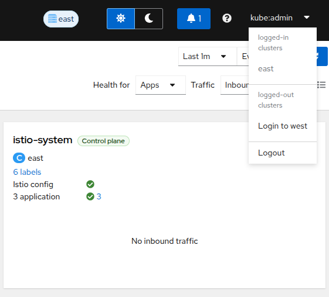
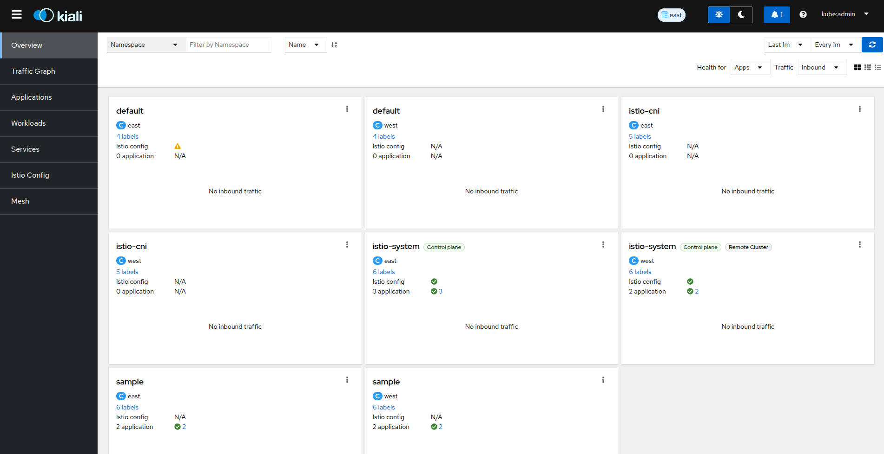
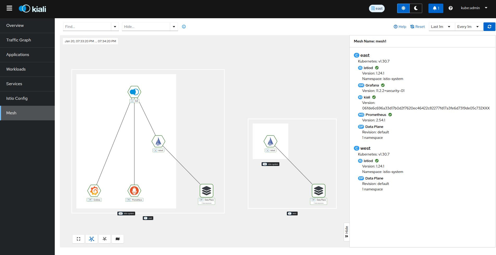

[Return to OSSM Docs](../)

# Kiali - multi-cluster

For multi-cluster Istio deployments, Kiali can show you a single unified view of your mesh across clusters.

Before proceeding with the setup, ensure you meet the requirements.

## Requirements

- Two OpenShift clusters. In this tutorial they are named `east` and `west`.
- Istio installed in a multi-cluster configuration on each cluster.
- IstioCNI installed on each cluster.
- Aggregated metrics and traces. Kiali needs a single endpoint for metrics and a single endpoint for traces where it can consume aggregated metrics/traces across all clusters. There are multiple ways to aggregate metrics/traces such as Prometheus federation or using OTEL collector pipelines.
- Cluster Admin for each cluster.
- Latest Kiali Operator installed on the `east` cluster.

## Setup

In this tutorial, we will deploy Kiali on the `east` cluster and then grant Kiali access to the `west` cluster. The unified multi-cluster setup requires a Kiali Service Account (SA) to have read access to each Kubernetes cluster in the mesh. This is separate from the user credentials that are required when a user logs into Kiali. Kiali uses the user's credentials to check if the user has access to a namespace and when performing any write operation such as creating/editing/deleting objects in Kubernetes. To give the Kiali Service Account access to each remote cluster, a kubeconfig with credentials needs to be created and mounted into the Kiali pod.

### Procedure

1. Install Kiali on the `east` cluster.

   Create a file named `kiali.yaml`.

   ```yaml
   apiVersion: kiali.io/v1alpha1
   kind: Kiali
   metadata:
     name: kiali
     namespace: istio-system
   spec:
     version: default
   ```

   Apply the yaml file into the `east` cluster.

   ```sh
   oc --context east apply -f kiali.yaml
   ```

   Wait for the Kiali Operator to finish deploying the Kiali Server:

   ```sh
   oc --context east wait --for=condition=Successful --timeout=2m kialis/kiali -n istio-system
   ```

1. Find your Kiali `Route` hostname.

   ```sh
   oc --context east get route kiali -n istio-system -o jsonpath='{.spec.host}'
   ```

1. Create a Kiali CR on the remote cluster with the following config:

   ```yaml
   apiVersion: kiali.io/v1alpha1
   kind: Kiali
   metadata:
     name: kiali
     namespace: istio-system
   spec:
     version: default
     auth:
       openshift:
         redirect_uris:
           # Replace kiali-route-hostname with the hostname from the previous step.
           - "https://{kiali-route-hostname}/api/auth/callback/west"
     deployment:
       remote_cluster_resources_only: true
   ```

   Kiali will create some of the remote resources necessary for Kiali to connect to the remote cluster but no deployment will be created.

1. Apply the yaml file into the `west` cluster.

   ```sh
   oc --context west apply -f kiali-remote.yaml
   ```

1. Create a remote cluster secret.

   In order to access a remote cluster, you must provide a kubeconfig to Kiali via a Kubernetes secret.

   1. Create a long lived API token bound to the `kiali-service-account` in the `west` cluster.

      Kiali will use this to authenticate to the `west` cluster.

      ```yaml
      apiVersion: v1
      kind: Secret
      metadata:
        name: "kiali-service-account"
        namespace: "istio-system"
        annotations:
          kubernetes.io/service-account.name: "kiali-service-account"
      type: kubernetes.io/service-account-token
      ```

   1. Apply the yaml file into the `west` cluster.

      ```sh
      oc --context west apply -f kiali-svc-account-token.yaml
      ```

   1. Create a kubeconfig file and save this as a secret in the namespace where Kiali is deployed on the `east` cluster.

      To make this process easier you can use the `kiali-prepare-remote-cluster.sh` script to generate the kubeconfig for you.

      ```sh
      curl -L -o kiali-prepare-remote-cluster.sh https://raw.githubusercontent.com/kiali/kiali/master/hack/istio/multicluster/kiali-prepare-remote-cluster.sh
      ```

   1. Make the script executeable.

      ```sh
      chmod +x kiali-prepare-remote-cluster.sh
      ```

   1. Run the script passing your `east` and `west` cluster contexts.

      ```sh
      ./kiali-prepare-remote-cluster.sh --kiali-cluster-context east --remote-cluster-context west --view-only false --kiali-resource-name kiali-service-account --remote-cluster-namespace istio-system --process-kiali-secret true --process-remote-resources false --remote-cluster-name west
      ```

      **Note:** Use the option `--help` for additional details on how to use the script.

1. Trigger a reconcile of the Kiali CR for Kiali to pickup the remote secret.

   ```sh
   oc --context east annotate kiali kiali -n istio-system --overwrite kiali.io/reconcile="$(date)"
   ```

   Wait for Kiali to become ready.

   ```sh
   oc --context east wait --for=condition=Successful --timeout=2m kialis/kiali -n istio-system
   oc --context east rollout status deployments/kiali -n istio-system
   ```

1. Login to Kiali.

   When you first visit Kiali, you will login to the cluster where Kiali is deployed. In our case it will be the `east` cluster.

   Find your Kiali route's hostname.

   ```sh
   oc --context east get route kiali -n istio-system -o jsonpath='{.spec.host}'
   ```

   Navigate to your Kiali URL in your browser.

   ```sh
   https://<your-kiali-route-hostname>
   ```

1. Login to the `west` cluster through Kiali.

   In order to see other clusters in the Kiali UI, you must first login as a user to those clusters through Kiali. Click on the user profile dropdown in the top right hand menu. Then select `Login to west`. You will again be redirected to an OpenShift login page and prompted for credentials but this will be for the `west` cluster.

   

1. Verify that Kiali shows information from both clusters.

   1. Navigate to the `Overview` page from the left hand nav and verify you can see namespaces from both clusters.

      

   2. Navigate to the `Mesh` page from the left hand nav and verify you see both clusters on the mesh graph.

   
