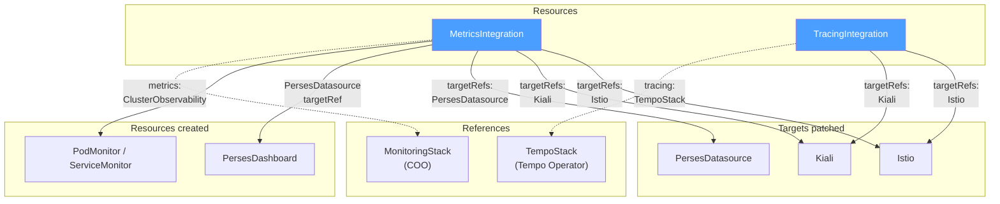

|Status                                             | Authors      | Created    | 
|---------------------------------------------------|--------------|------------|
| WIP                                               | @nrfox       | 2026-07-22 |

# Integrations API

## Overview
Configuring Istio to work with various integrations, especially on OpenShift, often requires following rote procedures that are easy to get wrong. This SEP aims to provide a new CRD(s) to simplify this process while still giving users full control over their resources.

## Goals
- Simplify integrations with Istio, especially on OpenShift
- Allow for full customization without fighting against a controller

## Non-goals
- Modifying the existing Istio CRD.
- Installing or managing the Perses Operator, Perses server, or Cluster Observability Operator (COO).

## Design

Note that the Integrations controller detailed below will be the same one implemented as part of the [metrics integration SEP](https://github.com/istio-ecosystem/sail-operator/pull/2028). See the Implementation Plan for more details.

A new Integrations controller will be introduced along with new `Integration` types. Each type will be grouped by function. The `Integration` types will have a `targetRefs` field that specifies the resources the integration configures. Each target reference specifies the `kind` (e.g. `Istio`, `Kiali`, `PersesDatasource`), `name`, and optionally `namespace` of the target resource. A single `Integration` resource can target multiple resources, such as both an `Istio` and a `Kiali` resource. The Integration controller will configure the target resources and any other resources necessary to manage the integration based on which integrations are configured. For example, a UWM integration would look like this:
```yaml
kind: MetricsIntegration
apiVersion: sailoperator.io/v1alpha1
metadata:
  name: openshift-obserability
spec:
  targetRefs:
    - kind: Istio
      name: default
    - kind: Kiali
      name: kiali
      namespace: istio-system
  type: UserWorkloadMonitoring
  userWorkloadMonitoring: {}
```
A COO integration would look like this:
```yaml
kind: MetricsIntegration
apiVersion: sailoperator.io/v1alpha1
metadata:
  name: openshift-obserability
spec:
  targetRefs:
    - kind: Istio
      name: default
  type: ClusterObservabilityOperator
  clusterObservabilityOperator:
    monitoringStackRef:
      name: my-custom-prom
      namespace: custom-metrics
```
the Integrations controller would use the `monitoringStackRef` to reference the `MonitoringStack` for the prometheus instance and copy over any relevant fields such as the `resourceSelector` labels needed for the controller to label the `PodMonitor` and `ServiceMonitor` resources correctly.

Integrating with OpenShift COO and distributed tracing would involve a `MetricsIntegration` and a `TracingIntegration`:
```yaml
kind: MetricsIntegration
apiVersion: sailoperator.io/v1alpha1
metadata:
  name: openshift-obserability
spec:
  targetRefs:
    - kind: Istio
      name: default
  type: ClusterObservabilityOperator
  clusterObservabilityOperator:
    monitoringStackRef:
      name: my-custom-prom
      namespace: custom-metrics
---
kind: TracingIntegration
apiVersion: sailoperator.io/v1alpha1
metadata:
  name: openshift-obserability
spec:
  targetRefs:
    - kind: Istio
      name: default
  type: OpenTelemetry
  openTelemetry:
    otelCollectorRef:
      name: otel
      namespace: istio-system
```

The controller would then configure the following fields on the `Istio` and `Telemetry` resources:
```yaml
kind: Istio
apiVersion: sailoperator.io/v1
metadata:
  name: default
spec:
  values:
    meshConfig:
      enableTracing: true
      extensionProviders:
      - name: otel
        opentelemetry:
          port: 4317
          service: otel-collector.istio-system.svc.cluster.local
---
apiVersion: telemetry.istio.io/v1
kind: Telemetry
metadata:
  name: otel-demo
  namespace: istio-system
spec:
  metrics:
    - providers:
      - name: prometheus
  tracing:
    - providers:
        - name: otel
```

### Dealing with conflicts

A key part of the design is using **Server Side Apply** for all controller updates to resources. This will allow the Integrations controller to manage the fields of the `Istio` and `Telemetry` resources necessary to setup the integration while allowing users to manage other parts of the resources without users fighting against the controller. If users want to take full control over some of the controller managed fields, they can also do this cleanly with Server Side Apply. When [dealing with conflicts](https://kubernetes.io/docs/reference/using-api/server-side-apply/#conflicts), the controller will either give up management or become a shared manager. The controller will never overwrite values specified by the user or other controllers.

For users that manage their resources through Argo CD, the [Server Side Apply sync option](https://argo-cd.readthedocs.io/en/stable/user-guide/sync-options/#server-side-apply) must be enabled. This will cause Argo CD to use `kubectl apply --server-side --force-conflicts` and any fields that are written by both the Integrations controller and Argo CD will be owned by Argo CD. Since Server Side Apply is a stable, mature feature, it's assumed that other gitops solutions support a similar option.

### User Stories

- A mesh admin wants to configure Istio to work with UserWorkloadMonitoring on OpenShift. The admin wants Istio to work with UserWorkloadMonitoring without having to do any manual steps.
- A mesh admin wants to configure Kiali to read from UserWorkloadMonitoring and distributed tracing without having to perform any manual steps.
- A mesh admin on OpenShift wants a `PersesDatasource` in their Perses project wired to the same metrics backend as Kiali, by creating a minimal CR and letting the integration fill in the mesh-specific fields via server-side apply.
- A mesh admin on OpenShift wants supported Istio Perses dashboards installed from content shipped with the operator when `MetricsIntegration` targets a `PersesDatasource`, without manually applying community-mixins YAML.
- A mesh admin wants to maintain full control over the configuration of all resources in case any customizations are needed.

### API Changes

Three new CRDs will be added corresponding broadly to different integration types for Istio. These can be added separately and new `type` for each group added over time but it's not expected that we will add many new `Integration` CRDs. The new CRDs and subtypes are:

- `MetricsIntegration`
  - UserWorkloadMonitoring
  - ClusterObservabilityOperator
  - PrometheusOperator
- `TracingIntegration`
  - OpenTelemetry
  - TempoStack
- `CertificateIntegration`
  - ZeroTrustWorkloadIdentityManagement
  - IstioCSR
  - CertManager

Each `Integration` resource has a `targetRefs` field that specifies the resources the integration configures. Each target reference specifies the `kind` (e.g. `Istio`, `Kiali`, `PersesDatasource`), `name`, and optionally `namespace` of the target.

For `Istio` and `Kiali`, the controller patches an existing custom resource. For `PersesDatasource`, the user creates the CR (typically with an empty `spec`); the controller server-side applies the mesh-related fields onto that resource. The Perses **project** is the Kubernetes namespace of the `PersesDatasource` targetRef (the Perses Operator maps namespace → project). The controller does not install or manage the Perses Operator, Perses server, or `Perses` custom resources.

A single `Integration` resource can target multiple resources, such as both an `Istio` and a `Kiali` resource. If there are multiple `Integration` resources of the same Kind that target the same ref, the one that is created later is considered invalid and this will be reflected in the status. 

Here are examples of each type:

A `MetricsIntegration` targeting Istio and Perses for UWM:

The user creates the `PersesDatasource` (and any Perses prerequisites) before or alongside the `MetricsIntegration`:

```yaml
apiVersion: perses.dev/v1alpha2
kind: PersesDatasource
metadata:
  name: prometheus-datasource
  namespace: monitoring
spec:
  config:
    display:
      name: prometheus-datasource
    default: true
    plugin:
      kind: PrometheusDatasource
      spec: {}
```

```yaml
kind: MetricsIntegration
apiVersion: sailoperator.io/v1alpha1
metadata:
  name: openshift-observability
spec:
  targetRefs:
    - kind: Istio
      name: default
    - kind: PersesDatasource
      name: prometheus-datasource
      namespace: monitoring
  type: UserWorkloadMonitoring
  userWorkloadMonitoring: {}
```

Opt-in for Perses is **including `kind: PersesDatasource` in `targetRefs`**, not a new `type`. `type` remains the metrics backend (`UserWorkloadMonitoring`, `ClusterObservabilityOperator`, …) so the controller knows which metrics endpoint to configure on the datasource.

The Perses **project** is the Kubernetes namespace of the `PersesDatasource` targetRef (`namespace: monitoring` above). There is no separate `project` field on `MetricsIntegration`. See [Perses (MetricsIntegration)](#perses-metricsintegration).

A `TracingIntegration` targeting both Istio and Kiali:
```yaml
kind: TracingIntegration
apiVersion: sailoperator.io/v1alpha1
metadata:
  name: openshift-observability
spec:
  targetRefs:
    - kind: Istio
      name: default
    - kind: Kiali
      name: kiali
      namespace: istio-system
  type: TempoStack
  tempoStack:
    tempoStackRef:
      name: tempo
      namespace: tracing
```

Using the resources above, the controller would configure the following on the `Kiali` resource:
```yaml
apiVersion: kiali.io/v1alpha1
kind: Kiali
metadata:
  name: kiali
  namespace: istio-system
spec:
  external_services:
    prometheus:
      auth:
        type: bearer
        use_kiali_token: true
      thanos_proxy:
        enabled: true
      url: https://thanos-querier.openshift-monitoring.svc.cluster.local:9091
    tracing:
      enabled: true
      provider: tempo
      use_grpc: false
      internal_url: https://tempo-sample-gateway.tempo.svc.cluster.local:8080/api/traces/v1/default/tempo
      external_url: https://tempo-sample-gateway-tempo.apps-crc.testing/api/traces/v1/default/search 
      health_check_url: https://tempo-sample-gateway-tempo.apps-crc.testing/api/traces/v1/default/tempo/api/echo
      auth: 
        ca_file: /var/run/secrets/kubernetes.io/serviceaccount/service-ca.crt
        insecure_skip_verify: false
        type: bearer
        use_kiali_token: true
      tempo_config:
         url_format: "jaeger"
```

Kiali `external_services.perses` is **not** configured implicitly when a `PersesDatasource` is also targeted. Users who want Perses deep links in Kiali configure `external_services.perses` directly on the `Kiali` CR (or via a future explicit integration mechanism). See [Perses (MetricsIntegration)](#perses-metricsintegration).

#### Perses (MetricsIntegration)

When a `MetricsIntegration` includes `targetRefs` with `kind: PersesDatasource`, the Integrations controller **server-side applies** mesh-related fields onto the referenced `PersesDatasource`. The user creates that CR (and any Perses prerequisites); the controller does not create it. Integration types do not duplicate fields from `PersesDatasource` or `PersesDashboard`; users set overrides directly on those resources if needed.

The controller also **creates** productized `PersesDashboard` custom resources in the same namespace as the `PersesDatasource` targetRef. This applies for any metrics `type` that targets a `PersesDatasource`.

What is configurable vs fixed:

| Setting | How it is chosen |
|---------|------------------|
| Perses project | `PersesDatasource` targetRef `namespace`. Change the project by targeting a datasource in a different namespace. Not a separate spec field on `MetricsIntegration`. |
| Datasource CR | **Created by the user.** Referenced by `targetRefs` (`kind`, `name`, `namespace`). The controller SSA-applies proxy URL, auth, and TLS aligned with `type`. Users customize other fields on the CR directly. |
| Dashboard CRs | **Created by the controller** from bundled YAML in the datasource namespace. `metadata.name` is the productized dashboard ID (table below). All six supported dashboards are installed; users customize queries or layout on the CRs directly. |

Reconciliation order:

1. Detect `PersesDatasource` and `PersesDashboard` CRDs (`perses.dev/v1alpha2`). If missing, skip Perses reconciliation and report `PersesAvailable=False` with reason `MissingCRDs`; other targets (`Istio`, monitors) continue to reconcile.
2. Verify each `PersesDatasource` targetRef exists. If not, report validation failure in status.
3. Server-side apply mesh-related fields onto each referenced `PersesDatasource`, aligned with `type`.
4. Create/apply productized `PersesDashboard` resources from content shipped in the operator bundle, in the same namespace as each datasource targetRef, referencing that datasource by name.

The controller does not create a Perses `Project` CR, install viewer RBAC (`persesdashboard-viewer-role`, etc.), or patch Kiali `external_services.perses` based on Perses targets. Those remain user or platform responsibilities. If dashboards already exist in that namespace (manual fallback), the controller still applies its owned dashboard CRs by name (SSA / parallel resources, same migration rule as `PodMonitor`).

##### PersesDatasource

The datasource wires Perses to the same metrics backend selected by `type`, analogous to how a `Kiali` target wires `external_services.prometheus`.

| `MetricsIntegration.type` | `PersesDatasource` endpoint |
|---------------------------|-----------------------------|
| `UserWorkloadMonitoring` | OpenShift User Workload Monitoring Thanos querier (same URL and auth as Kiali `external_services.prometheus` for UWM) |
| `ClusterObservabilityOperator` | Prometheus/Thanos URL derived from the referenced `MonitoringStack` |

The controller server-side applies these fields onto the user-created `PersesDatasource` referenced in `targetRefs`. Users who need a different proxy URL, authentication, or TLS set those fields directly on the CR; SSA conflict rules apply.

Example fields applied by the controller for UWM (merged onto the user's `PersesDatasource`):

```yaml
apiVersion: perses.dev/v1alpha2
kind: PersesDatasource
metadata:
  name: prometheus-datasource
  namespace: monitoring
spec:
  config:
    display:
      name: Thanos Querier Datasource
    default: true
    plugin:
      kind: PrometheusDatasource
      spec:
        proxy:
          kind: HTTPProxy
          spec:
            url: https://thanos-querier.openshift-monitoring.svc.cluster.local:9091
            secret: prometheus-datasource-secret
  client:
    tls:
      enable: true
      caCert:
        type: file
        certPath: /ca/service-ca.crt
```

##### PersesDashboard

When the `PersesDashboard` CRD is available, the controller **creates** the productized Istio dashboards in the namespace of each `PersesDatasource` targetRef (the project). Panels reference the datasource by the targetRef `name`.

OSSM ships six dashboards aligned with the Istio/Grafana addon set. `metadata.name` on each CR is the Perses dashboard ID:

| `PersesDashboard` name | Display name |
|------------------------|--------------|
| `istio-control-plane` | Istio Control Plane Dashboard |
| `istio-mesh-dashboard` | Istio Mesh Dashboard |
| `istio-performance` | Istio Performance Dashboard |
| `istio-service-dashboard` | Istio Service Dashboard |
| `istio-workload-dashboard` | Istio Workload Dashboard |
| `istio-ztunnel-dashboard` | Istio Ztunnel Dashboard |

Names follow the community-mixins operator YAML. Kiali slugifies the display name to build Perses URLs (`Istio Mesh Dashboard` → `istio-mesh-dashboard`). Mesh was aligned in [community-mixins#279](https://github.com/perses/community-mixins/pull/279). Control Plane and Performance still use `istio-control-plane` and `istio-performance` in mixins, which do not match the slugified display names; vendoring should rename those CRs (or contribute the rename upstream) so Kiali links resolve when users configure `external_services.perses` themselves.

All six dashboards are installed for each `PersesDatasource` targetRef. Upstream community-mixins also has `istio-extension-dashboard` (Wasm); it is **not** in the initial supported set.

###### Lifecycle

- The controller puts an `ownerRef` on every `PersesDashboard` it creates, so deleting the `MetricsIntegration` deletes them.
- The controller does **not** put an `ownerRef` on `PersesDatasource` resources; those are user-owned prerequisites.
- Changing the `PersesDatasource` targetRef (name or namespace) stops managing the previous datasource and creates dashboards in the new namespace.
- Dashboards are applied with Server Side Apply. User edits to queries or layout are not overwritten; the same conflict rules as the rest of this SEP apply.
- On operator upgrade, the controller reapplies the shipped dashboard version. Fields still owned by the controller move to the new content; fields owned by the user stay with the user.

##### Dashboard productization

The six dashboards are defined as Go SDK mixins in [perses/community-mixins](https://github.com/perses/community-mixins) and rendered to operator-format YAML under `examples/dashboards/operator/istio/` ([community-mixins#277](https://github.com/perses/community-mixins/pull/277), [community-mixins#279](https://github.com/perses/community-mixins/pull/279)). That rendered YAML is what Sail ships. The controller does not pull from GitHub at runtime and does not compile the Perses Go SDK into the operator (unlike MCOA/COO dashboards-as-code). Content is updated by bumping the mixins pin and regenerating the vendored YAML.

| Concern | Decision |
|---------|----------|
| Source of truth | community-mixins Go SDK; Sail vendors the generated `PersesDashboard` YAML |
| Pin | Git commit/tag of community-mixins aligned with the Istio version Sail supports (initially Istio 1.30 / mixins after #277 and #279) |
| Location | `resources/perses/dashboards/` in the Sail Operator repo, embedded in the operator image / OLM bundle |
| Upstream vs OSSM | Controller and vendored community YAML live in upstream `istio-ecosystem/sail-operator` (community content, skip when CRDs are absent). OSSM productization is support, docs, OpenShift e2e, and bumping the pin on Istio upgrades |
| Cadence | Bump the mixins pin when Sail/OSSM ships a new Istio minor; contribute query/panel fixes back to community-mixins ([OSSM-15317](https://redhat.atlassian.net/browse/OSSM-15317) already did this for 1.30) |
| Manual fallback | Users may apply the same mixins YAML and set Kiali `external_services.perses` themselves. No `PersesDatasource` targetRef required |
| If this API misses a release | Ship docs + golden YAML (community-mixins operator examples) as the GA path; automation follows when `MetricsIntegration` is available |

Integrating Istio with Zero Trust Workload Identity Management:
```yaml
kind: CertificateIntegration
apiVersion: sailoperator.io/v1alpha1
metadata:
  name: ztwim
spec:
  targetRefs:
    - kind: Istio
      name: default
  type: ZeroTrustWorkloadIdentityManagement
  ztwim: {}
```

Integrating Istio with Istio CSR:
```yaml
kind: CertificateIntegration
apiVersion: sailoperator.io/v1alpha1
metadata:
  name: istio-csr
spec:
  targetRefs:
    - kind: Istio
      name: default
  type: IstioCSR
  istioCSR:
    istioCSRRef:
      name: default
      namespace: istio-csr
```

These are broadly what the golang API changes would be:
```go
// TargetReference identifies a resource that the integration configures
type TargetReference struct {
	// Kind specifies the target kind: "Istio" or "PersesDatasource".
	Kind string `json:"kind"`

	// Name is the name of the target resource.
	Name string `json:"name"`

	// Namespace is the namespace of the target resource.
	// Only required for namespace-scoped resources like Kiali and PersesDatasource.
	Namespace string `json:"namespace,omitempty"`
}

// MetricsIntegrationSpec defines the desired state of MetricsIntegration.
type MetricsIntegrationSpec struct {
	// TargetRefs specifies the resources that this integration configures.
	TargetRefs []TargetReference `json:"targetRefs"`

	MetricsConfig `json:",inline"`
}

// MetricsType identifies the type of metrics integration.
type MetricsType string

const (
	MetricsTypeUserWorkloadMonitoring      MetricsType = "UserWorkloadMonitoring"
	MetricsTypeClusterObservabilityOperator MetricsType = "ClusterObservabilityOperator"
)

// MetricsConfig configures a metrics backend.
type MetricsConfig struct {
	// Type specifies the metrics integration type.
	Type MetricsType `json:"type"`

	// UserWorkloadMonitoring configures integration with OpenShift User Workload Monitoring.
	UserWorkloadMonitoring *UserWorkloadMonitoringConfig `json:"userWorkloadMonitoring,omitempty"`

	// ClusterObservabilityOperator configures integration with the Cluster Observability
	// Operator's MonitoringStack resource for metrics collection.
	ClusterObservabilityOperator *ClusterObservabilityOperatorConfig `json:"clusterObservabilityOperator,omitempty"`
}

type UserWorkloadMonitoringConfig struct{}

// ClusterObservabilityOperatorConfig configures the Cluster Observability Operator integration.
type ClusterObservabilityOperatorConfig struct {
	// MonitoringStackRef is a reference to a MonitoringStack resource that defines
	// the Prometheus stack used for scraping Istio metrics.
	MonitoringStackRef NamespacedReference `json:"monitoringStackRef"`
}

// TracingIntegrationSpec defines the desired state of TracingIntegration.
type TracingIntegrationSpec struct {
	// TargetRefs specifies the resources that this integration configures.
	TargetRefs []TargetReference `json:"targetRefs"`

	TracingConfig `json:",inline"`
}

// TracingType identifies the type of tracing integration.
type TracingType string

const (
	TracingTypeOpenTelemetry TracingType = "OpenTelemetry"
	TracingTypeTempoStack    TracingType = "TempoStack"
)

// TracingConfig configures a tracing backend.
type TracingConfig struct {
	// Type specifies the tracing integration type.
	Type TracingType `json:"type"`

	// OpenTelemetry configures integration with an OpenTelemetry Collector.
	OpenTelemetry *OpenTelemetryConfig `json:"openTelemetry,omitempty"`

	// TempoStack configures integration with a TempoStack resource.
	TempoStack *TempoStackConfig `json:"tempoStack,omitempty"`
}

// OpenTelemetryConfig configures the OpenTelemetry integration.
type OpenTelemetryConfig struct {
	// OTELCollectorRef is a reference to an OpenTelemetry Collector resource.
	OTELCollectorRef NamespacedReference `json:"otelCollectorRef"`
}

// TempoStackConfig configures the TempoStack integration.
type TempoStackConfig struct {
	// TempoStackRef is a reference to a TempoStack resource.
	TempoStackRef NamespacedReference `json:"tempoStackRef"`
}

// CertificateIntegrationSpec defines the desired state of CertificateIntegration.
type CertificateIntegrationSpec struct {
	// TargetRefs specifies the resources that this integration configures.
	TargetRefs []TargetReference `json:"targetRefs"`

	// Type specifies the identity integration type.
	Type IdentityType `json:"type"`

	// ZTWIM configures integration with Zero Trust Workload Identity Management.
	ZTWIM *ZTWIMConfig `json:"ztwim,omitempty"`

	// IstioCSR configures integration with cert-manager istio-csr.
	IstioCSR *IstioCSRConfig `json:"istioCSR,omitempty"`
}

// IdentityType identifies the type of identity integration.
type IdentityType string

const (
	IdentityTypeZTWIM    IdentityType = "ZeroTrustWorkloadIdentityManagement"
	IdentityTypeIstioCSR IdentityType = "IstioCSR"
)

// ZTWIMConfig configures the Zero Trust Workload Identity Management integration.
type ZTWIMConfig struct{}

// IstioCSRConfig configures the cert-manager istio-csr integration.
type IstioCSRConfig struct {
	// IstioCSRRef is a reference to an IstioCSR resource.
	IstioCSRRef NamespacedReference `json:"istioCSRRef"`
}
```

#### Status
Integrations will report `Status`. Non-exhaustive list of what should be in `Status`:
- Validations: do the refs exist?
- Success/failure to update resources.
- Possibly report if the update was partially applied i.e. some other controller owns part of the fields.
- `PersesAvailable=False` with reason `MissingCRDs` when `kind: PersesDatasource` is set but `perses.dev` CRDs are not installed. Other targets still reconcile.

#### Migration

Some users will already have configured their integrations. They may already have `PodMonitor` and `ServiceMonitor` resources created for example. How should the Integrations controller handles this?

The integrations controller could either:

1. Adopt the resources i.e. add the Integrations controller's OwnerRef to them. 
2. Do nothing.
3. Create parallel resources. In the case of `PodMonitor` creating a second `PodMonitor`.

The Integrations controller will implement option 3. and will create new resources regardless of any existing resources. This is the simplest option. Users who have already configured their integrations may not need this API and if they want to utilize this API they can remove their existing resources before or after creating the `Integration` resource.

#### Resource Ownership

The Integrations controller should own the resources that it directly creates as part of the integration. This will tie the lifecycle of these resources to the `Integration` ensuring resources are properly cleaned up when the `Integration` is removed. The Integrations controller will **not** put an `ownerRef` on any of the resources that it references. The Integrations controller will never put an `ownerRef` on an `Istio` resource or on an `OpenTelemetry` resource. 

#### Permissions

Adding this API will require adding new permissions to the Sail Operator for each `Integration`. In general, the Sail Operator will need `READ` permissions for all of the `Integration` types and subtypes, `PATCH` permissions for any `targetRef`, and `CREATE`/`PATCH` for all resources the Integrations controller creates e.g. `PodMonitor`. Other permissions may also be needed for different integrations.

Adding the Cluster Observability Operator integration would require adding:
- `GET`/`WATCH`/`LIST` for `MonitoringStack` resources
- `PATCH` for `Kiali` resources (the Sail Operator already has permission to patch `Istio` resources)
- `CREATE`/`PATCH` for `PodMonitor`/`ServiceMonitor` resources.

When `MetricsIntegration` targets a `PersesDatasource`, the Integrations controller also needs:
- `PATCH` for `PersesDatasource` resources (`perses.dev/v1alpha2`)
- `CREATE`/`PATCH`/`DELETE` for `PersesDashboard` resources (`perses.dev/v1alpha2`)

This will greatly increase the scope of the Sail Operator's Service Account but the operator already has full control of `Secret` and `ClusterRole`/`ClusterRoleBinding` resources effectively giving it cluster admin for the cluster.

### Architecture



### Performance Impact

The exact performance impact will partially depend on the implementation details of each integration type. For example, the UWM integration requires creating/watching more resources so it will likely have a greater impact but the tracing integration only requires updating some fields on the `Istio` resource and reconciling `Telemetry` objects.

### Kubernetes vs OpenShift vs Other Distributions

Some of this controller will only be applicable to OpenShift. The UWM and COO types are OpenShift specific but other types, such as `TempoStack` would be valid on either Kubernetes or OpenShift. `PersesDatasource` and `PersesDashboard` provisioning is reconciled only when `perses.dev` CRDs are present; the default UWM/COO datasource endpoints and dashboard productization are OpenShift-specific for the initial deliverable.

## Alternatives Considered
- The main alternative to having a separate CRD for the integrations is to add fields to the `Istio` spec directly. One drawback of this approach is that there isn't a clear separation of concerns. Today the istio controller alone reconciles the `Istio` spec. If the integrations controller began to reconcile parts of the `Istio` spec, care would need to be taken to ensure the two controllers do not fight with one another. Having a separate resources also allows the API to evolve and rapidly add new types without affecting the stable `Istio` API.

- Two types with many subtypes. In this scenario you would have a `IstioIntegration` type and a `KialiIntegration` type rather than grouping the integrations by their function.

  ```yaml
  kind: IstioIntegration
  apiVersion: sailoperator.io/v1alpha1
  metadata:
    name: openshift-obserability
  spec:
    istioRef:
      name: default
    metrics:
      type: ClusterObservabilityOperator
      clusterObservabilityOperator:
        monitoringStackRef:
          name: my-custom-prom
          namespace: custom-metrics
    tracing:
      type: OpenTelemetry
      openTelemetry:
        otelCollectorRef:
          name: otel
          namespace: istio-system
  ```
  
  The main disadvantage of this API is that you end up with a single large CR with many different fields and subtypes.

- No subtypes and only CRDs e.g.
  ```yaml
  kind: ClusterObservabilityOperator
  apiVersion: sailoperator.io/v1alpha1
  metadata:
    name: openshift-obserability
  spec:
    monitoringStackRef:
      name: my-custom-prom
      namespace: custom-metrics
  ```

  With this API you end up with a large number of CRDs that have very few fields.

- A separate `DashboardIntegration` or `PersesIntegration` CRD, or a `MetricsIntegration.type` of `Perses`, was considered for dashboards. It was not adopted: Perses is a visualization target, not a metrics backend. Datasource URL depends on `type` (UWM/COO). Provisioning belongs in `MetricsIntegration` when `targetRefs` includes `kind: PersesDatasource`.

## Implementation Plan
The implementation for UWM is already complete as part of the [monitoring controller](https://github.com/istio-ecosystem/sail-operator/pull/1959). The only user facing change would be switching the enablement from an annotation on the `Istio` resource to creating a separate `MetricsIntegration` resource. The monitoring controller implementation would change slightly to reconcile `MetricsIntegration` resources and use Server Side Apply to update the `Istio` and `Telemetry` resources. A rough timeline would be:

- [ ] Add `MetricsIntegration` CRD
- [ ] Update monitoring controller for UWM to reconcile `MetricsIntegration` resources.
- [ ] Add `TracingIntegration` CRD
- [ ] Add `CertificateIntegration` CRD
- [ ] Add a `Kiali` target on the `Integration` resources.
- [ ] When `MetricsIntegration` targets a `PersesDatasource`, server-side apply mesh-related fields onto the referenced datasource and create productized `PersesDashboard` resources in the same namespace.
- [ ] Vendor Istio Perses dashboard YAML from community-mixins under `resources/perses/dashboards/` and include it in the operator bundle.

## Test Plan
- A key aspect of this design is utilizing Server Side Apply to ensure that users can override values that the operator sets if need be without fighting against the controller. This needs to be an integral part of the test suite and will be included in e2e testing. Specifically e2e testing should ensure that the operator can Apply a configuration partially and ignore any conflict errors.
- Some of the integrations types will only be available on OpenShift like the UWM and COO types. e2e tests for these can only be run in an OpenShift environment. These will be filtered out of the kind based suite with the openshift label similar to the TLS profile tests.
- Perses tests should cover: SSA on user-created datasource and controller-created dashboards; `PersesAvailable` when CRDs are missing; validation when a `PersesDatasource` targetRef does not exist; datasource proxy URL aligned with `type` for UWM; deleting `MetricsIntegration` removes owned `PersesDashboard` CRs but not user-owned `PersesDatasource`; OpenShift e2e that productized dashboards show data when COO Perses is enabled.

## Change History (only required when making changes after SEP has been accepted)
- Changed the API from `IstioIntegration` --> `<Component>Integration`.
- Replaced `istioRef` + `dashboard` fields with a unified `target` discriminated union (Istio | Kiali).
- Replaced `target` discriminated union with `targetRefs` array of references.
- Updated migration section to ignore any existing resources.
- Specified `PersesDatasource` as a `MetricsIntegration` targetRef: user-created datasource with controller SSA, productized dashboards, and dashboard productization (OSSM-15316). Kiali `external_services.perses` is not configured implicitly.