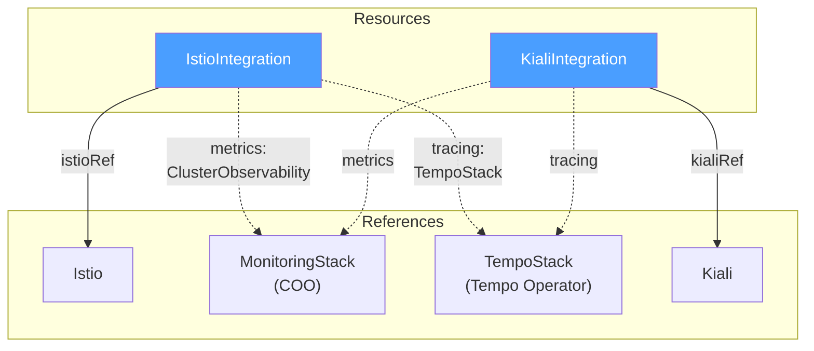

|Status                                             | Authors      | Created    | 
|---------------------------------------------------|--------------|------------|
| WIP                                               | @nrfox       | 2026-07-22 |

# Integrations API

## Overview
Configuring Istio to work with various integrations, especially on OpenShift, often requires following rote procedures that are easy to get wrong. This SEP aims to provide a new CRD(s) to simplify this process while still giving users full control over their resources.

## Goals
- Simplify integrations with Istio, especially on OpenShift
- Allow for full customization without fighting against a controller

## Non-goals
- Modifying the existing Istio CRD.

## Design

Note that the Integrations controller detailed below will be the same one implemented as part of the [metrics integration SEP](https://github.com/istio-ecosystem/sail-operator/pull/2028). See the Implementation Plan for more details.

A new Integrations controller will be introduced along with a new `IstioIntegration` type. The `IstioIntegration` will have both a reference to an `Istio` and references to any other resources that Istio may integrate with. The controller would set fields on the Istio resource based on which integrations are configured. This is similar to the `targetRef` on a `ZTunnel` resource but with potentially more references involved. For example, a UWM integration would look like this:
```
kind: IstioIntegration
apiVersion: sailoperator.io/v1alpha1
metadata:
  name: openshift-obserability
spec:
  istioRef:
    name: default
  metrics:
    type: UserWorkloadMonitoring
    userWorkloadMonitoring: {}
```
A COO integration would look like this:
```
kind: IstioIntegration
apiVersion: sailoperator.io/v1alpha1
metadata:
  name: openshift-obserability
spec:
  istioRef:
    name: default
  metrics:
    type: ClusterObservabilityOperator
    clusterObservabilityOperator:
      monitoringStackRef:
        name: my-custom-prom
        namespace: custom-metrics
```
the Integrations controller would use the `monitoringStackRef` to reference the `MonitoringStack` for the prometheus instance and copy over any relevant fields such as the `resourceSelector` labels needed for the controller to label the `PodMonitor` and `ServiceMonitor` resources correctly.

An OpenShift with COO and OpenShift distributed tracing would look like this:
```
kind: IstioIntegration
apiVersion: sailoperator.io/v1alpha1
metadata:
  name: openshift-obserability
spec:
  istioRef:
    name: default
  metrics:
    type: ClusterObservabilityOperator
    clusterObservabilityOperator:
      stackRef:
        name: my-custom-prom
        namespace: custom-metrics
  tracing:
    type: OpenTelemetry
    openTelemetry:
      otelCollectorRef:
        name: otel
        namespace: istio-system
```

The controller would then in turn configure the following:
```
kind: Istio
apiVersion: sailoperator.io/v1
metadata:
  name: default
spec:
  values:
    meshConfig:
      enableTracing: true
      extensionProviders:
      - name: otel
        opentelemetry:
          port: 4317
          service: otel-collector.istio-system.svc.cluster.local
```
```
apiVersion: telemetry.istio.io/v1
kind: Telemetry
metadata:
  name: otel-demo
  namespace: istio-system
spec:
  metrics:
    - providers:
      - name: prometheus
  tracing:
    - providers:
        - name: otel
```

A key part of the design is using Server Side Apply for all controller updates to resources. This will allow the Integrations controller to manage the fields of the `Istio` and `Telemetry` resources necessary to setup the integration while allowing users to manage other parts of the resources without users fighting against the controller. If users want to take full control over some of the controller managed fields, they can also do this cleanly with Server Side Apply. When [dealing with conflicts](https://kubernetes.io/docs/reference/using-api/server-side-apply/#conflicts), the controller will either give up management or become a shared manager. The controller will never overwrite values specified by the user or other controllers.

Kiali has these same configuration requirements. A `KialiIntegration` resource could also be managed by this controller which would look like this:
```
kind: KialiIntegration
apiVersion: sailoperator.io/v1alpha1
metadata:
  name: kiali-openshift
spec:
  kialiRef:
    name: kiali
    namespace: istio-system
  metrics:
    type: UserWorkloadMonitoring
    userWorkloadMonitoring: {}
  tracing:
    type: TempoStack
    tempoStackRef:
      name: tempo
      namespace: tracing
```

The controller would configure:
```
apiVersion: kiali.io/v1alpha1
kind: Kiali
metadata:
  name: kiali-user-workload-monitoring
  namespace: istio-system
spec:
  external_services:
    prometheus:
      auth:
        type: bearer
        use_kiali_token: true
      thanos_proxy:
        enabled: true
      url: https://thanos-querier.openshift-monitoring.svc.cluster.local:9091
    tracing:
      enabled: true
      provider: tempo
      use_grpc: false
      internal_url: https://tempo-sample-gateway.tempo.svc.cluster.local:8080/api/traces/v1/default/tempo
      external_url: https://tempo-sample-gateway-tempo.apps-crc.testing/api/traces/v1/default/search 
      health_check_url: https://tempo-sample-gateway-tempo.apps-crc.testing/api/traces/v1/default/tempo/api/echo
      auth: 
        ca_file: /var/run/secrets/kubernetes.io/serviceaccount/service-ca.crt
        insecure_skip_verify: false
        type: bearer
        use_kiali_token: true
      tempo_config:
         url_format: "jaeger"
```

Rather than having to manually configure each one of these fields, users only need to configure a reference to a resource which is much less error prone. The `IstioIntegration` or `KialiIntegration` statuses would be used to help validate the reference(s). Another advantage of having refs as the primary configuration mechanism is that it would make configuration from a UI much simpler. A UI could autopopulate configurations based on what types have been selected and what custom resources exist in the cluster for those types or else easily redirect to another part of the UI to create those types.

Additional types could be added to `IstioIntegration` in the future for other integrations such as cert-manager or ZTWIM.

### User Stories

- A mesh admin wants to configure Istio to work with UserWorkoadMonitoring on OpenShift. The admin wants Istio to work with UserWorkloadMonitoring without having to do any manual steps.
- A mesh admin wants to configure Kiali to read from UserWorkloadMonitoring and distributed tracing without having to perform any manual steps.
- A mesh admin wants to maintain full control over the configuration of all resources in case any customizations are needed.

### API Changes

Initially only one new `IstioIntegration` CRD will be added as `v1alpha1` with the focus on `UserWorkloadMonitoring` for metrics but new fields will be added to this CRD in the future. Below more fields are added to show how the API is expected to evolve over time.

A `KialiIntegration` CRD could be added in the future. That is also detailed below but wouldn't be included initially.

```
type IstioIntegrationSpec struct {
  // IstioRef is a reference to the Istio resource that this integration configures.
  IstioRef IstioReference `json:"istioRef"`

  // Metrics configures the metrics collection integration for the Istio control plane.
  Metrics *MetricsConfig `json:"metrics,omitempty"`

  // Tracing configures the distributed tracing integration for the Istio control plane.
  Tracing *TracingConfig `json:"tracing,omitempty"`
}

// MetricsType identifies the type of metrics integration.
type MetricsType string

const (
	// MetricsTypeClusterObservability integrates with the Cluster Observability Operator's MonitoringStack.
	MetricsTypeClusterObservability MetricsType = "ClusterObservability"

	// MetricsTypeUserWorkloadMonitoring integrates with OpenShift User Workload Monitoring.
	MetricsTypeUserWorkloadMonitoring MetricsType = "UserWorkloadMonitoring"
)

// MetricsConfig configures metrics collection for the service mesh.
type MetricsConfig struct {
	// Type specifies the metrics integration type.
	Type MetricsType `json:"type"`

	// ClusterObservability configures integration with the Cluster Observability
	// Operator's MonitoringStack resource for metrics collection.
	ClusterObservability *ClusterObservabilityConfig `json:"clusterObservability,omitempty"`
}

// ClusterObservabilityConfig configures the Cluster Observability Operator integration.
type ClusterObservabilityConfig struct {
	// MonitoringStackRef is a reference to a MonitoringStack resource that defines
	// the Prometheus stack used for scraping Istio metrics.
	MonitoringStackRef NamespacedReference `json:"monitoringStackRef"`
}

// TracingType identifies the type of tracing integration.
type TracingType string

const (
	// TracingTypeTempoStack integrates with a Tempo Operator TempoStack.
	TracingTypeTempoStack TracingType = "TempoStack"
)

// TracingConfig configures distributed tracing for the service mesh.
type TracingConfig struct {
	// Type specifies the tracing integration type.
	Type TracingType `json:"type"`

	// TempoStack configures integration with a Tempo Operator TempoStack resource
	// for distributed tracing.
	TempoStack *TempoStackConfig `json:"tempoStack,omitempty"`
}

// TempoStackConfig configures the TempoStack integration.
type TempoStackConfig struct {
	// TempoStackRef is a reference to a TempoStack resource that receives
	// trace data from the Istio control plane.
	TempoStackRef NamespacedReference `json:"tempoStackRef"`
}

// KialiIntegrationSpec defines the desired state of KialiIntegration
type KialiIntegrationSpec struct {
	// KialiRef is a reference to a Kiali resource that this integration configures.
	KialiRef NamespacedReference `json:"kialiRef"`

	// Metrics configures the metrics backend integration for Kiali.
	Metrics *MetricsConfig `json:"metrics,omitempty"`

	// Tracing configures the distributed tracing backend integration for Kiali.
	Tracing *TracingConfig `json:"tracing,omitempty"`
}
```

### Architecture



### Performance Impact

The exact performance impact will partially depend on the implementation details of each integration type. For example, the UWM integration requires creating/watching more resources so it will likely have a greater impact but the tracing integration only requires updating some fields on the `Istio` resource and reconciling `Telemetry` objects.

### Kubernetes vs OpenShift vs Other Distributions

Some of this controller will only be applicable to OpenShift. The UWM and COO types are OpenShift specific but other types, such as `TempoStack` would be valid on either Kubernetes or OpenShift.

## Alternatives Considered
- The main alternative to having a separate CRD for the integrations is to add fields to the `Istio` spec directly. One drawback of this approach is that there isn't a clear separation of concerns. Today the istio controller alone reconciles the `Istio` spec. If the integrations controller began to reconcile parts of the `Istio` spec, care would need to be taken to ensure the two controllers do not fight with one another. Having a separate `IstioIntegration` resource also allows the API to evolve and rapidly add new types without affecting the stable `Istio` API.
- An entirely separate integrations operator. Since much of the focus in this SEP is on improving the OpenShift integration experience and some of the new types that are proposed are OpenShift specific, it may make sense to have this be a separate operator entirely from the upstream Sail Operator. But some of the propsed integration types are applicable outside of OpenShift as well.

## Implementation Plan
The implementation for UWM is already complete as part of the [monitoring controller](https://github.com/istio-ecosystem/sail-operator/pull/1959). The only user facing change would be switching the enablement from an annotation on the `Istio` resource to creating a separate `IstioIntegration` resource. The monitoring controller implementation would change slighty to reconcile `IstioIntegration` resources and use Server Side Apply to update the `Istio` and `Telemetry` resources. A rough timeline would be:

- [ ] Update monitoring controller for UWM to reconcile `IstioIntegration` resources.
- [ ] Add support for additional types (COO, tracing)
- [ ] Add a `KialiIntegration` resource.

## Test Plan
- A key aspect of this design is utilizing Server Side Apply to ensure that users can override values that the operator sets if need be without fighting against the controller. This needs to be an integral part of the test suite and will be included in e2e testing. Specifically e2e testing should ensure that the operator can Apply a configuration partially and ignore any conflict errors.
- Some of the integrations types will only be available on OpenShift like the UWM and COO types. e2e tests for these can only be run in an OpenShift environment. These will be filtered out of the kind based suite with the openshift label similar to the TLS profile tests.

## Change History (only required when making changes after SEP has been accepted)
N/A